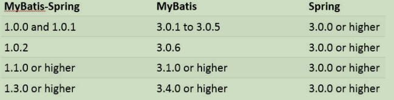

#  Mybatis学习笔记

​				-----------整理来源:尚硅谷-雷丰阳

## **第** **1** **章** **MyBatis** **简介**

### **1.1 MyBatis** **历史** 

1）MyBatis 是 Apache 的一个开源项目 iBatis, 2010 年 6 月这个项目由 Apache Software Foundation 迁移到了 Google Code，随着开发团队转投 Google Code 旗下， iBatis3.x 正式更名为 MyBatis ，代码于 2013 年 11 月迁移到 Github 

2）iBatis 一词来源于“internet”和“abatis”的组合，是一个基于 Java 的持久层框架。 iBatis 提供的持久层框架包括 SQL Maps 和 Data Access Objects（DAO）

### **1.2 MyBatis** **简介** 

1） MyBatis 是支持定制化 SQL、存储过程以及高级映射的优秀的持久层框架 

2） MyBatis 避免了几乎所有的 JDBC 代码和手动设置参数以及获取结果集 

3） MyBatis可以使用简单的XML或注解用于配置和原始映射，将接口和Java的POJO（Plain Old Java Objects，普通的 Java 对象）映射成数据库中的记录

### **1.3** **为什么要使用** **MyBatis –** **现有持久化技术的对比** 

1） JDBC 

​	1 SQL 夹在 Java 代码块里，耦合度高导致硬编码内伤 

​	2 维护不易且实际开发需求中 sql 是有变化，频繁修改的情况多见 

2） Hibernate 和 JPA 

​	1 长难复杂 SQL，对于 Hibernate 而言处理也不容易 

​	2 内部自动生产的 SQL，不容易做特殊优化 

​	3 基于全映射的全自动框架，大量字段的 POJO 进行部分映射时比较困难。导致数据 库性能下降

3） MyBatis 

1 对开发人员而言，核心 sql 还是需要自己优化 

2 sql 和 java 编码分开，功能边界清晰，一个专注业务、一个专注数据

## **第** **2** **章** **MyBatis HelloWorld**

### **2.1** **开发环境的准备**

1) 导入 MyBatis 框架的 jar 包、Mysql 驱动包、log4j 的 jar 包

2) 导入 log4j 的配置文件

```xml
<?xml version="1.0" encoding="UTF-8" ?> <!DOCTYPE log4j:configuration SYSTEM "log4j.dtd">
<log4j:configuration xmlns:log4j="http://jakarta.apache.org/log4j/">
    <appender name="STDOUT" class="org.apache.log4j.ConsoleAppender">
        <param name="Encoding" value="UTF-8"/>
        <layout class="org.apache.log4j.PatternLayout">
            <param name="ConversionPattern" value="%-5p %d{MM-dd HH:mm:ss,SSS} %m (%F:%L) \n"/>
        </layout>
    </appender>
    <logger name="java.sql">
        <level value="debug"/>
    </logger>
    <logger name="org.apache.ibatis">
        <level value="info"/>
    </logger>
    <root>
        <level value="debug"/>
        <appender-ref ref="STDOUT"/>
    </root>
</log4j:configuration>
```

### **2.2** **创建测试表**

```sql
-- 创建库 CREATE DATABASE test_mybatis; -- 使用库 USE test_mybatis; -- 创建表 CREATE TABLE tbl_employee( id INT(11) PRIMARY KEY AUTO_INCREMENT, last_name VARCHAR(50), email VARCHAR(50), gender CHAR(1) );
```

### **2.3** **创建** **javaBean**

```java
public class Employee {
    private Integer id ; 
    private String lastName; 
    private String email ; 
    private String gender ;
    //对应的getter / setter
}
```

### **2.4** **创建** **MyBatis** **的全局配置文件**

```xml
<?xml version="1.0" encoding="UTF-8" ?>
<!DOCTYPE configuration PUBLIC "-//mybatis.org//DTD Config 3.0//EN"
        "http://mybatis.org/dtd/mybatis-3-config.dtd">

<configuration> <!-- 数据库连接环境的配置 -->
    <environments default="development">
        <environment id="development">
            <transactionManager type="JDBC"/>
            <dataSource type="POOLED">
                <property name="driver" value="com.mysql.jdbc.Driver"/>
                <property name="url" value="jdbc:mysql://localhost:3306/test"/>
                <property name="username" value="root"/>
                <property name="password" value="root"/>
            </dataSource>
        </environment>
    </environments> <!-- 引入SQL映射文件,Mapper映射文件 -->
    <mappers>
        <mapper resource="EmployeeMapper.xml"/>
    </mappers>
</configuration>
```

### **2.5** **创建** **Mybatis** **的** **sql** **映射文件**

```xml
<?xml version="1.0" encoding="UTF-8" ?>
<!DOCTYPE mapper PUBLIC "-//mybatis.org//DTD Mapper 3.0//EN"
        "http://mybatis.org/dtd/mybatis-3-mapper.dtd">

<!--指定为接口的全类名-->
<mapper namespace="com.github.mybatis.dao.UserMapper">
    <select id="getUserById"
            resultType="com.github.mybatis.bean.User">
        select id ,username,password,email from t_user where id = #{id}
        <!-- select * from tbl_employee where id = #{id} -->
    </select>
</mapper>
```

### **2.6 Mapper** **接口开发** **MyBatis HelloWorld**

1) 编写 Mapper 接口 

```java
public interface EmployeeMapper { 
	public Employee getEmployeeById(Integer id ); 
} 
```

2) 完成两个绑定 

​	1 Mapper 接口与 Mapper 映射文件的绑定 在 Mppper 映射文件中的<mapper>标签中的 namespace 中必须指定 Mapper 接口 的全类名 

​	2 Mapper 映射文件中的增删改查标签的 id 必须指定成 Mapper 接口中的方法名.

3) 获取 Mapper 接口的代理实现类对象

```java
@Test
public void test() throws Exception{ 
    String resource = "mybatis-config.xml";
    InputStream inputStream = Resources.getResourceAsStream(resource);
    SqlSessionFactory sqlSessionFactory = new SqlSessionFactoryBuilder() .build(inputStream); 
    SqlSession session =sqlSessionFactory.openSession(); 
    try {//Mapper接口:获取Mapper接口的 代理实现类对象 
        EmployeeMapper mapper = session.getMapper(EmployeeMapper.class);
        Employee employee = mapper.getEmployeeById(1006);
        System.out.println(employee); } 
    finally { session.close(); } }
```

## **第** **3** **章** **MyBatis** **全局配置文件** 

### **3.1 MyBatis** **全局配置文件简介** 

1) The MyBatis configuration contains settings and properties that have a dramatic effect on how MyBatis behaves. MyBatis 的配置文件包含了影响 MyBatis 行为甚深的设置（settings ）和属性 （properties）信息。 

2) 文件结构如下:

configuration 配置 

​	properties 属性 

​	settings 设置 

​	typeAliases 类型命名 

​	typeHandlers 类型处理器 

​	objectFactory 对象工厂 

​	plugins 插件 

​	environments 环境 

​			environment 环境变量 

​					transactionManager 事务管理器 

​					dataSource 数据源 

databaseIdProvider 数据库厂商标识 

mappers 映射器 

### **3.2 properties** **属性** 

1) 可外部配置且可动态替换的，既可以在典型的 Java 属性文件中配置，亦可 通过 properties 元素的子元素来配置

```xml
<properties> 
    <property name="driver" value="com.mysql.jdbc.Driver" /> 
    <property name="url" value="jdbc:mysql://localhost:3306/test_mybatis" />
    <property name="username" value="root" /> 
    <property name="password" value="1234" /> </properties>
```

2) 然而 properties 的作用并不单单是这样，你可以创建一个资源文件，名为 jdbc.properties 的文件,将四个连接字符串的数据在资源文件中通过键值 对 (key=value)的方式放置，不要任何符号，一条占一行 

```properties
jdbc.driver=com.mysql.jdbc.Driver 
jdbc.url=jdbc:mysql://localhost:3306/mybatis_1129 
jdbc.username=root
jdbc.password=1234
```

```xml
<!-- properties: 引入外部的属性文件 
resource: 从类路径下引入属性文件 
url: 引入网络路径或者是磁盘路径下的属性文件 -->
<properties resource="db.properties" ></properties>
```

3)在 environment 元素的 dataSource 元素中为其动态设置

```xml
<environments default="oracle"> 
    <environment id="mysql">
        <transactionManager type="JDBC" /> 
        <dataSource type="POOLED">
            <property name="driver" value="${jdbc.driver}" /> 
            <property name="url" value="${jdbc.url}" />
            <property name="username" value="${jdbc.username}" />
            <property name="password" value="${jdbc.password}" />
        </dataSource> 
    </environment>
```


### **3.3 settings** **设置** 

1) 这是 MyBatis 中极为重要的调整设置，它们会改变 MyBatis 的运行时行为。 

2) 包含如下的 setting 设置: 

```xml
<settings>
<setting name="cacheEnabled" value="true"/>
<setting name="lazyLoadingEnabled" value="true"/>
<setting name="multipleResultSetsEnabled" value="true"/>
<setting name="useColumnLabel" value="true"/>
<setting name="useGeneratedKeys" value="false"/>
<setting name="autoMappingBehavior" value="PARTIAL"/>
<setting name="autoMappingUnknownColumnBehavior" value="WARNING"/>
<setting name="defaultExecutorType" value="SIMPLE"/>
<setting name="defaultStatementTimeout" value="25"/>
<setting name="defaultFetchSize" value="100"/>
<setting name="safeRowBoundsEnabled" value="false"/>
<setting name="mapUnderscoreToCamelCase" value="false"/>
<setting name="localCacheScope" value="SESSION"/>
<setting name="jdbcTypeForNull" value="OTHER"/>
<setting name="lazyLoadTriggerMethods" value="equals,clone,hashCode,toString"/>
</settings>
```

### **3.4 typeAliases** **别名处理** 

1) 类型别名是为 Java 类型设置一个短的名字，可以方便我们引用某个类

```xml
<typeAliases> <typeAlias type="com.atguigu.mybatis.beans.Employee" alias="emp"/> </typeAliases>
```

2) 类很多的情况下，可以批量设置别名这个包下的每一个类创建一个默认的别名，就是简单类名小写

```xml
<typeAliases> <package name="com.atguigu.mybatis.beans"/></typeAliases>
```

3) MyBatis 已经取好的别名


### **3.5 typeHandlers** **类型处理器** 

1) 无论是 MyBatis 在预处理语句（PreparedStatement）中设置一个参数时，还是从结果 集中取出一个值时， 都会用类型处理器将获取的值以合适的方式转换成 Java 类型 

2) MyBatis 中提供的类型处理器: 


3) 日期和时间的处理，JDK1.8 以前一直是个头疼的问题。我们通常使用 JSR310 规范领导者 Stephen Colebourne 创建的 Joda-Time 来操作。1.8 已经实现全部的 JSR310 规范了 

4) 日期时间处理上，我们可以使用 MyBatis 基于 JSR310（Date and Time API）编写的各 种日期时间类型处理器。 

5) MyBatis3.4 以前的版本需要我们手动注册这些处理器，以后的版本都是自动注册的,如 需注册，需要下载 mybatistypehandlers-jsr310,并通过如下方式注册


6) 自定义类型转换器 

1 我们可以重写类型处理器或创建自己的类型处理器来处理不支持的或非标准的类 型 

2 步骤 

- 实 现 org.apache.ibatis.type.TypeHandler 接 口 或 者 继 承 org.apache.ibatis.type.BaseTypeHandler 

- 指定其映射某个 JDBC 类型（可选操作）  

- 在 mybatis 全局配置文件中注册

### **3.6 plugins** **插件机制** 

1) 插件是 MyBatis 提供的一个非常强大的机制，我们可以通过插件来修改 MyBatis 的一些 核心行为。插件通过动态代理机制，可以介入四大对象的任何一个方法的执行 

2) 四大对象: 

Executor (update, query, flushStatements, commit, rollback, getTransaction, close, isClosed) 

ParameterHandler (getParameterObject, setParameters) 

ResultSetHandler (handleResultSets, handleOutputParameters) 

StatementHandler (prepare, parameterize, batch, update, query)

### **3.7 environments** **环境配置** 

1) MyBatis 可以配置多种环境，比如开发、测试和生产环境需要有不同的配置 

2) 每种环境使用一个 environment 标签进行配置并指定唯一标识符 

3) 可以通过environments标签中的default 属性指定一个环境的标识符来快速的切换环境

4) environment-指定具体环境 

​		id：指定当前环境的唯一标识 

​		transactionManager、和 dataSource 都必须有

5) transactionManager 

type： JDBC | MANAGED | 自定义 

JDBC：使用了 JDBC 的提交和回滚设置，依赖于从数据源得到的连接来管理事务 范 围。 JdbcTransactionFactory 

MANAGED：不提交或回滚一个连接、让容器来管理事务的整个生命周期（比如 JEE 应用服务器的上下文）。ManagedTransactionFactory 

自定义：实现 TransactionFactory 接口，type=全类名/别名 

6) dataSource 

type： UNPOOLED | POOLED | JNDI | 自定义 

UNPOOLED：不使用连接池， UnpooledDataSourceFactory 

POOLED：使用连接池， PooledDataSourceFactory 

JNDI： 在 EJB 或应用服务器这类容器中查找指定的数据源 

自定义：实现 DataSourceFactory 接口，定义数据源的获取方式。 

7) 实际开发中我们使用 Spring 管理数据源，并进行事务控制的配置来覆盖上述配置

### **3.8 databaseIdProvider** **数据库厂商标识**

1) MyBatis 可以根据不同的数据库厂商执行不同的语句

```xml
<databaseIdProvider type="DB_VENDOR">
    <property name="MySQL" value="mysql"/> 
    <property name="Oracle" value="oracle"/>
</databaseIdProvider>
```

2) Type： DB_VENDOR, 

使用 MyBatis 提供的 VendorDatabaseIdProvider 解析数据库厂 商标识。也可以实现 DatabaseIdProvider 接口来自定义. 会通过 DatabaseMetaData#getDatabaseProductName() 返回的字符串进行设置。由于 通常情况下这个字符串都非常长而且相同产品的不同版本会返回不同的值，所以最好通 过设置属性别名来使其变短. 

Property-name：数据库厂商标识 

Property-value：为标识起一个别名，方便 SQL 语句使用 databaseId 属性引用 

3) 配置了 databaseIdProvider 后，在 SQL 映射文件中的增删改查标签中使用 databaseId来指定数据库标识的别名

```xml
<select id="getEmployeeById" resultType="com.atguigu.mybatis.beans.Employee" databaseId="mysql"> select * from tbl_employee where id = #{id} </select>
```

4) MyBatis 匹配规则如下: 

1 如果没有配置 databaseIdProvider 标签，那么 databaseId=null 

2 如果配置了 databaseIdProvider 标签，使用标签配置的 name 去匹配数据库信息，匹配上设置 databaseId=配置指定的值，否则依旧为 null 

3 如果 databaseId 不为 null，他只会找到配置 databaseId 的 sql 语句 

4 MyBatis 会加载不带 databaseId 属性和带有匹配当前数据库 databaseId 属性的 所有语句。如果同时找到带有 databaseId 和不带 databaseId 的相同语句，则后者 会被舍弃

### **3.9 mappers** **映射器** 

1) 用来在 mybatis 初始化的时候，告诉 mybatis 需要引入哪些 Mapper 映射文件 

2) mapper 逐个注册 SQL 映射文件 

resource : 引入类路径下的文件 

url : 引入网络路径或者是磁盘路径下的文件 

class : 引入 Mapper 接口. 

有 SQL 映射文件 , 要求 Mapper 接口与 SQL 映射文件同名同位置. 

没有 SQL 映射文件 , 使用注解在接口的方法上写 SQL 语句.

```xml
<mappers>
    <mapper resource="EmployeeMapper.xml" />
    <mapper class="com.atguigu.mybatis.dao.EmployeeMapper"/> 
    <package name="com.atguigu.mybatis.dao"/> </mappers>
```

3) 使用批量注册，这种方式要求 SQL 映射文件名必须和接口名相同并且在同一目录下

## **第** **4** **章** **MyBatis** **映射文件** 

### **4.1 Mybatis** **映射文件简介** 

1) MyBatis 的真正强大在于它的映射语句，也是它的魔力所在。由于它的异常强大，映射器的 XML 文件就显得相对简单。如果拿它跟具有相同功能的 JDBC 代码进行对比， 你会立即发现省掉了将近 95% 的代码。MyBatis 就是针对 SQL 构建的，并且比普通 的方法做的更好。 

2) SQL 映射文件有很少的几个顶级元素（按照它们应该被定义的顺序）： 

cache – 给定命名空间的缓存配置。 

cache-ref – 其他命名空间缓存配置的引用。 

resultMap – 是最复杂也是最强大的元素，用来描述如何从数据库结果集中来加 载对象。 

parameterMap – 已废弃！老式风格的参数映射。内联参数是首选,这个元素可能 在将来被移除，这里不会记录。 

sql – 可被其他语句引用的可重用语句块。 

insert – 映射插入语句 

update – 映射更新语句 

delete – 映射删除语句 

select – 映射查询语

### **4.2 Mybatis** **使用** **insert|update|delete|select** **完成** **CRUD** 

#### **4.2.1 select** 

1) Mapper 接口方法

```java
public Employee getEmployeeById(Integer id );
```

2) Mapper 映射文件

```xml
<select id="getEmployeeById" resultType="com.atguigu.mybatis.beans.Employee" databaseId="mysql"> select * from tbl_employee where id = ${_parameter} </select>
```

#### **4.2.2 insert** 

1) Mapper 接口方法 

```java
public Integer insertEmployee(Employee employee); 
```

2) Mapper 映射文件 

```xml
<insert id="insertEmployee" parameterType="com.atguigu.mybatis.beans.Employee" databaseId="mysql"> insert into tbl_employee(last_name,email,gender) values(#{lastName},#{email},#{gender}) </insert>
```

#### **4.2.3 update** 

1) Mapper 接口方法 

```java
public Boolean updateEmployee(Employee employee); 
```

2) Mapper 映射文件 

```xml
<update id="updateEmployee" > 
update tbl_employee set last_name = #{lastName}, email = #{email}, gender = #{gender} where id = #{id} </update>
```

**4.2.4 delete** 

1) Mapper 接口方法 

```java
public void deleteEmployeeById(Integer id ); 
```

2) Mapper 映射文件 

```xml
<delete id="deleteEmployeeById"> 
delete from tbl_employee where id = #{id} 
</delete>
```

### **4.3** **主键生成方式、获取主键值** 

#### **4.3.1** **主键生成方式** 

1) 支持主键自增，例如 MySQL 数据库 

2) 不支持主键自增，例如 Oracle 数据库 

#### **4.3.2** **获取主键值** 

1) 若数据库支持自动生成主键的字段（比如 MySQL 和 SQL Server），则可以设置 useGeneratedKeys=”true”，然后再把 keyProperty 设置到目标属性上。

```xml
<insert id="insertEmployee" parameterType="com.atguigu.mybatis.beans.Employee" databaseId="mysql" useGeneratedKeys="true" keyProperty="id"> 
    insert into tbl_employee(last_name,email,gender) values(#{lastName},#{email},#{gender})
</insert>
```

2) 而对于不支持自增型主键的数据库（例如 Oracle），则可以使用 selectKey 子元素：selectKey 元素将会首先运行，id 会被设置，然后插入语句会被调用

```xml
<insert id="insertEmployee" parameterType="com.atguigu.mybatis.beans.Employee" databaseId="oracle"> <selectKey order="AFTER" keyProperty="id" resultType="integer"> select employee_seq.currval from dual </selectKey> insert into orcl_employee(id,last_name,email,gender) values(employee_seq.nextval,#{lastName},#{email},#{gender}) </insert>
```

### **4.4** **参数传递** 

#### **4.4.1** **参数传递的方式** 

1) 单个参数 

可以接受基本类型，对象类型。这种情况 MyBatis 可直接使用这个参数，不需要经过任 何处理。 

2) 多个参数 

任意多个参数，都会被 MyBatis 重新包装成一个 Map 传入。Map 的 key 是 param1，param2，或者 0，1…，值就是参数的值 

3) 命名参数 

为参数使用@Param 起一个名字，MyBatis 就会将这些参数封装进 map 中，key 就是我 们自己指定的名字 

4) POJO 

当这些参数属于我们业务 POJO 时，我们直接传递 POJO 

5) Map 

我们也可以封装多个参数为 map，直接传递 

6) Collection/Array 

会被 MyBatis 封装成一个 map 传入, Collection 对应的 key 是 collection,Array 对应的 key是 array. 如果确定是 List 集合，key 还可以是 list.

#### **4.4.2** **参数传递源码分析**

1) 以命名参数为例: 

```java
public Employee getEmployeeByIdAndLastName 
(@Param("id")Integer id, @Param("lastName")String lastName);
```

2) 源码: 

```java
public Object getNamedParams(Object[] args) { 
    final int paramCount = names.size(); 
    if (args == null || paramCount == 0) { return null; }
    else if (!hasParamAnnotation && paramCount == 1) { return args[names.firstKey()]; }
    else {
        final Map<String, Object> param = new ParamMap<Object>(); 
        int i = 0;
        for (Map.Entry<Integer, String> entry : names.entrySet()) {
            param.put(entry.getValue(), args[entry.getKey()]); 
            // add generic param names (param1, param2, ...) 
            final String genericParamName = GENERIC_NAME_PREFIX + String.valueOf(i + 1);
            // ensure not to overwrite parameter named with @Param 
            if (!names.containsValue(genericParamName)) { 
                param.put(genericParamName, args[entry.getKey()]); }
            i++; }
        return param; 
    } }
```

#### **4.4.3** **参数处理** 

1) 参数位置支持的属性: 

javaType、jdbcType、mode、numericScale、resultMap、typeHandler、jdbcTypeName、expression 

2) 实际上通常被设置的是：可能为空的列名指定 jdbcType ,例如: 

```sql
insert into orcl_employee(id,last_name,email,gender) values(employee_seq.nextval,#{lastName, ,jdbcType=NULL },#{email},#{gender})
```

#### **4.4.4** **参数的获取方式** 

1) #{key}：获取参数的值，预编译到 SQL 中。安全。 

2) ${key}：获取参数的值，拼接到 SQL 中。有 SQL 注入问题。ORDER BY ${name}

### **4.5 select** **查询的几种情况** 

1) 查询单行数据返回单个对象 

**public** Employee getEmployeeById(Integer id ); 

2) 查询多行数据返回对象的集合 

**public** List<Employee> getAllEmps(); 

3) 查询单行数据返回 Map 集合 

**public** Map<String,Object> getEmployeeByIdReturnMap(Integer id ); 

4) 查询多行数据返回 Map 集合 

@MapKey("id") // 指定使用对象的哪个属性来充当 map 的 key 

**public** Map<Integer,Employee> getAllEmpsReturnMap()

### **4.6 resultType** **自动映射** 

1) autoMappingBehavior 默认是 PARTIAL，开启自动映射的功能。唯一的要求是列名和 javaBean 属性名一致 

2) 如果 autoMappingBehavior 设置为 null 则会取消自动映射 

3) 数据库字段命名规范，POJO 属性符合驼峰命名法，如 A_COLUMN aColumn，我们可 以开启自动驼峰命名规则映射功能，mapUnderscoreToCamelCase=true 

### **4.7 resultMap** **自定义映射** 

1) 自定义 resultMap，实现高级结果集映射 

2) id ：用于完成主键值的映射 

3) result ：用于完成普通列的映射 

4) association ：一个复杂的类型关联;许多结果将包成这种类型 

5) collection ： 复杂类型的集 

#### **4.7.1 id&result**


```xml
<select id="getEmployeeById" resultMap="myEmp"> select id, last_name,email, gender from tbl_employee where id =#{id} </select>
<resultMap type="com.atguigu.mybatis.beans.Employee" id="myEmp">
    <id column="id" property="id" /> <result column="last_name" property="lastName"/> 
    <result column="email" property="email"/> <result column="gender" property="gender"/> 
</resultMap>
```

#### **4.7.2 association** 

1) POJO 中的属性可能会是一个对象,我们可以使用联合查询，并以级联属性的方式封装对象.使用 association 标签定义对象的封装规则

2) 使用级联的方式:

```xml
<select id="getEmployeeAndDept" resultMap="myEmpAndDept" >
    SELECT e.id eid, e.last_name, e.email,e.gender ,d.id did, d.dept_name FROM tbl_employee e , tbl_dept d WHERE e.d_id = d.id AND e.id = #{id} </select> 
<resultMap type="com.atguigu.mybatis.beans.Employee" id="myEmpAndDept"> 
    <id column="eid" property="id"/> 
    <result column="last_name" property="lastName"/>
    <result column="email" property="email"/> 
    <result column="gender" property="gender"/> 
    <!-- 级联的方式 --> 
    <result column="did" property="dept.id"/>
    <result column="dept_name" property="dept.departmentName"/>
</resultMap>
```

3) Association‘

```xml
<resultMap type="com.atguigu.mybatis.beans.Employee" id="myEmpAndDept">
    <id column="eid" property="id"/> 
    <result column="last_name" property="lastName"/> 
    <result column="email" property="email"/> 
    <result column="gender" property="gender"/> 
    <association property="dept" javaType="com.atguigu.mybatis.beans.Department"> 
        <id column="did" property="id"/>
        <result column="dept_name" property="departmentName"/>
    </association> 
</resultMap>
```

#### **4.7.3 association** **分步查询** 

1) 实际的开发中，对于每个实体类都应该有具体的增删改查方法，也就是 DAO 层， 因此 对于查询员工信息并且将对应的部门信息也查询出来的需求，就可以通过分步的方式 完成查询。 

1 先通过员工的 id 查询员工信息 

2 再通过查询出来的员工信息中的外键(部门 id)查询对应的部门信息

#### **4.7.4 association** **分步查询使用延迟加载** 

1) 在分步查询的基础上，可以使用延迟加载来提升查询的效率，只需要在全局的 Settings 中进行如下的配置:

```xml
<!-- 开启延迟加载 -->
<setting name="lazyLoadingEnabled" value="true"/>
<!-- 设置加载的数据是按需还是全部 --> 
<setting name="aggressiveLazyLoading" value="false"/>
```

#### **4.7.5 collection** 

1) POJO 中的属性可能会是一个集合对象,我们可以使用联合查询，并以级联属性的方式封装对象.使用 collection 标签定义对象的封装规则

#### **4.7.6 collection** **分步查询** 

1) 实际的开发中，对于每个实体类都应该有具体的增删改查方法，也就是 DAO 层， 因此 对于查询部门信息并且将对应的所有的员工信息也查询出来的需求，就可以通过分步的 方式完成查询。 

3 先通过部门的 id 查询部门信息 

4 再通过部门 id 作为员工的外键查询对应的部门信息.

#### **4.7.7 collection** **分步查询使用延迟加载** 

#### **4.7.8** **扩展****:** **分步查询多列值的传递** 

1) 如果分步查询时，需要传递给调用的查询中多个参数，则需要将多个参数封装成Map 来进行传递，语法如下: {k1=v1, k2=v2....} 

2) 在所调用的查询方，取值时就要参考 Map 的取值方式，需要严格的按照封装 map 时所用的 key 来取值. 

#### **4.7.9** **扩展****: association** **或** **collection** **的** **fetchType** **属性** 

1) 在<association> 和<collection>标签中都可以设置 fetchType，指定本次查询是否要使 用延迟加载。默认为 fetchType=”lazy” ,如果本次的查询不想使用延迟加载，则可设置 为fetchType=”eager”. 

2) fetchType 可以灵活的设置查询是否需要使用延迟加载，而不需要因为某个查询不想使 用延迟加载将全局的延迟加载设置关闭.

## **第** **5** **章：****MyBatis** **动态** **SQL** 

### **5.1 MyBatis** **动态** **SQL** **简介** 

1) 动态 SQL 是 MyBatis 强大特性之一。极大的简化我们拼装 SQL 的操作

2) 动态 SQL 元素和使用 JSTL 或其他类似基于 XML 的文本处理器相似 

3) MyBatis 采用功能强大的基于 OGNL 的表达式来简化操作 

if

choose (when, otherwise) 

trim (where, set) 

foreach 

4) OGNL（ Object Graph Navigation Language ）对象图导航语言，这是一种强大的 表达式语言，通过它可以非常方便的来操作对象属性。 类似于我们的 EL，SpEL 等 

访问对象属性： person.name 

调用方法： person.getName() 

调用静态属性/方法： @java.lang.Math@PI 			@java.util.UUID@randomUUID()

调用构造方法： new com.atguigu.bean.Person(‘admin’).name 

运算符： +,-*,/,% 

逻辑运算符： in,not in,>,>=,<,<=,==,!= 	注意：xml 中特殊符号如”,>,<等这些都需要使用转义字符

### **5.2 if where** 

1) If 用于完成简单的判断. 

2) Where 用于解决 SQL 语句中 where 关键字以及条件中第一个 and 或者 or 的问题

```xml
<select id="getEmpsByConditionIf" resultType="com.atguigu.mybatis.beans.Employee"> 
    select id , last_name ,email , gender from tbl_employee <where> 
    <if test="id!=null"> and id = #{id} </if> 
    <if test="lastName!=null &amp;&amp; lastName!=&quot;&quot;"> and last_name = #{lastName} </if> 
    <if test="email!=null and email.trim()!=''"> and email = #{email} </if> 
    <if test="&quot;m&quot;.equals(gender) or &quot;f&quot;.equals(gender)">and gender = #{gender} </if> 
    </where>
</select>
```

### **5.3 trim** 

1) Trim 可以在条件判断完的 SQL 语句前后 添加或者去掉指定的字符 

prefix: 添加前缀 

prefixOverrides: 去掉前缀 

suffix: 添加后缀 

suffixOverrides: 去掉后缀

### **5.4 set** 

1) set 主要是用于解决修改操作中 SQL 语句中可能多出逗号的问题

### **5.5 choose(when****、****otherwise)** 

1) choose 主要是用于分支判断，类似于 java 中的 switch case,只会满足所有分支中的一个

### **5.6 foreach** 

1) foreach 主要用户循环迭代 

collection: 要迭代的集合 

item: 当前从集合中迭代出的元素 

open: 开始字符 

close:结束字符 

separator: 元素与元素之间的分隔符 

index:

迭代的是 List 集合: index 表示的当前元素的下标 

迭代的 Map 集合: index 表示的当前元素的 key

```xml
<select id="getEmpsByConditionForeach" resultType="com.atguigu.mybatis.beans.Employee">
    select id , last_name, email ,gender from tbl_employee where id in 
    <foreach collection="ids" item="curr_id" open="(" close=")"separator="," > #{curr_id} </foreach> </select>
```

### **5.7 sql** 

1) sql 标签是用于抽取可重用的 sql 片段，将相同的，使用频繁的 SQL 片段抽取出来，单 独定义，方便多次引用. 

2) 抽取 SQL

```xml
<sql id="selectSQL"> select id , last_name, email ,gender from tbl_employee </sql>
引用:
<include refid="selectSQL">
```

## **第** **6** **章：****MyBatis** **缓存机制** 

### **6.1** **缓存机制简介** 

1) MyBatis 包含一个非常强大的查询缓存特性,它可以非常方便地配置和定制。缓存可以 极大的提升查询效率 

2) MyBatis 系统中默认定义了两级缓存	 一级缓存 	二级缓存 

3) 默认情况下，只有一级缓存（SqlSession 级别的缓存，也称为本地缓存）开启。 

4) 二级缓存需要手动开启和配置，他是基于 namespace 级别的缓存。 

5) 为了提高扩展性。MyBatis 定义了缓存接口 Cache。我们可以通过实现 Cache 接口来自 定义二级缓存 

### **6.2** **一级缓存的使用**

1) 一级缓存(local cache), 即本地缓存, 作用域默认为 sqlSession。当 Session flush 或 close 后, 该 Session 中的所有 Cache 将被清空。 

2) 本地缓存不能被关闭, 但可以调用 clearCache() 来清空本地缓存, 或者改变缓存的作用域. 

3) 在 mybatis3.1 之后, 可以配置本地缓存的作用域. 在 mybatis.xml 中配置


4) 一级缓存的工作机制 

同一次会话期间只要查询过的数据都会保存在当前 SqlSession 的一个 Map 中 key: hashCode+查询的 SqlId+编写的 sql 查询语句+参数

### **6.3** **一级缓存失效的几种情况** 

1) 不同的 SqlSession 对应不同的一级缓存 

2) 同一个 SqlSession 但是查询条件不同 

3) 同一个 SqlSession 两次查询期间执行了任何一次增删改操作 

4) 同一个 SqlSession 两次查询期间手动清空了缓存 

### **6.4** **二级缓存的使用** 

1) 二级缓存(second level cache)，全局作用域缓存 

2) 二级缓存默认不开启，需要手动配置 

3) MyBatis 提供二级缓存的接口以及实现，缓存实现要求 POJO 实现 Serializable 接口 

4) 二级缓存在 SqlSession 关闭或提交之后才会生效 

5) 二级缓存使用的步骤: 

1 全局配置文件中开启二级缓存<setting name="cacheEnabled" value="true"/> 

2 需要使用二级缓存的映射文件处使用 cache 配置缓存<cache /> 

3 注意：POJO 需要实现 Serializable 接口 

**6) 二级缓存相关的属性** 

1 eviction=“FIFO”：缓存回收策略： 

LRU – 最近最少使用的：移除最长时间不被使用的对象。 

FIFO – 先进先出：按对象进入缓存的顺序来移除它们。 

SOFT – 软引用：移除基于垃圾回收器状态和软引用规则的对象。 

WEAK – 弱引用：更积极地移除基于垃圾收集器状态和弱引用规则的对象。 

默认的是 LRU。 

2 flushInterval：刷新间隔，单位毫秒 

默认情况是不设置，也就是没有刷新间隔，缓存仅仅调用语句时刷新 

3 size：引用数目，正整数 代表缓存最多可以存储多少个对象，太大容易导致内存溢出 

4 readOnly：只读，true/falsetrue：只读缓存；会给所有调用者返回缓存对象的相同实例。因此这些对象不能被修改。这提供了很重要的性能优势。 false：读写缓存；会返回缓存对象的拷贝（通过序列化）。这会慢一些，但是安全， 因此默认是 false。

### **6.5** **缓存的相关属性设置** 

1) 全局 setting 的 cacheEnable： 配置二级缓存的开关，一级缓存一直是打开的。 

2) select 标签的 useCache 属性： 配置这个 select 是否使用二级缓存。一级缓存一直是使用的 

3) sql 标签的 flushCache 属性： 增删改默认 flushCache=true。sql 执行以后，会同时清空一级和二级缓存。查询默认 flushCache=false。 

4) sqlSession.clearCache()：只是用来清除一级缓存。 

### **6.6** **整合第三方缓存** 

1) 为了提高扩展性。MyBatis 定义了缓存接口 Cache。我们可以通过实现 Cache 接口来自定义二级缓存 

2) EhCache 是一个纯 Java 的进程内缓存框架，具有快速、精干等特点，是 Hibernate 中 默认的 CacheProvider 

3) 整合 EhCache 缓存的步骤: 

1 导入 ehcache 包，以及整合包，日志包 

ehcache-core-2.6.8.jar、mybatis-ehcache-1.0.3.jar 

slf4j-api-1.6.1.jar、slf4j-log4j12-1.6.2.jar 

2 编写 ehcache.xml 配置文件

```xml
<?xml version="1.0" encoding="UTF-8"?> 
<ehcache xmlns:xsi="http://www.w3.org/2001/XMLSchema-instance" xsi:noNamespaceSchemaLocation="../config/ehcache.xsd"> 
    <!-- 磁盘保存路径 -->
    <diskStore path="D:\atguigu\ehcache" /> 
    <defaultCache maxElementsInMemory="1000" maxElementsOnDisk="10000000" eternal="false"overflowToDisk="true" timeToIdleSeconds="120" timeToLiveSeconds="120" diskExpiryThreadIntervalSeconds="120" memoryStoreEvictionPolicy="LRU"> 
    </defaultCache>
</ehcache>
<!-- 属性说明：
 l diskStore：指定数据在磁盘中的存储位置。
 l defaultCache：当借助CacheManager.add("demoCache")创建Cache时，EhCache 便会采用<defalutCache/>指定的的管理策略 以下属性是必须的：
 l maxElementsInMemory - 在内存中缓存的element的最大数目
 l maxElementsOnDisk - 在磁盘上缓存的element的最大数目，若是0表示无穷大 
l eternal - 设定缓存的elements是否永远不过期。如果为true，则缓存的数据始 终有效，如果为false那么还要根据timeToIdleSeconds，timeToLiveSeconds判断 
l overflowToDisk - 设定当内存缓存溢出的时候是否将过期的element缓存到磁 盘上以下属性是可选的：
 l timeToIdleSeconds - 当缓存在EhCache中的数据前后两次访问的时间超过 timeToIdleSeconds的属性取值时，这些数据便会删除，默认值是0,也就是可闲置 时间无穷大 
l timeToLiveSeconds - 缓存element的有效生命期，默认是0.,也就是element存活 时间无穷大 diskSpoolBufferSizeMB 这个参数设置DiskStore(磁盘缓存)的缓存区大小.默认 是30MB.每个Cache都应该有自己的一个缓冲区. 
l diskPersistent - 在VM重启的时候是否启用磁盘保存EhCache中的数据，默认是 false。
 l diskExpiryThreadIntervalSeconds - 磁盘缓存的清理线程运行间隔，默认是120 秒。每个120s，相应的线程会进行一次EhCache中数据的清理工作 
l memoryStoreEvictionPolicy - 当内存缓存达到最大，有新的element加入的时 候， 移除缓存中element的策略。默认是LRU（最近最少使用），可选的有LFU （最不常使用）和FIFO（先进先出） -->
```

3 配置 cache 标签 

<cache type="org.mybatis.caches.ehcache.EhcacheCache"></cache>

## **第** **7** **章：****MyBatis** **逆向工程** 

### **7.1** **逆向工程简介** 

1) MyBatis Generator: 简称 MBG，是一个专门为 MyBatis 框架使用者定制的代码生成器， 可以快速的根据表生成对应的映射文件，接口，以及 bean 类。支持基本的增删改查， 以及 QBC 风格的条件查询。但是表连接、存储过程等这些复杂 sql 的定义需要我们手 工编写 

官方文档地址 http://www.mybatis.org/generator/ 

官方工程地址 https://github.com/mybatis/generator/releases 

### **7.2** **逆向工程的配置** 

1) 导入逆向工程的 jar 包 

mybatis-generator-core-1.3.2.jar 

2) 编写 MBG 的配置文件（重要几处配置）,可参考官方手册 

```xml
<?xml version="1.0" encoding="UTF-8"?> 
<!DOCTYPE generatorConfiguration PUBLIC "-//mybatis.org//DTD MyBatis Generator Configuration 1.0//EN" "http://mybatis.org/dtd/mybatis-generator-config_1_0.dtd">
<generatorConfiguration>
    <!-- targetRuntime: 执行生成的逆向工程的版本 MyBatis3Simple: 生成基本的CRUD MyBatis3: 生成带条件的CRUD --> 
    <context id="DB2Tables" targetRuntime="MyBatis3">
        <jdbcConnection driverClass="com.mysql.jdbc.Driver" connectionURL="jdbc:mysql://localhost:3306/mybatis_1129" userId="root" password="1234"> </jdbcConnection> 
        <!-- javaBean的生成策略-->
        <javaModelGenerator targetPackage="com.atguigu.mybatis.beans"targetProject=".\src"> 
            <property name="enableSubPackages" value="true" /> 
            <property name="trimStrings" value="true" /> 
        </javaModelGenerator> <!-- SQL映射文件的生成策略 --> 
        <sqlMapGenerator targetPackage="com.atguigu.mybatis.dao" targetProject=".\conf"> 
            <property name="enableSubPackages" value="true" /> 
        </sqlMapGenerator> 
        <!-- Mapper接口的生成策略 -->
        <javaClientGenerator type="XMLMAPPER" targetPackage="com.atguigu.mybatis.dao" targetProject=".\src">
            <property name="enableSubPackages" value="true" /> 
        </javaClientGenerator> <!-- 逆向分析的表 --> 
        <table tableName="tbl_dept" domainObjectName="Department"></table>
        <table tableName="tbl_employee" domainObjectName="Employee"></table>
    </context> 
</generatorConfiguration>
```

3) 运行代码生成器生成代码

```java
@Test
public void testMBG() throws Exception { 
    List<String> warnings = new ArrayList<String>();
    boolean overwrite = true; 
    File configFile = new File("mbg.xml"); 
    ConfigurationParser cp = new ConfigurationParser(warnings);
    Configuration config = cp.parseConfiguration(configFile);
    DefaultShellCallback callback = new DefaultShellCallback(overwrite); 
    MyBatisGenerator myBatisGenerator = new MyBatisGenerator(config, callback, warnings); 
    myBatisGenerator.generate(null);
}
```

### **7.3** **逆向工程的使用** 

1) 基本查询的测试

```java
@Test
public void testSelect() throws Exception { 
    SqlSessionFactory ssf = getSqlSessionFactory(); 
    SqlSession session = ssf.openSession(); 
    try {
        EmployeeMapper mapper = session.getMapper(EmployeeMapper.class); 
        List<Employee> emps = mapper.selectAll(); 
        for (Employee employee : emps) { 
            System.out.println(employee); 
        } 
    } finally { 
        session.close(); 
    }
}
```

2) 带条件查询的测试

```java
@Test
public void testSelect() throws Exception {
    SqlSessionFactory ssf = getSqlSessionFactory();
    SqlSession session = ssf.openSession();
    try {EmployeeMapper mapper = session.getMapper(EmployeeMapper.class);
         //条件查询: 名字中带有'张' 并且 email中'j' 或者 did = 2
         EmployeeExample example = new EmployeeExample(); 
         Criteria criteria = example.createCriteria(); 
         criteria.andLastNameLike("%张%"); criteria.andEmailLike("%j%"); 
         //or 
         Criteria criteriaOr = example.createCriteria(); 
         criteriaOr.andDIdEqualTo(2); 
         example.or(criteriaOr); 
         List<Employee> emps = mapper.selectByExample(example);
         for (Employee employee : emps) { 
             System.out.println(employee); 
         } } finally { session.close();}
}
```

## **第** **8** **章：扩展****-PageHelper** **分页插件** 

### **8.1 PageHelper** **分页插件简介** 

1) PageHelper 是 MyBatis 中非常方便的第三方分页插件 

2) 官方文档： https://github.com/pagehelper/Mybatis-PageHelper/blob/master/README_zh.md 

3) 我们可以对照官方文档的说明，快速的使用插件 

### **8.2 PageHelper** **的使用步骤** 

1) 导入相关包 pagehelper-x.x.x.jar 和 jsqlparser-0.9.5.jar 

2) 在 MyBatis 全局配置文件中配置分页插件

```xml
<plugins> <plugin interceptor="com.github.pagehelper.PageInterceptor"></plugin> </plugins>
```

3) 使用 PageHelper 提供的方法进行分页 

4) 可以使用更强大的 PageInfo 封装返回结果

### **8.3 Page** **对象的使用** 

1) 在查询之前通过 PageHelper.startPage(页码，条数)设置分页信息，该方法返回 Page 对象

```java
@Test 
public void testPageHelper() throws Exception{ 
    SqlSessionFactory ssf = getSqlSessionFactory();
    SqlSession session = ssf.openSession(); 
    try {
        EmployeeMapper mapper = session.getMapper(EmployeeMapper.class);
        //设置分页信息
        Page<Object> page = PageHelper.startPage(9, 1);
        List<Employee> emps = mapper.getAllEmps(); 
        for (Employee employee : emps) { 
            System.out.println(employee); 
        }
        System.out.println("=============获取分页相关的信息 ================="); 
        System.out.println("当前页: " + page.getPageNum());
        System.out.println("总页码: " + page.getPages()); 
        System.out.println("总条数: " + page.getTotal()); 
        System.out.println("每页显示的条数: " + page.getPageSize()); 
    } finally { 
        session.close(); 
    }
}
```

### **8.4 PageInfo** **对象的使用** 

1) 在查询完数据后，使用 PageInfo 对象封装查询结果，可以获取更详细的分页信息以及 可以完成分页逻辑

```java
@Test
public void testPageHelper1() throws Exception{ 
    SqlSessionFactory ssf = getSqlSessionFactory(); 
    SqlSession session = ssf.openSession(); 
    try {
        EmployeeMapper mapper = session.getMapper(EmployeeMapper.class); 
        //设置分页信息 
        Page<Object> page = PageHelper.startPage(9, 1);
        List<Employee> emps = mapper.getAllEmps();
        //PageInfo<Employee> info = new PageInfo<>(emps,5); 
        for (Employee employee : emps) { 
            System.out.println(employee); 
        }
        System.out.println("=============获取详细分页相关的信息 ================="); 
        System.out.println("当前页: " + info.getPageNum()); 
        System.out.println("总页码: " + info.getPages()); 
        System.out.println("总条数: " + info.getTotal()); 
        System.out.println("每页显示的条数: " + info.getPageSize());
        System.out.println("是否是第一页: " + info.isIsFirstPage()); 
        System.out.println("是否是最后一页: " + info.isIsLastPage()); 
        System.out.println("是否有上一页: " + info.isHasPreviousPage());
        System.out.println("是否有下一页: " + info.isHasNextPage()); 
        System.out.println("============分页逻辑===============");
        int [] nums = info.getNavigatepageNums(); 
        for (int i : nums) { System.out.print(i +" " );}
    } finally { session.close(); } }
```

## **第** **9** **章：****SSM** **框架整合** 

### **9.1** **整合注意事项** 

1) 查看不同 MyBatis 版本整合 Spring 时使用的适配包；



2) 下载整合适配包 https://github.com/mybatis/spring/releases 

3) 官方整合示例，jpetstore   https://github.com/mybatis/jpetstore-6 

### **9.2** **整合思路、步骤** 

1) 搭建环境 

​	创建一个动态的 WEB 工程

​	导入 SSM 需要使用的 jar 包 

​	导入整合适配包 

​	导入其他技术的一些支持包 

​	连接池 数据库驱动 

​	日志.... 

2) Spring + Springmvc 

在 web.xml 中配置: 

​	Springmvc 的前端控制器 

​	实例化 Spring 容器的监听器 

​	字符 

​	编码过滤器 REST 过滤器 

​	创建 Spring 的配置文件: applicationContext.xml:组件扫描、 连接池、 事务..... 

​	创建 Springmvc 的配置文件: springmvc.xml : 组件扫描、 视图解析器 <mvc:...> 

3) MyBatis 

​	创建 MyBatis 的全局配置文件 

​	编写实体类 Mapper 接口 Mapper 映射文件 

4) Spring + MyBatis ： 

​	MyBatis 的 SqlSession 的创建 . 

​	MyBatis 的 Mapper 接口的代理实现类 

5) 测试: REST CRUD 

​	课堂: 查询所有的员工信息,列表显示 

​	课下: 增删改 

### **9.3** **整合的配置** 

#### **9.3.1 web.xml** 

```xml
<?xml version="1.0" encoding="UTF-8"?> <web-app xmlns:xsi="http://www.w3.org/2001/XMLSchema-instance" xmlns="http://java.sun.com/xml/ns/javaee" xsi:schemaLocation="http://java.sun.com/xml/ns/javaee http://java.sun.com/xml/ns/javaee/web-app_2_5.xsd" id="WebApp_ID" version="2.5"> <!-- 字符编码过滤器 --> <filter> <filter-name>CharacterEncodingFilter</filter-name> <filter-class>org.springframework.web.filter.CharacterEncodingFilter</filter-class> <init-param> <param-name>encoding</param-name> <param-value>UTF-8</param-value> </init-param> </filter> <filter-mapping> <filter-name>CharacterEncodingFilter</filter-name> <url-pattern>/*</url-pattern> </filter-mapping><!-- REST 过滤器 --> <filter> <filter-name>HiddenHttpMethodFilter</filter-name> <filter-class>org.springframework.web.filter.HiddenHttpMethodFilter</filter-class> </filter> <filter-mapping> <filter-name>HiddenHttpMethodFilter</filter-name> <url-pattern>/*</url-pattern> </filter-mapping> <!-- 实例化SpringIOC容器的监听器 --> <context-param> <param-name>contextConfigLocation</param-name> <param-value>classpath:applicationContext.xml</param-value> </context-param> <listener> <listener-class>org.springframework.web.context.ContextLoaderListener</listener-cl ass></listener> <!-- Springmvc的前端控制器 --> <servlet> <servlet-name>springDispatcherServlet</servlet-name> <servlet-class>org.springframework.web.servlet.DispatcherServlet</servlet-class> <init-param> <param-name>contextConfigLocation</param-name> <param-value>classpath:springmvc.xml</param-value> </init-param> <load-on-startup>1</load-on-startup> </servlet> <servlet-mapping> <servlet-name>springDispatcherServlet</servlet-name> <url-pattern>/</url-pattern> </servlet-mapping> </web-app>
```

#### **9.3.2 Spring** **配置** 

```xml
<?xml version="1.0" encoding="UTF-8"?> <beans xmlns="http://www.springframework.org/schema/beans" xmlns:xsi="http://www.w3.org/2001/XMLSchema-instance" xmlns:context="http://www.springframework.org/schema/context" xmlns:tx="http://www.springframework.org/schema/tx" xmlns:mybatis-spring="http://mybatis.org/schema/mybatis-spring" xsi:schemaLocation="http://mybatis.org/schema/mybatis-spring http://mybatis.org/schema/mybatis-spring-1.2.xsd http://www.springframework.org/schema/beans http://www.springframework.org/schema/beans/spring-beans.xsd http://www.springframework.org/schema/context http://www.springframework.org/schema/context/spring-context-4.0.xsd http://www.springframework.org/schema/tx http://www.springframework.org/schema/tx/spring-tx-4.0.xsd"> <!-- 组件扫描 --> <context:component-scan base-package="com.atguigu.ssm"> <context:exclude-filter type="annotation" expression="org.springframework.stereotype.Controller"/> </context:component-scan> <!-- 连接池 --> <context:property-placeholder location="classpath:db.properties"/> <bean id="dataSource" class="com.mchange.v2.c3p0.ComboPooledDataSource"> <property name="driverClass" value="${jdbc.driver}"></property> <property name="jdbcUrl" value="${jdbc.url}"></property> <property name="user" value="${jdbc.username}"></property> <property name="password" value="${jdbc.password}"></property> </bean> <!-- 事务 --> <bean id="dataSourceTransactionManager" class="org.springframework.jdbc.datasource.DataSourceTransactionManager"> <property name="dataSource" ref="dataSource"></property> </bean> <tx:annotation-driven transaction-manager="dataSourceTransactionManager"/></beans>
```

#### **9.3.3 SpringMVC** **配置**

```xml
<?xml version="1.0" encoding="UTF-8"?> <beans xmlns="http://www.springframework.org/schema/beans" xmlns:xsi="http://www.w3.org/2001/XMLSchema-instance" xmlns:context="http://www.springframework.org/schema/context" xmlns:mvc="http://www.springframework.org/schema/mvc" xsi:schemaLocation="http://www.springframework.org/schema/mvc http://www.springframework.org/schema/mvc/spring-mvc-4.0.xsd http://www.springframework.org/schema/beans http://www.springframework.org/schema/beans/spring-beans.xsd http://www.springframework.org/schema/context http://www.springframework.org/schema/context/spring-context-4.0.xsd"> <!-- 组件扫描 --> <context:component-scan base-package="com.atguigu.ssm" use-default-filters="false"> <context:include-filter type="annotation" expression="org.springframework.stereotype.Controller"/> </context:component-scan> <!--视图解析器 --> <bean class="org.springframework.web.servlet.view.InternalResourceViewResolver"> <property name="prefix" value="/WEB-INF/views/"></property> <property name="suffix" value=".jsp"></property> </bean> <mvc:default-servlet-handler/> <mvc:annotation-driven/> </beans>
```

#### **9.3.4 MyBatis** **配置**

1) 全局文件的配置

```xml
<?xml version="1.0" encoding="UTF-8" ?> <!DOCTYPE configuration PUBLIC "-//mybatis.org//DTD Config 3.0//EN" "http://mybatis.org/dtd/mybatis-3-config.dtd"><configuration> <!-- Spring 整合 MyBatis 后， MyBatis中配置数据源，事务等一些配置都可以 迁移到Spring的整合配置中。MyBatis配置文件中只需要配置与MyBatis相关 的即可。 --><!-- settings: 包含很多重要的设置项 --> <settings> <!-- 映射下划线到驼峰命名 --> <setting name="mapUnderscoreToCamelCase" value="true"/> <!-- 设置Mybatis对null值的默认处理 --> <setting name="jdbcTypeForNull" value="NULL"/> <!-- 开启延迟加载 --> <setting name="lazyLoadingEnabled" value="true"/> <!-- 设置加载的数据是按需还是全部 --> <setting name="aggressiveLazyLoading" value="false"/> <!-- 配置开启二级缓存 --> <setting name="cacheEnabled" value="true"/> </settings> </configuration>
```

2) SQL 映射文件配置

```xml
<?xml version="1.0" encoding="UTF-8" ?> <!DOCTYPE mapper PUBLIC "-//mybatis.org//DTD Mapper 3.0//EN" "http://mybatis.org/dtd/mybatis-3-mapper.dtd"> <mapper namespace="com.atguigu.ssm.mapper.EmployeeMapper"> <!-- public List<Employee> getAllEmps(); --> <select id="getAllEmps" resultMap="myEmpsAndDept" > select e.id eid, e.last_name,e.email,e.gender, d.id did, d.dept_name from tbl_employee e ,tbl_dept d where e.d_id = d.id </select> <resultMap type="com.atguigu.ssm.beans.Employee" id="myEmpsAndDept"> <id column="eid" property="id"/> <result column="last_name" property="lastName"/> <result column="email" property="email"/> <result column="gender" property="gender"/> <association property="dept" javaType="com.atguigu.ssm.beans.Department"> <id column="did" property="id"/><result column="dept_name" property="departmentName"/> </association> </resultMap> </mapper>
```

#### **9.3.5 Spring** **整合** **MyBatis** **配置**

```xml
<!-- Spring 整合 Mybatis --> <!--1. SqlSession --> <bean class="org.mybatis.spring.SqlSessionFactoryBean"> <!-- 指定数据源 --> <property name="dataSource" ref="dataSource"></property> <!-- MyBatis的配置文件 --> <property name="configLocation" value="classpath:mybatis-config.xml"></property> <!-- MyBatis的SQL映射文件 --> <property name="mapperLocations" value="classpath:mybatis/mapper/*.xml"></property> <property name="typeAliasesPackage" value="com.atguigu.ssm.beans"></property> </bean> <!-- Mapper接口 MapperScannerConfigurer 为指定包下的Mapper接口批量生成代理实现类.bean 的默认id是接口名首字母小写. --> <bean class="org.mybatis.spring.mapper.MapperScannerConfigurer"> <property name="basePackage" value="com.atguigu.ssm.mapper"></property> </bean> <!-- <mybatis-spring:scan base-package="com.atguigu.ssm.mapper"/> -->
```

### **9.4** **整合测试** 

1) 编写页面，发送请求：http://localhost:8888/ssm/employees 

2) 编写 Handler,处理请求，完成响应 

3) 在页面中获取数据，显示数据