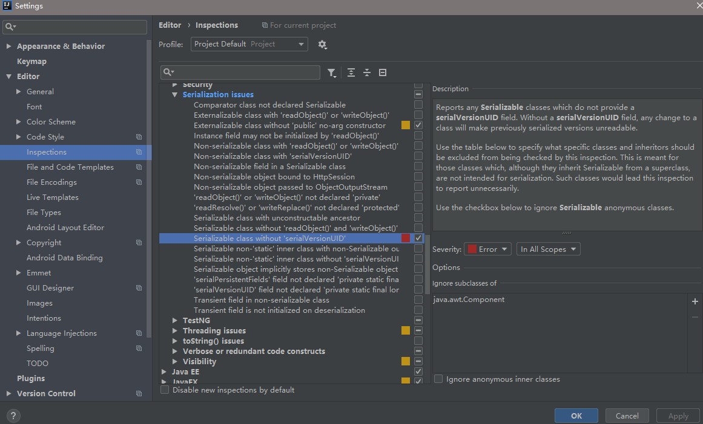

# 错误笔记---关于Java操作数据库的笔记

## 1.[java.lang.NoClassDefFoundError:com.mchange.v2.ser.Indirector]

- 分析:这是c3p0的一个错误信息，我们在下载 c3p0时候，zip压缩包中，有三个jar，其中一个 c3p0-x.x.x.jar，还有一个  mchange.......jar的文件，该错误原因就是缺少该jar;至于 该jar包的作用就是，一，解决上面的问题，二：本身作用，见，，，jar解压后的源码。
- 方案:mchange-commons-java-版本号.jar丢进项目的lib文件即可。

## 2.log4j URI is not registed

问题出现:

```xml
<?xml version="1.0" encoding="UTF-8" ?> <!DOCTYPE log4j:configuration SYSTEM "log4j.dtd">
<log4j:configuration xmlns:log4j="http://jakarta.apache.org/log4j/">
```

解决方案:

```xml
<!DOCTYPE log4j:configuration SYSTEM
        "http://logging.apache.org/log4j/1.2/apidocs/org/apache/log4j/xml/doc-files/log4j.dtd">
<log4j:configuration debug="true">
```

## 3.Mybatis在maven环境下通过class的映射失效

在maven的pom.xml中添加包含对应的映射文件

```xml
<!--解决mybatis的mapper配置映射找不到-->
    <build>
        <resources>
            <resource>
                <!--此处配置到java是因为mapper.xml文件在java目录-->
                <directory>src/main/java</directory>
                <includes><!--此处配置需要包含的映射文件,当然也可以直接用通配符-->
                    <include>com/github/mybatis/dao/*.xml</include>
                </includes>
                <filtering>false</filtering>
            </resource>
        </resources>
    </build>
```

## 4.Idea实现序列化接口没有自动生成序列号

设置: File | Settings | Editor | Inspections | Java | Serialization issues Java | Serialization issues | Serializable class without 'serialVersionUID'将其打勾并设置为Error等级,默认式warning等级