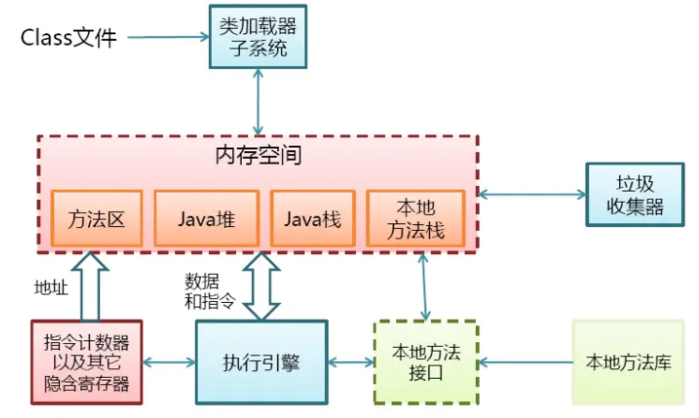
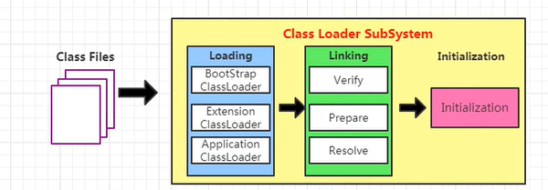
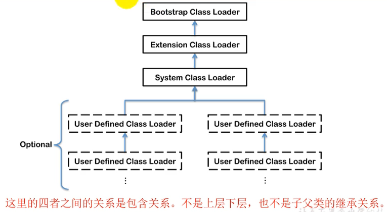
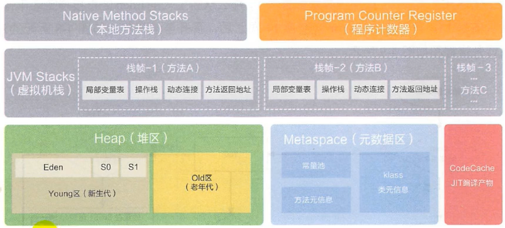

## JVM学习笔记

文档  https://docs.oracle.com/javase/specs/jvms/se8/html/

### 1.jvm简介

#### **1.1 HotSpot虚拟机-内存结构:**



#### **1.2 JVM的架构模型:**

	1. **基于栈式架构**:    设计简单 可移植性好 指令集小 零地址
 	2. **基于寄存器架构**:  高效  耦合度高  (传统PC  安卓的Davlik)

#### **1.3 生命周期:**

 1.  启动: 由引导类加载器(Bootstrap Class Loader)创建一个初始类(initial class)完成

 2.  执行: 真正执行的时候是一个jvm的进程,进程结束虚拟机也就结束了  (通过任务管理器可以查看到)

 3.  结束: ①正常代码运行结束    代码调用exit()/halt()等进行结束

     ②异常结束:  发生异常  操作系统错误

#### 1.4 jvm发展历程  

​	Sun Classic VM:  只提供解释器,效率比较低,第一款商用JVM,JIT编译器可以外挂但是只能二选一,所以为了让响应时间和运行效率取得平衡,注定被淘汰(jdk1.4)

​	Exact VM: jdk1.2  热点探测 混合工作模式 

​    HotSpot VM: jdk6/8默认虚拟机  热点探测:计数器找到最具编译价值的代码,触发JIT/栈上替换

​    JRockit(BEA): 专注服务器,所以不包含解释器,速度快

​    J9(IBM): 定位与HotSpot接近,多用途

​    Azul VM / Liquid VM 高性能虚拟机

​    Apache Harmony 被吸收进Android SDK

​    Dalvik VM: 基于寄存器架构

​	Graal VM: 跨语言,可能是未来的


### 2. 类加载子系统

####     2.1 简图

 

作用: 负责Class文件加载(文件开头由特殊标识),只负责加载

#### 	2.2 加载(Loading)

```
1. 通过全类名获取定义此类的二进制流
2. 将这个字节流所代表的静态储存结构转化为方法区的动态结构
3. 在内存中生成一个代表这个类的java.lang.Class对象,作为方法区这个类的入口

补充: (加载文件来源)
本地直接加载 压缩包 动态代理 其他文件生成(JSP等)  数据库 加密解密
```

​	2.2.1类的加载器

```
1. 引导类加载器:非java编写,
   --加载核心类库(只加载java/sun/javax开头的类)
   	 jre/lib/rt.jar  resource.jar  或 sun.boot.class.path
   --加载 扩展类 和 系统类 加载器
    
2. 自定义加载器: 派生于Abstract ClassLoader的加载器
   extClassLoader:jre/lib/ext加载 ,自定义的jar包也可以加载
   applicationClassLoader:classpath下加载类
   自定义:
   		--为什么? 
   		隔离加载类--中间件隔离
   		修改类加载方式--
   		扩展加载源--数据库等
   		防止源码泄露--代码加密/解密
 3. 获取方式
 	1. clazz.getClassLoader();
 	2. Thread.currentThread().getContextClassLoader()
 	3. ClassLoader.getXXX();
 	4. 
 4. 双亲委派机制(按需加载)
 	Ⅰ.一个加载器收到加载请求,发往父类加载器
 	Ⅱ.直到顶层加载器如果可以加载,则完成加载并返回,如果不能,子类才会尝试加载(还可以反向委派)
 	好处: 避免重复加载 安全(防止篡改核心api) 沙箱安全机制
 5. 其他	
 	1.判断两个内存中类是不是相同的必要条件:-全类名相同 -加载器相同
 	2.假如一个类是用户类加载器加载的,jvm会将这个类加载器的一个引用作为类型信息的一部分保存在方法区中
	3.类的主动使用和被动使用(不会导致初始化)
		主动:	
		-创建类的实例
		-访问类的静态变量
		-调用静态方法
		-反射
		-初始化子类
		-标明为启动类的类
		-JDK7动态语言的支持
	
 	
```



#### 	2.3 链接(Linking)

```
Ⅰ. 校验(verify):确保符合规范,主要四种校验: 文件格式,元数据,字节码,符号引用
Ⅱ. 准备(prepare):为类变量赋初值(默认值) 不包括final修饰的static常量,不包括实例变量
Ⅲ. 解析(resolve): 常量池的符号引用转化为直接引用
```

####     2.4 初始化(initial)

```
  类构造器的初始化<clinit>()过程,javac编译器自动收集所有类变量的赋值语句和静态代码块合并  顺序执行(没有类变量就没有该方法)
  假如有父类,会先执行父类<clinit>
  必须保证<clinit>多线程同步加锁,原因类变量共享
<init> 	对应构造器
```

### 3.运行时数据区(Runtime Data Area)

#### 3.1 图例



```
堆 方法区(元空间) 线程共享      pc,栈,本地栈 线程一份
一个jvm实例对应一个Runtime实例

JVM里面的线程:支持多线程,每个线程与本地线程直接映射,调度由操作系统决定
	-虚拟机线程:
	-周期任务线程:
	-GC线程:
	-编译线程:
	-先好调度线程:
```

#### 3.2 PC寄存器

```
1. 是对物理寄存器的模拟,记录下一条指令的地址,由搜索引擎读取下一条指令.
2. 每个线程一份,体积很小
3. 唯一一个没有规定任何OutOfMemory的区域,也没有GC
4. 作用: 
	jvm字节码解释器通过改变pc寄存器明确下一条指令的执行地址
	java支持多线程,当线程切换时,就必须保存线程的上下文(线程私有)
```

#### 3.3 虚拟机栈

##### 3.3.1 简介

```
由于跨平台,jvm选择用栈设计指令,指令集小,容易实现,缺点:性能下降
栈是运行单位,堆是存储单位
Java虚拟机栈 线程私有,每一次方法调用对应一个栈帧
作用: 主管Java程序的运行,保存方法的局部变量,部分结果,参与方法调用与返回
优点: 速度快,仅次于PC寄存器,操作简单,没有GC (存在OOM)

常见异常OOM StackOverflowError(直接递归调用自己可以看到)
-Xss 设置栈大小
文档参考  https://docs.oracle.com/en/java/javase/11/tools/java.html
```

##### 3.3.2 栈的存储单位

**-栈帧(Stack Frame)** 在线程上每个方法对应一个栈帧,栈帧是一个内存块,是一个数据集

```
原理:
	在一条活动线程中,一个时间点上,只会有一个活动的栈帧.该帧叫当前栈帧,对应的方法叫当前方法,定义该方法的类叫当前类
	执行引擎运行的指令只针对当前栈帧
	如果调用别的方法会有新的栈帧入栈,成为新的当前栈帧
	执行结束弹出栈帧,结果放入次栈帧,(return 或者 抛出未捕获异常 都会结束方法)
```

**-栈帧的内部结构**

```
-局部变量表(local variables):
	1.定义为数字数组,存储方法参数和方法体内局部变量(8种基本类型,引用类型,returnAddress类型变量)
	2.大小在编译期已经确定
	3.slot 变量表的存储单位,32位以内占一个slot,64位以内占两个slot(long,double)
	4.对于构造方法和实例方法,会在index0处放入this引用
	5.slot可以重复利用,假如前面有变量超出作用域,那么它原本占据的slot可以被重新利用
	6.必须初始化才能使用(相比之下,成员变量会有默认值)
	7.总结: 与性能调优密切相关,表中变量是垃圾回收的根节点,直接/间接引用的对象都不会被回收
-操作数栈(operand stack)
-动态链接(dynamic linking)
-方法返回地址(return address)
-附加信息
```


