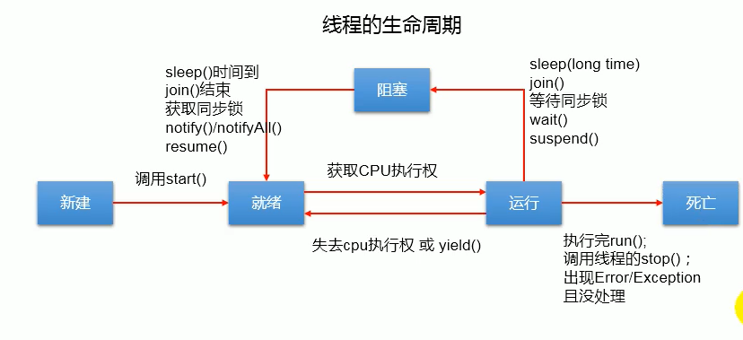

1.	JDK JRE JVM之间的关系

​	jdk = jre+ Java开发工具(javac.exe java.exe 等) bin lib db include jre 等

​	jre = jvm+Java核心类库

​	jvm

---


## 2.  标识符相关

### 1. **命名规则:字母 _ $ 数字,数字不能开头**

### 2. **命名规范:**

   1. package xxxx
   2. class XxxxYyy  
   3. int  xxxYyyZzz
   4. final  XXX_YYY

### 3. **关键字,保留字都是小写**

---

   

## 3.类型转换

   ### 	**1. 7种基本类型之间转换**


 ### 2. **8种类型和string类型(引用类型)之间用 + 是连接**

 ### 3. **包装类Wrapper	对应8种基本类型**

    1. 原因:希望基本数据类型也有面向对象的功能,特点(继承,封装,多态),统一起来
    2. 除了character 和Boolean,其他包装类都有共同父类,Number
    3. 相互转换  基本数据类型  包装类  String类
    
    ```java
    //这里以int类型为例子
    
    //int --> Integer 		构造器,自动装箱
    int i=1; 
    Integer integer  = new Integer(1);
    new Boolean("fasdklfjalsd");//false
    
    // Integer --> int		intValue(),自动拆箱(jdk5.0)
    i = integer.intValue();
    
    // int  -- >  String	连接+,valueOf(),包装类toString
    String s = i+"";
    s = String.valueOf(i);
    
    // String --> int		parseInt(Integer类的)
    i = Integer.parseInt(s);
    ```
    
    4. **Integer**
    
    ```java
    //有一个IntegerCache内部类,从-128到127
    //自动装箱时候可以直接从里面获取
    ```
    
    ---


​    

## 4.运算符

### 1. **++操作 ,+= , ?:**

```java
 byte i = 0;
  i = i++;
//+=  ++  操作不会改变数据类型
Object obj = true?new Integer(1):new Double(2);//1.0 原因:自动类型提升
```

- 执行过程//入栈 操作 出栈
 ```java
     0:   iconst_0     //生成整数0
      1:   istore_1     //把0复制给一号存储单元,变量i
      2:   iload_1      //i的值（0）进栈
      3:   iinc    1, 1  //#1加1,（注意：这里是#1加1而不是i加1）
      
      6:   istore_1    ///把栈顶元素（第二步的0）出栈，放到#1,这时#1又改为了0
      7:   getstatic       #2; //Field java/lang/System.out:Ljava/io/PrintStream;
      10:  iload_1      //i的值（0）进栈
      11:  invokevirtual   #3; //Method java/io/PrintStream.println:(I)V
      14:  return
 ```

### 2. **变量交换**

   ```java
   //1.中间变量
   //2.减法--->可能溢出,局限与能使用数值加减的类型
   num1 = num1 + num2;
   num2 = num1 - num2;
   num1 = num1 - num2;
   //3.a = a^b^b
   num1 = num1 ^ num2;
   num2 = num1 ^ num2;
   num1 = num1 ^ num2;
   ```

---

   

## 5.类 及 类的结构

 ### 1. **局部变量和属性**

     	1. 声明位置不同
      2. 默认值不同,属性有默认值,默认值参照xmind图
      3. 作用域不同
      4. 权限修饰
      5. 内存:非静态属性在堆中, 局部变量在jvm栈里面,静态属性在方法区

 ### 2. **可变形参 jdk5.0加入**

    本质就是数组
    
    - 值传递机制  值类型和引用类型
    
    - 属性赋值顺序  :    默认初始化->显示初始化/代码块->构造器->set方法
    
    - this() 要放在构造器内首行,参数少的调用参数多的

 ### 3. **多态性只适用于方法,不适用于属性**

       1. 多态是运行时行为 动态绑定(运行时期绑定方法)
       2. 重载和重写对比
    
      | 区别点   | 重载方法 | 重写方法                                       |
      | :------- | :------- | :--------------------------------------------- |
      | 参数列表 | 必须修改 | 一定不能修改                                   |
      | 返回类型 | 可以修改 | 一定不能修改                                   |
      | 异常     | 可以修改 | 可以减少或删除，一定不能抛出新的或者更广的异常 |
      | 访问     | 可以修改 | 一定不能做更严格的限制（可以降低限制）         |

 ### 4. Object类 及常用方法


```java
	public final native Class<?> getClass();
	public native int hashCode();
//比较的是地址
    public boolean equals(Object obj) {return (this == obj);}
	public String toString() {return getClass().getName() + "@" + Integer.toHexString(hashCode());  }
	public final native void notify();
```

​		**`1.==和equals的区别`**

   - ==运算符	 可以是用在基本数据类型和引用数据类型之间(类型可以不一致)

        - 基本类型比较 比较的是内容,会有自动类型提升
        - 引用类型比较 比较的是地址

     ```java
     	10 == 10.0//true
         (char)65 == 'A'//true
     ```

- equals方法     对象调用,不能使用在基本数据类型间,但是它可以重写

### 5. **static关键字**
   + 修饰 属性 方法 内部类 代码块	//常见用于共享的属性(常量....),工具类
   + 不可以调用this() super()
   + 有默认值
   + Singleton
### 6. **abstract 和 interface(模板方法设计模式)**
   + abstract 可以修饰类 和 方法   
     + 类不可以实例化,仍然有构造器,子类可以调用
     + 抽象方法父类不实现,由子类实现

```java
//利用抽象类实现 模板方法设计模式
abstract class Template{	//计算可变部分执行时间
    public long spendTime(){
        long start = System.currentTimeMillis();
        code(); 			//可变部分
        long end = System.currentTimeMillis();
        return end-start;
    }
    public abstract void code();
}
class TemplateImpl extends Template{
    @Override
    public void code(){
        //......
    }
}

```

- interface 抽取相同的行为特征(代理模式,

  - JDK7 (全局常量和抽象方法)      JDK8(增加了静态方法 和 默认方法)    接口支持多继承
  - 在继承和默认方法中同名方法,类优先,子类重写方法可以对应多个接口的同名同参方法(InterfaceName.super.methodName调用接口默认方法);而属性名相同会报错

- 比较

  相同点:

  都位于继承的顶端,用于被其他实现或继承;

  都不能实例化;

  都包含抽象方法,其子类都必须覆写这些抽象方法;

  区别:

  抽象类为部分方法提供实现,避免子类重复实现这些方法,提供代码重用性;接口只能包含抽象方法;

  一个类只能继承一个直接父类(可能是抽象类),却可以实现多个接口;(接口弥补了Java的单继承)

```java
//代理模式
interface NetWork{
    public void browse();
}
// 被代理类
class Server implements NetWork{
    @Override
    public void browse(){
        System.out.println("Server access NetWork");
    }
}
//代理类
class ProxyServer implements NetWork{
    private NetWork work;
    public ProxyServer(NetWork netWork){
        this.work = netWork;
    }
    public void check(){
        System.out.println("check before accessing network");
    }
     @Override
    public void browse(){
        check();
        work.browse();
    }
}
```

### 7. **内部类**

   1. 作为外部类的成员  可以调用外部类的结构,可以被static修饰,可以被四种权限修饰
   2. 作为类 可以定义属性方法构造器等,可以被final,abstract修饰

*****

   

## 6.异常

1. "抛":   throw  代码异常处抛出一个异常对象,往下代码不再执行
2. "抓":   try-catch-finally        throws
3. 子类抛出的异常不能大于父类 -->如果父类的方法没有写throws,则子类要try-catch
4. 方法a中调用了几个递进的方法,在a中用一个try-catch处理
5. 自定义异常不可带泛型

---------


## 7.多线程

	### 1. 线程 与 进程

> **进程——资源分配的最小单位**  	 程序是指令的有序集合，其本身没有任何运行的含义，是一个静态的概念。而进程是程序在处理机上的一次执行过程，它是一个动态的概念	
>
> **线程——程序执行的最小单位**	线程是操作系统进程中能够并发执行的实体，程序内部的一条执行路径,是处理器调度和分派的基本单位。

### 2. **线程的创建 (4中方法)与使用**

```java
// 1.继承Thread类 可以使用匿名子类
调用start():(一个线程对象只能start一次)
直接调用run()就是一个普通的方法
    
// 2.实现 Runnable接口
new Thread(new RunnableImp()).start();
    对比: 1.共享数据,推荐实现
        2.没有单继承的局限性
// 3.实现Callable接口	jdk5.0
FutureTask ft = new FutureTask(new CallableImpl());
new Thread(ft).start();
	对比: 1.有返回值	2.可以抛出异常  3.支持泛型	4.需要借助FutureTask获取返回结果
        
// 4.线程池 提高响应速度,降低资源消耗,便于管理
        //要关闭
Executors 工具类
ExecutorService.submit/execute	//适合Callable /Runnable
```

```java
//Thread中的常用方法
/**
*	1.start()	表示 开启线程;调用run方法
*	2.run()		要执行的操作重写在这里
*	3.currentThread()	静态方法,返回执行当前代码的线程
*	4.get/setName()		线程名
*	5.yield()	释放CPU的占用权
*	6.join()	a等待调用join()的对象b执行完再执行,a进入阻塞状态
*	7.sleep()
*	8.get/setPriority()	获取/设置线程优先级(1-10)
*/
```

### 3. **线程的生命周期**

```java
//Thread的内部类
public enum State {
    NEW,RUNNABLE,BLOCKED,WAITING,TIMED_WAITING,TERMINATED;
}
```



### 4. **同步机制** 

   1. 原因:并发问题,一个线程操作未完成,另一个线程也进来操作
   2. 方案:同步机制   局限性:效率低,死锁

   ```java
   //同步代码块						//多个线程共享同一个锁
   synchronized(同步监视器){		//监视器	->	继承用类 实现用对象
   	//操作共享数据的代码						//类.class	this 	
   }
   
   //同步方法						//把操作封装在一个方法中
   //加上关键字 synchronized		继承方式要加上static
   
   //lock  jdk5.0 ReentrantLock
   
   >>>对比:lock手动释放锁,灵活一点
   ```

### 5. **线程通信**

```java
//wait()        			进入阻塞状态,会释放锁,但是sleep不会
//notify() notifyAll()     	 唤醒
    /**注意点
    1.必须放在同步代码块或者同步方法里面
    2.调用对象必须是同步锁
    3.这些方法是在Object里面的
    */

			wait	和	sleep比较:
同:调用之后使线程进入阻塞状态
异:1.声明位置:Object			Thread
   2.调用要求:同步代码块内	任意位置
   3.监视器	释放			不释放
```

--------

## 8.常用类

### 1. **String类**

```java
public final class String
    implements java.io.Serializable, Comparable<String>, CharSequence {
    /** The value is used for character storage. */
    private final char value[];
    /** Cache the hash code for the string */
    private int hash; // Default to 0
    通过字面量的赋值方式,该字符串会放在方法区的字符串常量池中,而常量池中不会存储相同的字符串
	1.不可继承,代表一个不可变的字符序列
    2.是常量,创建之后不可更改
    3.	更改内容不可以在原来的value数组进行改变;
    	拼接操作也会有新的内存区域赋值
         替换操作	
```

- 初始化  字面量	new 构造器

  ​			一个对象	两个对象

- 拼接操作        字面量连接还是在常量池中,有变量名就会在对空间开辟,intern()方法会返回常量池的地址

```java
//一个例子
String s1 = "abc";  //字面量的定义方式
String s2 = "abc";
System.out.println(s1 == s2);//true
s2="hello";
System.out.println(s1); 	//abc ,体现了不可变性
```

- 常用方法 查看文档
- 转换  

```java
//跟包装类转换,参考前面
//跟char[]  转换
s.toCharArray()  ----  new String(char[] arr)
//跟byte[]  转换       编码/解码
s.getBytes()	-----  new String(byte[] arr,charset)
```

### 2. **StringBuild StringBuffer**

- 比较	建议:指定大小,避免扩容	

  | String             | StringBuffer    | StringBuilder |
  | ------------------ | --------------- | ------------- |
  | 不可变             | 可变            | 可变          |
  |                    | 线程安全,效率低 | 不安全,效率高 |
  | final char[] value | char[] value    | char[] value  |
| 默认长度:          | length()+16     |               |
  | 扩容               | length<<1+2     |               |
  

### 3. **时间日期类**	**java.lang.System类提供了获取当前时间**

| <jdk8                                         | 格式化/解析                  |                                              |
| --------------------------------------------- | ---------------------------- | -------------------------------------------- |
| java.util/sql.Date                            | java.text.SimpleDateFormat   | java.util.Calendar                           |
| 两个构造器,两个方法<br />getTime(),toString() | 构造器<br />format()/parse() | 抽象类,子类构造器<br />getInstance() get/set |
| 时间戳来进行转换                              | 字符串   <-->  日期          |                                              |

| jdk8    java.time  | 方法是通用的 |         |
| ------------------ | ------------ | ------- |
| LocalDate          | LocalTime    | Instant |
| now()/of()/get/set | withXxxx()   | now()   |
|                    |              |         |

### 4. **比较器**

```java
	Comaparable              Comparator
    重写compareTo()			compare()
    自然排序					定制排序
```

5. 其它常用类

```java
System.exit() 	System.currentTimeMillis()
getProperty(...)
    
```

## 9.枚举类   注解

### 1. **枚举**	类的对象只有有限的

- 自定义枚举类  
- enum与Enum
  - Enum方法
    - valueOf()     values()  
- 实现接口的枚举类
  - 每个对象都Override

### 2. **注解**     参考https://www.runoob.com/w3cnote/java-annotation.html

> Java 注解（Annotation）又称 Java 标注，是 JDK5.0 引入的一种注释机制.Java 语言中的类、方法、变量、参数和包等都可以被标注。Java 标注可以通过反射获取标注内容。在编译器生成类文件时，标注可以被嵌入到字节码中。Java 虚拟机可以保留标注内容，在运行时可以获取到标注内容 。

+ 内置7个注解(3个在java.lang  4个在java.annotation)

```java
/**  作用在代码中的注解
@Override - 检查该方法是否是重写方法。如果发现其父类，或者是引用的接口中并没有该方法时，会报编译错误。
@Deprecated - 标记过时方法。如果使用该方法，会报编译警告。
@SuppressWarnings - 指示编译器去忽略注解中声明的警告。
    */

/**  元注解
@Retention - 标识这个注解怎么保存，是只在代码中，还是编入class文件中，或者是在运行时可以通过反射访问。
@Documented - 标记这些注解是否包含在用户文档中。
@Target - 标记这个注解应该是哪种 Java 成员。
@Inherited - 标记这个注解是继承于哪个注解类(默认 注解并没有继承于任何子类)
*/

/**
从 Java 7 开始，额外添加了 3 个注解:

@SafeVarargs - Java 7 开始支持，忽略任何使用参数为泛型变量的方法或构造函数调用产生的警告。
@FunctionalInterface - Java 8 开始支持，标识一个匿名函数或函数式接口。
@Repeatable - Java 8 开始支持，标识某注解可以在同一个声明上使用多次。
*/
```

### 2. Annotation组成部分 

```java
Annotation关联一个RetentionPolicy类对象和多个ElementType类对象
    
```

## 10. 集合框架

- **引入**
  - 数组存储的特点:长度 类型在初始化就确定了,有序可重复,插入\删除不适合

### 1. **常见集合的分类**

**Collection** 接口的接口 对象的集合（单列集合）
├——-**List** 接口：动态数组,用于替换原来的数组,元素按进入先后有序保存，可重复 
│—————-├ **LinkedList** 接口实现类， 链表， 插入删除， 没有同步， 线程不安全
│—————-├ **ArrayList** 接口实现类， 数组， 随机访问， 没有同步， 线程不安全
│—————-└ **Vector** 接口实现类 ,数组， 同步， 线程安全
│ ———————-└ **Stack** 是Vector类的实现类
|——-**Set** 接口： 仅接收一次，不可重复，并做内部排序
├—————-**HashSet** 使用hash表（数组）存储元素;可以存储null
│———————— **LinkedHashSet** 链表维护元素的插入次序
└ —————-**TreeSet** 底层实现为二叉树，元素排好序

**Map** 接口 键值对的集合 （双列集合）
├———**Hashtable** 接口实现类， 同步， 线程安全
├———**HashMap** 接口实现类 ，没有同步， 线程不安全,可以添加null-null
│—————–├ **LinkedHashMap** 双向链表和哈希表实现
│—————–└ **WeakHashMap**
├ ——–**TreeMap** 红黑树对所有的key进行排序
└———**IdentifyHashMap**

### 2. 常用方法 看文档
### 3. 注意事项

```java
//基本类型的数组会识别为一个,但是引用类型会拆开,只能是一个数组,
//多个的话依旧会识别为一个个对象
//原因,泛型不支持基本数据类型,底层直接将参数赋值给一个ArrayList<>的内部的数组,
//本质上还是操作参数传递的数组
        List list = Arrays.asList(new char[]{'1','2'});
```

### 4. **Iterator设计模式**

- 接口 Iterator -->方法 next()    hasNext()
- foreach 是取出元素复制给局部变量,修改的话注意值传递机制

### 5. **源码**

- List的实现类

```java
//ArrayList  jdk7
    transient Object[] elementData
    空参构造器 默认大小 10
    当添加后原来容量不够,扩容为1.5倍,然后复制到新的数组
			//jdk8
     空参构造器 默认{}
	第一次才创建底层数组,其余同上
        
//LinkedList
     双向链表,尾部插入
private static class Node<E> {
  E item;
  Node<E> next;
  Node<E> prev;

  Node(Node<E> prev, E element, Node<E> next) {
      this.item = element;
      this.next = next;
      this.prev = prev;
}}

//Vetor
	扩容为2倍,线程安全,其余跟ArriList没什么区别
```

- Set的实现类

```java
//HashSet --> 去重,查询
相对于Collection没有添加新方法
    1.无序性.添加顺序 != 数组中存储顺序
    2.不可重复性:需要重写Hashcode和equals方法
add()方法:
	先判断Hashcode() 再判断equals
	jdk7 头插式	jdk8 尾插式
//LinkedHashSet
作为HashSet的子类添加对象同时维护两个引用,指向前后添加的对象,遍历加快

//TreeSet 
1.add的类型必须一致
2.必须有比较器,用此来判断对象是否相同(添加时用到,而不是hashcode / equals)
 

```

- Map的实现类     key ->set    value->Collection    entry->set

```java
//HashMap jdk7 默认扩容2倍,并复制
实例化以后,底层创建了长度为16的一维数组Entry[] table
put() 首先调用key所在类的HashCode()计算key的哈希值,进过散列算法后得到Entry的索引位置,如果位置上为空,放入;
	不为空,比较哈希值:
		不同,头插法;
		相同,比较key的equals(),
			不同,头插法;
             相同,替换掉;
addEntry() 扩容:当size>=threshold && 该位置不为空,扩容为2倍
    			
//jdk8	
实例化后没有直接创建长度16的数组
数组时Node[]
第一次调用put()才实例化
当数组的某一个索引位置上的元素以链表的形式存在的数据个数>8 并且 当前数组长度>64
    时,索引位置上的所有数据改用红黑树存储
    

/**
DEFAULT_LOAD_FACTOR 默认负载因子 0.75
DEFAULT_INITIAL_CAPACITY 默认长度16
threshold 默认阈值 长度*负载因子:12
TREEIFY_THRESHOLD	bucket中链表长度大于该值,转化为红黑树:8
MIN_TREEIFY_CAPACITY	 桶中Node被树化时最小的hash表长度:64
索引位置计算用&

*/
  static class Node<K,V> implements Map.Entry<K,V> {
        final int hash;
        final K key;
        V value;
        Node<K,V> next;}     
//LinkedHashMap
static class Entry<K,V> extends HashMap.Node<K,V> {
        Entry<K,V> before, after;
        Entry(int hash, K key, V value, Node<K,V> next) {
            super(hash, key, value, next);
        }
    }
//TreeMap
按照key进行排序
//Hashtable-->properties
    key-value都是string类型,用于读取文件
```

-------

## 11.泛型

### 1. **引入** jdk5.0

+ 没有泛型时,容器类存在类型不安全,转换异常

- 允许在定义类.接口时通过一个标识表示类中的某个属性或方法的返回值,参数,这个标识就是**泛型**
- **泛型提供了编译时类型安全监测机制**

### 2. **注意点**

- 不能使用基本类型
- 默认时Object
- jdk7 菱形语法(类型推断)
- 泛型是要在对象创建的时候才知道是什么类型的

### 3. **自定义泛型**

```java
//泛型类/接口		
class A<E,T>{
    A(){}	//构造器
    E[] e = (E[]) new Object[10];
    //静态方法/属性 不可以使用类的泛型 -> 类加载时候不能确定类型
    //泛型不同的引用不可以相互赋值;
    //异常类不能是泛型,try-catch(T t)编译不通过
}
	//继承后子类可以 部分保留/擦除/自己增加

//泛型方法 跟泛型类没有半毛钱关系 --> 调用时可以确定类型
 public static <T> T method(T t){}

//通配符的使用
List<?> list = new ArrayList<String>();//不能添加,除了null,可以读取
List<? extends Object> list	// <=
List<? super String> list	//>=

```

------------

## 12.IO流 

### 1.**File类**

- 创建一个对象时,在内存层面的,无论实际文件存不存在,都不会报错,默认相对路径基于module

### 2. **流的分类**

- 根据传输单位  字节流(stream)               		字符流(reader/writer)
- 根据传输方向  输入流 (input)	                     输出流(output)
- 根据处理过程  节点流 (FileXxx)                     处理流(其它)

### 3. **使用注意**

- 使用后必须关闭,放在finally里面
- 读文件时候,文件必须存在,不存在会报异常    写文件则不用
- 先关闭外层流,再关闭内层流
- idea的junit在输入时候有问题,改用main方法测试就可以

### 4.  **常用流**

   + **缓冲流**(加快读写速度)	                 BufferedXxx

   + **转换流**(字节->字符转换)                  InputStreamReader OutputStreamWriter
   + 标准输入输出流(键盘/控制台)          System.in/ System.out/ System.err;可以使用System.setIn()修改标准输入输出
   + 打印流         PrintStream,PrintWriter 重载了很多print(),调System.setOut()修改输出
   + 数据流        用于读写基本数据类型的变量或者字符串,读写顺序要一致
   + **对象流**       
     1. **序列化**用ObjectOutputStream类保存对象/基本数据类型的机制,即允许把内存中的Java对象转换成与平台无关的二进制流
     2. 实现Serializable接口\Externalizable接口,并且提供public static final long serialVersionUID = 123321L;
     3. 假如不加序列化版本标识符,修改后,在反序列化时候可能识别不出原来的
     4. 内部属性也必须要都是能序列化的
     5. static,transient修饰的成员不参加序列化
   + 随机存取文件流      直接继承Object,即可以输入,又可以输出 , getFilePoint(),seek();默认会对文件从头覆盖;随机插入需要自己实现从指针处到结尾的复制

### 5. **字符集**(Unicode是统称)

- GBK   最多两个字节,用首位1标识一个字符两个字节
- UCS Transfer Fomat   一个字节0xxxxxxx  两个字节 110xxxxx 10xxxxxx  三个字节1110xxxx 10xxxxxx 10xxxxxx

### 6. **NIO2** jdk7 基于channel 可以自己了解

- Path接口    Paths工具类   Files

## 13.网络编程(web阶段)

### 1.目的

​	直接或者间接得通过网络协议与其他计算机进行通讯,需要了解ip和端口(定位主机,进程);协议(传输规则) 具体的知识细节查看网络原理

​	tcp(三次握手,四次挥手)  udp(

### 2.常用类

- InetAddress        代表一个IP地址  socket= ip+port,网络通信=socket通信
- Socket                步骤:创建连接的IP,port的socket,获取连接的流,发送数据,关闭
- ServerSocket     步骤:创建port的ServerSocket,accept(),获取连接的流,接收数据,关闭
- 由于是阻塞式IO,会在传输后不退出,需要手动关闭,socket.shutdownInputStream()...
- DatagramSocket UDP传输:发送端--创建DatagramSocket对象,再创建DatagramPacket对象,然后send,关闭
                                             接收端---创建DatagramSocket(port)对象,再创建DatagramPacket(buffer)对象,然后receiver
- URL                  统一资源定位符,用于标识网络上的一个资源,步骤:先获取连接url.getOpenConnection(),然后connect(),获取流,保存,关闭

## 14.反射Reflection

### 1.引入

- 反射被视为动态语言的关键,反射机制允许程序在执行期间借助于ReflectionAPI取得任何类的内部信息,并能操作类对象的内部属性及方法 

- 原理:类加载后,堆中会有一份Class类型的对象,包含了这个类的完整信息
  1. 类的加载过程:程序经过编译后会生成若干个.class文件,接着java.exe对某个字节码文件进行解释运行,相当于将某个类加载到内存中,这个就是类的加载,加载到内存中的类称为运行时类,就作为Class的一个实例

- 反射与封装的关系
  - 封装是将具体的实现细节隐藏，而把功能作为整体提供给类的外部使用，也就是说，公有方法能够完成类所具有的功能。
  - 反射是使得我们能去调类的方法,属性,(而调用私有结构是反射功能太强,我们可以用,但没必要)

### 2.常用类

java.lang.Class 描述类的通用类  (本质也是类,继承于Object)

```java
//获取实例的4种方式
Class<Person> clazz = Person.class
clazz = p.getClass()
clazz = Class.forName("包路径.Person")
clazz = this.getClass().getClassLoader().load("包路径.Person");
//Class的实例 可以是class,interface,[],int,innovation,void,[][]
数组只要维度和类型一致就是同一种类型;
classLoader加载资源文件时相对路径从src下开始
 
```


java.reflection.*  跟反射相关

```java
//常用方法
//1. 获取属性及其结构-->方法 ,构造器,异常都是类似的
clazz.getFields();//获取公共属性,包括父类的
clazz.getDeclaredFields();//获取类的所有属性,包括私有的
	field.getModifiers()//获取权限修饰符,返回的是int型
     Modifier.toString(modifiers)//将int转换为修饰类型
     field.getType()//获取属性类型

```


### 3.注意事项

- 步骤:获取Class对象clazz,利用clazz的方法去获取结构对象obj,再用obj调用方法,传入对象和参数(私有属性,需要先调用setAccessable)
- javabean中要求一个空参构造器  1.便于反射构造对象 2.子类继承默认调用

```java
Class clazz = Person.class
clazz.newInstance()//调用空参构造器,
clazz.getDeclaredConstructor(xx.class,xx.class).newInstance(xx,xx)//有参
```

### 4.代理模式(两个类实现同一个接口,由代理类管理被代理类)

```java
//动态代理
class ProxyFactory {//代理工厂
    /**
     * @param obj:被代理类
     * @Description: 根据被代理类获取代理类
     * @create: 2020/3/23 0023 21:50
     * @return: 代理类
     */
    public static Object getProxyInstance(Object obj) {
        Class clazz = obj.getClass();
        InvocationHandler handler = new MyInvocationHandler();
        ((MyInvocationHandler) handler).bind(obj);
        Object proxyInstance = Proxy.newProxyInstance(clazz.getClassLoader(), clazz.getInterfaces(),
                handler);
        return proxyInstance;
    }
}
//
class MyInvocationHandler implements InvocationHandler {
    private Object obj;//被代理类
    public void bind(Object obj) {
        this.obj = obj;
    }
    /**
     * @param proxy:  代理类
     * @param method: 代理类方法
     * @param args:   代理类方法需要的参数
     * @Description:  代理类被调用方法时候会调用invoke
     * @create: 2020/3/23 0023 22:03
     * @return: java.lang.Object
     */
    @Override
    public Object invoke(Object proxy, Method method, Object[] args) throws Throwable {
        //代理类对象调用的方法,即被代理类的方法
        Object invoke = method.invoke(obj, args);
        return invoke;
    }
}

```

## java8 新特性

### 1.Lambda表达式

```java
//匿名函数-->本质,是一个接口(只能有一个抽象方法)的实现子类对象
(o1,o2) -> {...}
参数列表 λ操作符 λ体
1.无参无返回 Runnable e = ()->{...}
2.有参无返回 Consumer c = (String s)->{...}
3.类型推断	Consumer  c = ( s)->{...}
4.一个参数	Consumer  c = s->{...} 
5.多条语句且有返回值 Comparator  c = (o1,o2)->{}
6.只有一条执行语句   Comparator  c = (o1,o2)->o1.compare(o2)
```

### 2.函数式接口

如果接口中只有一个抽象方法,那么这个接口就是函数式接口,对应的注解@FunctionalInterface

```java
//四大核心函数式接口
Supplier<T> { T get();}
Consumer<T> { void accept(T t);}
Function<T, R> { R apply(T t);}
Predicate<T> { boolean test(T t);}
```

### 3.方法引用

lambda的语法糖:当要调用的方法和lambda的抽象方法类型一致时,可以直接用

类/对象::方法进行赋值

```java
Consumer<String> con = System.out::println;//类::静态方法,对象::实力方法
//类::实例方法 s1.method(s2)
Comparator<String> c = (s1,s2)->s1.compareTo(s2)
c = String::compareTo;

//构造器引用,空参构造器对应Supplier::get
Supplier<Employee> e = Employee::new; e.get();//返回一个对象
//数组构造器,同上

```

### 2.StreamAPI

提供对容器数据的运算,过滤,规约 ....不存储,不改变,延迟操作

```java
//对象的4中创建方式
1. list.stream();list.parallelStream();
2. Arrays.stream()
3. Stream.of()
4. Stream.iterate();Stream.generate();
```

- 中间操作

  - 筛选.切片

    ```java
     stream.filter  | stream.limit  | stream.distinct |stream.skip
    ```

  - 映射

    ```java
    stream.map | stream.flatmap
    ```

  - 排序

    ```java
    stream.sorted
    ```

- 终止操作 

  - 匹配   allMatch  |  anyMatch  | foreach |  count  |   max  |  min
  - 规约   reduce   |
  - 收集   collect(Collectors.toXxx)

### 3.Optional类

创建对象  .of  | .ofNullable 

方法  orElse()   |   


​	

 

