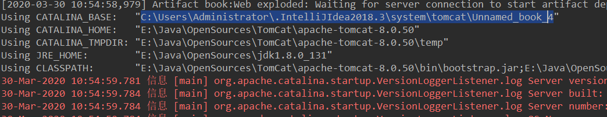
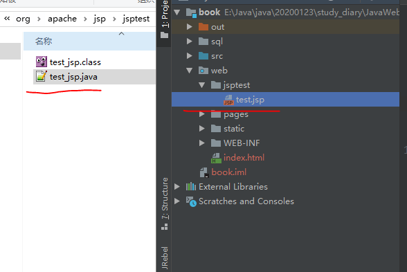
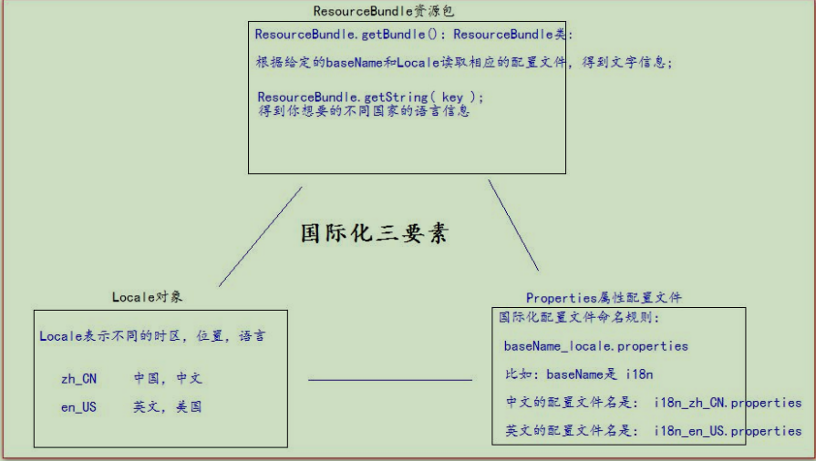

# JavaWeb核心技术

[w3c官网](https://www.w3school.com.cn/)

直接通过尚硅谷的书城项目直接练习,没有别的测试,笔记参考来源尚硅谷-王振国

## 1.Css+Html 见w3c文档

## 2.js  见w3c文档

## 3.jq 见pdf

## 4.xml 见w3c文档 dom4j 

## 5.Tomcat

### 		5.1 javaweb

			- java编写的代码通过服务器运行
			- 基于请求和响应(请求--客户端发起,响应--服务端)
			- 静态资源(html,css,js,txt,视频,图片等)  动态资源(jsp,Servlet程序,等)

**tomcat和servlet的对应关系**

| **Servlet Spec** | **JSP Spec** | **EL Spec** | **WebSocket Spec** | **JASPIC Spec** | **Apache Tomcat version** | **Actual release revision** | **Supported Java Versions**             |
| ---------------- | ------------ | ----------- | ------------------ | --------------- | ------------------------- | --------------------------- | --------------------------------------- |
| 4.0              | TBD (2.4?)   | TBD (3.1?)  | TBD (1.2?)         | 1.1             | 9.0.x                     | 9.0.0.M9 (alpha)            | 8 and later                             |
| 3.1              | 2.3          | 3.0         | 1.1                | 1.1             | 8.5.x                     | 8.5.4                       | 7 and later                             |
| 3.1              | 2.3          | 3.0         | 1.1                | N/A             | 8.0.x (superseded)        | 8.0.35 (superseded)         | 7 and later                             |
| 3.0              | 2.2          | 2.2         | 1.1                | N/A             | 7.0.x                     | 7.0.70                      | 6 and later (7 and later for WebSocket) |
| 2.5              | 2.1          | 2.1         | N/A                | N/A             | 6.0.x                     | 6.0.45                      | 5 and later                             |
| 2.4              | 2.0          | N/A         | N/A                | N/A             | 5.5.x (archived)          | 5.5.36 (archived)           | 1.4 and later                           |
| 2.3              | 1.2          | N/A         | N/A                | N/A             | 4.1.x (archived)          | 4.1.40 (archived)           | 1.3 and later                           |
|                  |              |             |                    |                 |                           |                             |                                         |

2.5-3.0版本基于xml配置,>3.0基于注解

- 使用startup.bat启动,假如JAVA_HOME配置错误,启动不了
- 使用catalina run启动,会有报错信息

### 5.2 部署方式

1. 直接将项目放在webapp下

2. 在catalinaconf/localhost下建立一个项目映射文件   XXX.xml

   ```xml
   <Context path="..." docBase="..."/>
   <!-- 
   	url= 协议://ip:port/path/source
   	Context 表示环境上下文
   	path  表示项目访问路径,就是跟在端口后面那部分,可以不和项目名称一样
   	docBase 真实的项目物理存储位置
   -->
   ```

3. 默认访问的是ROOT工程,访问的是index首页

4. idea中创建动态工程的一些问题

   - 没有web.xml文件

> 解决办法：
> 打开Project Structure，在facets中选中次级的web或者在Modules中选中web，在deployment Descriptors面板里，点击 +号选择web.xml以及版本号。然后在弹出的对话框中修改xml默认的目录，加上web就可以了。

## 6. Servlet

### 6.1 Servlet是什么

- Java EE规范之一(接口)
- JavaWeb三大组件之一(还有Filter,Listener)
- 运行在服务器的Java程序,接收请求,发出响应

### 6.2 使用

1. 编写一个类,实现Servlet接口
2. 实现方法service()
3. 部署到服务器(在web.xml中配置)
4. 注意事项

- JavaSE没有自带相关的api,所以需要相关的jar包,在tomcat\lib\servlet-api.jar
- 在ServletMapping配置中url的  /  非常重要,缺了会报错

```java
java.lang.IllegalArgumentException: Invalid <url-pattern> [hello] in servlet mapping
```

- HttpServlet看源码是支持REST风格,在重写init(参数)的时候,要先调用父类的方法,原因是底层用了父类的config,要是没有调用的话,会有空指针异常;**建议重写init()方法**

### 6.3生命周期

1. 构造器 //应该是通过反射调用的
2. init       //第一次访问的时候调用,
3. service//可以多次访问,刷新网页即可,请求的区分需要用到HttpServletRequest
4. destroy//项目卸载,停止的时候调用

### 6.4常用类

#### 1. 继承体系

Servlet

​	---------| GenericServlet //基本是空方法的实现

​	---------| ---------| HttpServlet //重点实现service方法,获取请求方式,并实现请求的分发,但是本身只是抛出错误,所以需要重写

#### 2. **ServletConfig**     配置类,由tomcat自动创建,一个servlet对应一个config
   - 获取Servlet程序的别名
   - 获取初始化参数init-param
   - 获取ServletContext

#### 3. **ServletContext** 上下文类,一个工程只有一个

- 域对象:可以像Map一样存取数据的的对象,域指存取数据的操作范围
  - 获取web.xml中的context-param
  - 获取当前工程路径
  - 获取工程在服务器的绝对路径
  - 存取数据(生命周期同工程)

#### 4. **Http**

- Get请求
  - 请求行              方式  资源路径  协议/版本号
  - 请求头              键值对
- Post请求
  - 多了一个请求体   发送给服务器的数据
-  MIME (*M*ultipurpose *I*nternet *M*ail *E*xtensions) 是描述消息内容类型的因特网标准。具体对应参考手册(w3c)

#### 5. **HttpServletRequest类**

   1. 每次只要有请求进入 Tomcat 服务器，Tomcat 服务器就会把请求过来的 HTTP 协议信息解析好封装到 Request 对象中。 

      然后传递到 service 方法（doGet 和 doPost）中给我们使用。我们可以通过 HttpServletRequest 对象，获取到所有请求的 

      信息

   2. 可以获取请求的相关信息,比如请求参数,主机名,解决乱码问题

      1. get请求:     username = **new** String(username.getBytes(**"iso-8859-1"**), **"UTF-8"**);
      2. post请求  :    req.setCharacterEncoding(**"UTF-8"**);

   3. 请求转发:服务器收到请求后，从一次资源跳转到另一个资源的操作叫请求转发。

      1. 在同一个服务器内,url不会变,
      2. 请求对象是同一个,
      3. 访问地址开始为项目根路径,可以到WEB-INF下

   4. 引入:所有相对路径的解析会依据浏览器请求的url,web是基于项目路径,由于转发不会修改url,从而导致相对路径发生解析错误;

      ```html
      <base href="设置相对路径参照的地址值"/>  
      在实际开发中，路径都使用绝对路径，而不简单的使用相对路径。 1、绝对路径 2、base+相对
      ```

   5. Web中相对路径的解析

      > 在 web 中 / 斜杠 是一种绝对路径。 
      >
      > / 斜杠 如果被浏览器解析，得到的地址是：http://ip:port/ 
      >
      > <a href="/"> 斜杠 </a> 
      >
      > / 斜杠 如果被服务器解析，得到的地址是：http://ip:port/工程路径 
      >
      > 1、<**url-pattern**>/servlet1</**url-pattern**> 
      >
      > 2、servletContext.getRealPath(“/”); 
      >
      > 3、request.getRequestDispatcher(“/”); 
      >
      > 特殊情况： response.sendRediect(“/”); 
      >
      > 把斜杠发送给浏览器解析。得到 http://ip:port/
      >
      

      
      #### 6.HttpServletResponse类
      
       1. 每次请求过来,服务器都会创建一个该类对象用于返回数据(通过servlet处理后)
      
       2. 两个输出流的说明
      
          > 字节流 	 getOutputStream();	 常用于下载（传递二进制数据） 
          >
          > 字符流 	 getWriter();     			 常用于回传字符串（常用） 
          >
          > 两个流同时只能使用一个。 使用了字节流，就不能再使用字符流，反之亦然，否则就会报错。
      
      3. 响应时候默认是ISO字符集,需要先设置响应字符集
      
      ```java
      // 它会同时设置服务器和客户端都使用 UTF-8 字符集，还设置了响应头 
      // 此方法一定要在获取流对象之前调用才有效
      resp.setContentType("text/html; charset=UTF-8");
      ```
      
      4. 请求重定向
      
      - 客户端给服务器发请求，然后服务器告诉客户端说。我给你一些地址。你去新地址访问。叫请求重定向（因为之前的地址可能已经被废弃  302）。
      - 可以不在同一个服务器内,url会变,
      - 请求对象不是同一个,会有两次访问,
      - 访问地址开始为http,不可以到WEB-INF下

## 7.JSP

### 1.引入:

​	jsp 的全称是 java server pages。Java 的服务器页面。 jsp 的主要作用是代替 Servlet 程序回传 html 页面的数据。

### 2.本质

是一个Servlet程序;证明:第一次访问jsp页面的时候会生成对应的java和class文件,打开后发现类间接继承httpServlet;



```java
public final class test_jsp extends org.apache.jasper.runtime.HttpJspBase
    implements org.apache.jasper.runtime.JspSourceDependent,
                 org.apache.jasper.runtime.JspSourceImports {
```

底层也是回传数据给客户端

### 3.jsp的三种语法

#### 1. 头部指令

| <%@ page ... %>    | 定义网页依赖属性，比如脚本语言、error页面、缓存需求等等 |
| ------------------ | ------------------------------------------------------- |
| <%@ include ... %> | 包含其他文件                                            |
| <%@ taglib ... %>  | 引入标签库的定义                                        |

**1.1 这些属性会对应前面的产生的jsp对应的类中的属性**

| **属性**           | **描述**                                                     |
| :----------------- | :----------------------------------------------------------- |
| buffer             | 指定out对象使用缓冲区的大小                                  |
| autoFlush          | 控制out对象的 缓存区                                         |
| contentType        | 指定当前JSP页面的MIME类型和字符编码,表示 jsp 返回的数据类型是什么 |
| errorPage          | 指定当JSP页面发生异常时需要转向的错误处理页面                |
| isErrorPage        | 指定当前页面是否可以作为另一个JSP页面的错误处理页面          |
| extends            | 指定servlet从哪一个类继承                                    |
| import             | 导入要使用的Java类                                           |
| info               | 定义JSP页面的描述信息                                        |
| isThreadSafe       | 指定对JSP页面的访问是否为线程安全                            |
| language           | 定义JSP页面所用的脚本语言，默认是Java                        |
| session            | 指定JSP页面是否使用session                                   |
| isELIgnored        | 指定是否执行EL表达式                                         |
| isScriptingEnabled | 确定脚本元素能否被使用                                       |

---

1.1 Include指令

JSP可以通过include指令来包含其他文件。被包含的文件可以是JSP文件、HTML文件或文本文件。包含的文件就好像是该JSP文件的一部分，会被同时编译执行。

Include指令的语法格式如下：

```
<%@ include file="文件相对 url 地址" %>
```

**include** 指令中的文件名实际上是一个相对的 URL 地址。

如果您没有给文件关联一个路径，JSP编译器默认在当前路径下寻找。

等价的XML语法：

```
<jsp:directive.include file="文件相对 url 地址" />
```

------

Taglib指令

JSP API允许用户自定义标签，一个自定义标签库就是自定义标签的集合。

Taglib指令引入一个自定义标签集合的定义，包括库路径、自定义标签。

Taglib指令的语法：

```
<%@ taglib uri="uri" prefix="prefixOfTag" %>
```

uri属性确定标签库的位置，prefix属性指定标签库的前缀。

等价的XML语法：

```
<jsp:directive.taglib uri="uri" prefix="prefixOfTag" />
```

#### 2.脚本

2.1 声明脚本格式

```jsp
<%!
    声明 属性,静态代码块,类方法,内部类
    ----以上都会在对应的类中产生-----
%>
```

2.2 表达式脚本

```jsp
<%= 基本类型,字符串,对象%>

<% 作用是在jsp页面上输出数据
    表达式脚本的特点： 
    1、所有的表达式脚本都会被翻译到_jspService() 方法中 
    2、表达式脚本都会被翻译成为 out.print()输出到页面上
    3、由于表达式脚本翻译的内容都在_jspService() 方法中,所以_jspService()方法中的对象都可以直接使用。
    4、表达式脚本中的表达式不能以分号结束。%>

```

2.3 代码脚本

```jsp
<% java语句 %>
<%--
     代码脚本的特点是：
     1、代码脚本翻译之后都在_jspService 方法中 
     2、代码脚本由于翻译到_jspService()方法中，所以在_jspService()方法中的现有对象都可以直接使用。
     3、还可以由多个代码脚本块组合完成一个完整的 java 语句。 
     4、代码脚本还可以和表达式脚本一起组合使用，在 jsp 页面上输出数据--%>
```


#### 3.三种注释

```html
<!-- 会被翻译到out.write()中-->
// /*会被翻译到java源代码中*/
<%-- 可以注释掉所有代码--%>
```


###  4. jsp的9大内置对象

```java
//jsp对应的java类 截取
//请求对象         响应对象
public void _jspService(final javax.servlet.http.HttpServletRequest request, final javax.servlet.http.HttpServletResponse response)
        throws java.io.IOException, javax.servlet.ServletException {

    final javax.servlet.jsp.PageContext pageContext;//jsp页面上下文对象
    javax.servlet.http.HttpSession session = null;  //会话对象
    final javax.servlet.ServletContext application;//ServletContext对象
    final javax.servlet.ServletConfig config;		//ServletConfig对象
    javax.servlet.jsp.JspWriter out = null;			//输出流对象
    final java.lang.Object page = this;				//指向当前jsp的对象
    java.lang.Throwable exception=null;			//异常对象,需要设置isErrorPage

```

### 5. 4大域对象

```java
final javax.servlet.jsp.PageContext pageContext;//jsp页面上下文对象,页面内有效
final javax.servlet.http.HttpServletRequest request//请求对象,整个请求有效
javax.servlet.http.HttpSession session         //会话对象,浏览器打开到关闭
final javax.servlet.ServletContext application;//ServletContext对象,项目不卸载都有效
/*
从上往下,作用范围逐渐变大,我们使用的优先级也越低
*/
```

### 6.out和response.getWrite()区别

两者分别都有各自的缓冲区,当jsp页面中的所有代码完成后会执行以下两个操作:

- 执行out.flush()操作,将out缓冲区的内容追加写入的response缓冲区末尾
- 执行response的刷新操作,报数据写给客户端

由于 jsp 翻译之后，底层源代码都是使用 out 来进行输出，所以一般情况下。我们在 jsp 页面中统一使用 out 来进行输出。避免打乱页面输出内容的顺序。 

- out.write() 输出字符串没有问题 (输出整型发生错误,原因:直接将整型转成char,从而可能无法打印出来)

- out.print() 输出任意数据都没有问题（都转换成为字符串后调用的 write 输出）

### 7.jsp的常用标签

#### 7.1  静态包含

```jsp
<%@ include  file="/"%> ,/ 映射到项目根路径,web目录
静态包含的特点：
1、静态包含不会翻译被包含的 jsp 页面。
2、静态包含其实是把被包含的 jsp 页面的代码拷贝到包含的位置执行输出。
```

#### 7.2 动态包含

```jsp
<jsp:include page=""></jsp:include> 这是动态包含 
page 属性是指定你要包含的 jsp 页面的路径 
动态包含也可以像静态包含一样。把被包含的内容执行输出到包含位置 

动态包含的特点： 
1、动态包含会把包含的 jsp 页面也翻译成为 java 代码 
2、动态包含底层代码使用如下代码去调用被包含的 jsp 页面执行输出。 JspRuntimeLibrary.include(request, response, "/include/footer.jsp", out, false); 
3、动态包含，还可以传递参数
```


#### 7.3 jsp标签-转发

```jsp
<jsp:forward page=""></jsp:forward> 是请求转发标签，它的功能就是请求转发 page 属性设置请求转发的路径
```

### 8. 监听器Listener

#### 8.1J是什么

- JavaWeb三大组件之一,filter,servlet
- Listener 它是 JavaEE 的规范，就是接口 
- 监听器的作用是，监听某种事物的变化。然后通过回调函数，反馈给客户（程序）去做一些相应的处理。

####  8.2 **ServletContextListener** 监听器(共8个)

ServletContextListener 它可以监听 ServletContext 对象的创建和销毁。 

ServletContext 对象在 web 工程启动的时候创建，在 web 工程停止的时候销毁。 

监听到创建和销毁之后都会分别调用 ServletContextListener 监听器的方法反馈。

```java
public interface ServletContextListener extends EventListener {
    /*** 在 ServletContext 对象创建之后马上调用，做初始化 */ 
    public void contextInitialized(ServletContextEvent sce); 
    /*** 在 ServletContext 对象销毁之后调用 */ 
    public void contextDestroyed(ServletContextEvent sce);
```

```xml
<!--web.xml  配置监听器--> 
<listener> 
    <listener-class>com.atguigu.listener.MyServletContextListenerImpl</listener-class> 
</listener>
```


## 8.EL表达式

### 8.1 是什么

1. EL 表达式的全称是：Expression Language   表达式语言。
2. EL 表达式的什么作用：EL 表达式主要是代替 jsp 页面中的表达式脚本在 jsp 页面中进行数据的输出。因为 EL 表达式在输出数据的时候，要比 jsp 的表达式脚本要简洁很多。
3. EL 表达式的格式是：${表达式} 
4. EL 表达式在输出 null 值的时候，输出的是空串。jsp 表达式脚本输出 null 值的时候，输出的是 null 字符串。
5. 搜索域数据的顺序:     按照域的作用范围从小到大查询

### 8.2 使用细节

```jsp
1.对象  数组  List  集合    Map //属性查询,调用的是对应的get方法
  .		[]     []   .    . [""]
2.运算 逻辑运算 关系运算 算术运算 ?: 跟javase一样,也可以支持单词 eq,lt等
3.empty 可以判断一个数据是否为空  null,"",Object[0],List长度为0,Map长度为0
4.EL隐含对象
```

### 8.3 11个隐含对象

| 变量             | 类型                 | 作用                               |
| ---------------- | -------------------- | ---------------------------------- |
| pageContext      | PageContextImpl      | 获取jsp九大内置对象                |
| pageScope        | Map<String,Object>   | 获取pageContext域中数据            |
| requestScope     | Map<String,Object>   | 获取requestScope域中数据           |
| sessionScope     | Map<String,Object>   | 获取sessionScope域中数据           |
| applicationScope | Map<String,Object>   | 获取applicationScope域中数据       |
| param            | Map<String,String>   | 获取请求参数的值                   |
| paramValues      | Map<String,String[]> | 获取请求参数的值,多值时候使用      |
| header           | Map<String,String>   | 获取请求头参数                     |
| headerValues     | Map<String,String[]> | 获取请求头参数,多值时候使用        |
| cookie           | Map<String,Cookie>   | 获取cookie值                       |
| iniParam         | Map<String,String>   | 获取web.xml中的<context-param>参数 |

 ```jsp
---  pageContext的使用场景----
1协议： ${ pageContext.request.scheme }<br>
2.服务器 ip：${ pageContext.request.serverName }<br> 
3.服务器端口：${ pageContext.request.serverPort }<br>
4.获取工程路径：${ pageContext.request.contextPath }<br> 
5.获取请求方法：${ pageContext.request.method }<br> 
6.获取客户端 ip 地址：${ pageContext.request.remoteHost }<br> 
7.获取会话的 id 编号：${ pageContext.session.id }<br>
 ```

## 9.JSTL标签库

### 9.1 是什么

​		JSTL 标签库 全称是指 JSP Standard Tag Library JSP 标准标签库。是一个不断完善的开放源代码的 JSP 标签库。

​		EL 表达式主要是为了替换 jsp 中的表达式脚本，而标签库则是为了替换代码脚本。这样使得整个 jsp 页面变得更佳简洁。

### 9.2**组成**

| 功能范围        | URI                                   | 前缀 |
| --------------- | ------------------------------------- | ---- |
| 核心标签库      | http://java.sun.com/jsp/jstl/core     | c    |
| 格式化          | http://java.sun.com/jsp/jstl/fmt      | fmt  |
| 函数            | http://java.sun.com/jsp/jstl/function | fn   |
| 数据库---不使用 | http://java.sun.com/jsp/jstl/sql      | sql  |
| xml---不适用    | http://java.sun.com/jsp/jstl/xml      | xml  |

- 使用事项---要先导入对应的jar包

```jsp
<%@ taglib prefix="c" uri="http://java.sun.com/jsp/jstl/core" %>

<%--保存变量,很少使用--%>
<c:set scope="session" var="abc" value="abcValue"/>

<%--判断test后面的条件,使用EL表达式--%>
<c:if test="${ 12 == 12 }"> <h1>12 等于 12</h1> </c:if>

<%-- 类似switch,配合when使用 --%> 
<c:choose> 
    <!--不要使用html注释,会发生异常-->
    <c:when test="${ requestScope.height > 190 }"> <h2>小巨人</h2> </c:when>
    <c:otherwise></c:otherwise>
</c:choose> 

<%-- foreach --%> 
<c:forEach begin="1" end="10" var="i" varStatus="status"> <tr><td>第${i}行</td> </tr> </c:forEach>
<c:forEach items="${ requestScope.arr }" var="item"> ${ item } <br> </c:forEach>
这个status是一个内部类,可以获取当前遍历的状态,如当前遍历到的对象等,参看Interface LoopTagStatus(在jar包中)

```

## 10.文件上传/下载

### 10.1 上传步骤:

> 1、要有一个 form 标签，method=post 请求 
>
> 2、form 标签的 encType 属性值必须为 multipart/form-data 值 
>
> 3、在 form 标签中使用 input type=file 添加上传的文件 
>
> 4、编写服务器代码（Servlet 程序）接收，处理上传的数据。 
>
> encType=multipart/form-data 表示提交的数据，以多段（每一个表单项一个数据段）的形式进行拼 
>
> 接，然后以二进制流的形式发送给服务器

### 10.2 commons-fileupload.jar   commons-io.jar    常用类和API

```java
ServletFileUpload 类，用于解析上传的数据。 
FileItem 类，表示每一个表单项。
    
    boolean ServletFileUpload.isMultipartContent(HttpServletRequest request); 
	判断当前上传的数据格式是否是多段的格式。   
    public List<FileItem> parseRequest(HttpServletRequest request) 解析上传的数据
    boolean FileItem.isFormField() 判断当前这个表单项，是否是普通的表单项。还是上传的文件类型。
       							 true 表示普通类型的表单项 false 表示上传的文件类型 
    String FileItem.getFieldName() 获取表单项的 name 属性值
    String FileItem.getString() 获取当前表单项的值。 
    String FileItem.getName(); 获取上传的文件名 
    void FileItem.write( file ); 将上传的文件写到 参数 file 所指向抽硬盘位置 。

```

### 10.3下载  常用类和API

```java
response.getOutputStream(); 
servletContext.getResourceAsStream(); 
servletContext.getMimeType(); 
response.setContentType();

response.setHeader("Content-Disposition", "attachment; fileName=1.jpg"); 
这个响应头告诉浏览器。这是需要下载的。
而 attachment 表示附件，也就是下载的一个文件。fileName=后面， 表示下载的文件名。 
完成上面的两个步骤，下载文件是没问题了。但是如果我们要下载的文件是中文名的话。
你会发现，下载无法正确显示出正确的中文名。 原因是在响应头中，不能包含有中文字符，只能包含 ASCII 码。
    
//解决方式
String ua = request.getHeader("User-Agent"); // 判断是否是火狐浏览器
if (ua.contains("Firefox")) { // 使用下面的格式进行 BASE64 编码后
    String str = "attachment; fileName=" + "=?utf-8?B?" +
        		new BASE64Encoder().encode("中文.jpg".getBytes("utf-8")) + "?="; 
    // 设置到响应头中 
    response.setHeader("Content-Disposition", str); } 
else { // 把中文名进行 UTF-8 编码操作。
    String str = "attachment; fileName=" + URLEncoder.encode("中文.jpg", "UTF-8"); 
    // 然后把编码后的字符串设置到响应头中 
    response.setHeader("Content-Disposition", str); 
}
    
```

## 11.Cookie & Session

### 11.1Cookie

1. Cookie 翻译过来是饼干的意思。
2. Cookie 是服务器通知客户端保存键值对的一种技术。
3. 客户端有了 Cookie 后，每次请求都发送给服务器。 
4. 每个 Cookie 的大小不能超过 4kb

### 11.2创建与使用

```java
//1.创建  在服务器端创建cookie对象,添加到响应对象,通知客户端保存,每次都要调用
resp.addCookie(new Cookie("key","value"));//可以多次添加
//2.获取	
req.getCookies();
//3.生命周期
setMaxAge(int) //整数以秒为单位 负数关闭浏览器销毁  0立即销毁
//4.path过滤
path="/工程路径/路径"  //有点像servlet
    
```

### 11.3Session

1. Session是一个接口,用来维护一个客户端和服务端之间关联的一种技术
2. 每个客户端都有自己的一个Seeion会话
3. 经常用来保存用户登陆之后的信息

### 11.4创建与使用

```java
//1.创建和获取Session是一样的,第一次调用是创建
req.getSession()
//2. 判断是否为刚创建
isNew()
//3. 获取Id
getId()
//4. 往Session域对象中存取数据
req.getSession().setAttribute("key");
//5. 生命周期 不活跃指定时间长度后销毁 默认30分钟,两次请求之间的时间间隔
setMaxInactiveInterval(int)//负数永不超时
ivalidate()//马上失效
```

### 11.5表单重复提交

> 表单重复提交由三种常见的情况:
>
> 1. 提交完表单,服务器使用请求转发来进行页面跳转,这个时候刷新页面(F5)会造成表单重复提交问题;**解决方案:采用重定向进行跳转**
> 2. 用户正常提交,但是由于网络延迟等原因,用户会多次点击提交按钮
> 3. 用户正常提交,提交完成后,返回,重新提交

## 12.Filter过滤器(三大组件之一)

### 12.1 是什么

1. Filter 过滤器它是 JavaWeb 的三大组件之一。三大组件分别是：Servlet 程序、Listener 监听器、Filter 过滤器 
2. Filter 过滤器它是 JavaEE 的规范。也就是接口 
3. Filter 过滤器它的作用是：**拦截请求**，过滤响应。
4. 拦截请求常见的应用场景有： 
   1. **权限检查** 
   2. 日志操作 
   3. 事务管理 

### 12.2 怎么用

```java
//i 实现Filter接口	
doFilter()//实现拦截功能
filterChain.doFilter()//放行,很重要
//对web.xml进行配置,跟Servlet差不多    
    
//ii 生命周期
1.构造器 -> init -> doFilter -> destory
2.     工程开始      每次请求    工程结束
    
//iii  FilterConfig类 获取也写配置信息
//iv	FilterChain
1.默认执行在同一个线程中    
2.执行优先顺序是在web.xml中的配置顺序
3.使用同一个req对象
    
//v 拦截路径的匹配
1.精确匹配    /xxxx
2.目录匹配		/目录/*
3.后缀名匹配    /*.html
    
```

### 12.3ThreadLocal

1. jdk提供有文档,作用:解决多线程的数据安全问题
2. 它可以为当前线程关联一个数据(可以是变量,对象,数组等),一个对象关联一个,可以多个对象
3. 对象通常定义为static
4. ThreadLocal中保存的数据,在线程销毁后由jvm回收

## 13. JSON & AJAX & i18n

### 13.1 是什么

**JSON** (JavaScript Object Notation) 是一种轻量级的数据交换格式。易于人阅读和编写。同时也易于机器解析和生成。JSON 采用完全独立于语言的文本格式，而且很多语言都提供了对 json 的支持（包括 C, C++, C#, Java, JavaScript, Perl, Python 等）。 这样就使得 JSON 成为理想的数据交换格式。

- json 是一种轻量级的数据交换格式。 
- 轻量级指的是跟 xml 做比较。
-  数据交换指的是客户端和服务器之间业务数据的传递格式。

### 13.2 使用

```javascript
//js中的使用:由键值对组成,并且由{}包围,每个键用"",:分割键值, ,分割多个
var jsonObj={"key":1,"key2":"sss"}
//常用方法
JSON.stringify()
JSON.parse()

```

```java
//Java中使用,gson
Gson gson = new Gson(); 
String personJsonString = gson.toJson(person); //转成字符串
Person per = gson.fromJson(personJsonString, Person.class);//转成对象

Map<Integer,Person> personMap2 = gson.fromJson(personMapJsonString, new TypeToken<HashMap<Integer,Person>>(){}.getType());//转成集合/Map
```

### 13.3 Ajax是什么

- AJAX 即“**A***synchronous* **J***avascript* **A***nd* **X***ML*”（异步 JavaScript 和 XML），是指一种创建交互式网页应用的网页开发 技术。
- ajax 是一种浏览器通过 js 异步发起请求，局部更新页面的技术。
- Ajax 请求的局部更新，浏览器地址栏不会发生变化 
- 局部更新不会舍弃原来页面的内容

### 13.4 原生Ajax使用示例

```js
//在javascrip中使用
//1.获取XMLhttpRequest对象
var xmlhttprequest = new XMLHttpRequest();
//2.为open方法设置参数
xmlhttprequest.open("GET","http://localhost:8080/16_json_ajax_i18n/ajaxServlet?action=javaScriptAjax",true)
//3.在send方法前绑定onreadystatechange事件,写法比较固定
xmlhttprequest.onreadystatechange = function(){ if (xmlhttprequest.readyState == 4 && xmlhttprequest.status == 200) { var jsonObj = JSON.parse(xmlhttprequest.responseText);             
                                                                                                      // 把响应的数据显示在页面上                                                                
                                                                                                     document.getElementById("div01").innerHTML = "编号：" + jsonObj.id + " , 姓名：" + jsonObj.name; } } 
// 3、调用 send 方法发送请求
                                                                                                       xmlhttprequest.send();
```

- jQuery中的使用

  **$.ajax 方法** 

  url 表示请求的地址 

  type 表示请求的类型 GET 或 POST 请求 

  data 表示发送给服务器的数据 

  ​		格式有两种： 

  ​				一：name=value&name=value 

  ​				二：{key:value} 

  success 请求成功，响应的回调函数 

  dataType 响应的数据类型 

  ​				常用的数据类型有： 

  ​					text 表示纯文本 

  ​					xml 表示 xml 数据 

  ​					json 表示 json 对象

```js
//jQuery中的ajax
$("#ajaxBtn").click(function(){ 
    $.ajax({ 
        url:"http://localhost:8080/16_json_ajax_i18n/ajaxServlet", 
    	data:{action:"jQueryAjax"}, 
        type:"GET",
        success:function (data) {
            var jsonObj = JSON.parse(data); $("#msg").html("编号：" + data.id + " , 姓名：" + data.name); },
        dataType : "json" }); });
```

**$.get 方法和$.post 方法** 

url 请求的 url 地址 

data 发送的数据 

callback 成功的回调函数 

type 返回的数据类型

### 13.5  i18n国际化

1. 是什么

- 国际化（Internationalization）指的是同一个网站可以支持多种不同的语言，以方便不同国家，不同语种的用户访问

- 于是就有了我们说的国际化，国际化总的来说就是同一个网站不同国家的人来访问可以显示出不同的语言。但实际上这种需求并不强烈，一般真的有国际化需求的公司，主流采用的依然是苹果公司的那种方案，为不同的国家创建不同的页 面。所以国际化的内容我们了解一下即可。

- 国际化的英文 Internationalization，但是由于拼写过长，老外想了一个简单的写法叫做 I18N，代表的是 Internationalization 这个单词，以 I 开头，以 N 结尾，而中间是 18 个字母，所以简写为 I18N。以后我们说 I18N 和国际化是一个意思。

  