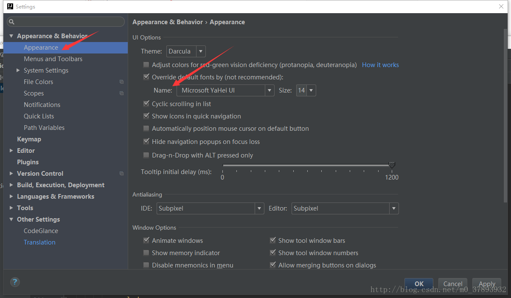
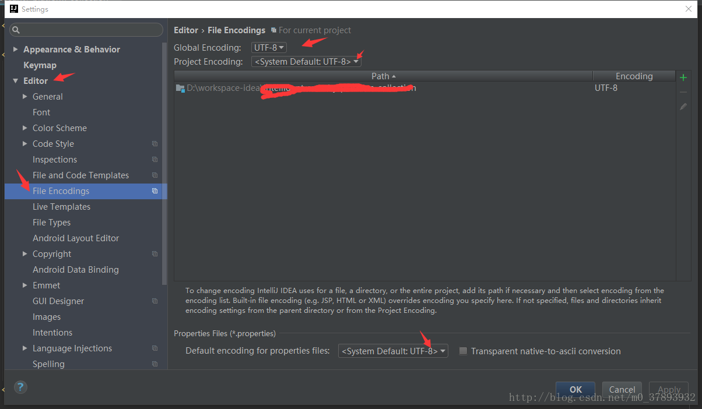
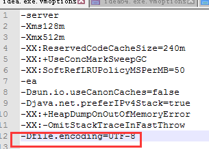
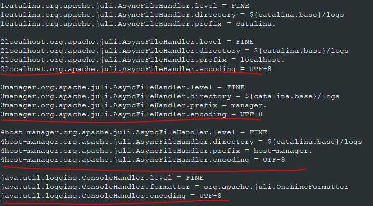
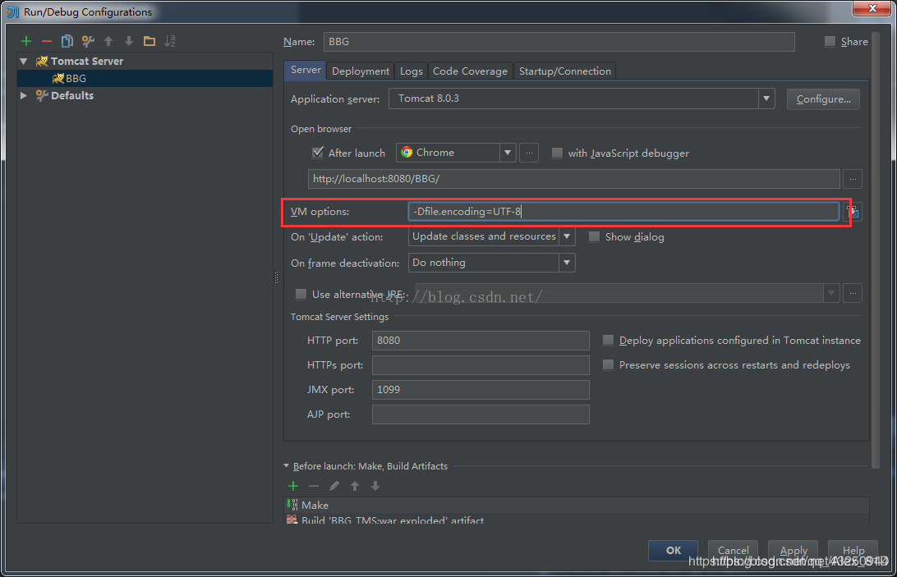

## 1.idea控制台乱码

#### 1.首先是编辑器的乱码，这个很好解决，file->settings->appearence里面有个Name设置成支持中文的字 体(这个很重要) 同样还要再settings中的Eidtor->File Encodings里面设置字体编码格式，一般都是UTF-8，GBK什么的也行。





### 2.找到idea安装目录bin目录下如下图所示两个文件，用编辑器打开，在文件末尾添加 -Dfile.encoding=UTF-8 ，然后重启idea，再打开流程图就会发现中文已经可以正常显示了。最好在Help->Edit Customer VM里面修改




## 2.tomcat整合时候乱码

#### 1. 控制台乱码

修改tomcat/conf/logging.properties



#### 2.tomcat的server.xml配置

(1) 添加 URIEncoding=“UTF-8”   

```xml
<Connector port="8080" protocol="HTTP/1.1"
               connectionTimeout="20000"
               redirectPort="8443" URIEncoding="UTF-8" />

<Connector port="8009" protocol="AJP/1.3" redirectPort="8443" URIEncoding="UTF-8"/>
```

(2)设置tomcat的 web.xml 

```xml
<servlet>
        <servlet-name>default</servlet-name>
        <servlet-class>org.apache.catalina.servlets.DefaultServlet</servlet-class>
        <init-param>
            <param-name>debug</param-name>
            <param-value>0</param-value>
        </init-param>
        <init-param>
        	<param-name>fileEncoding</param-name>
        	<param-value>UTF-8</param-value>
        </init-param>
        <init-param>
            <param-name>listings</param-name>
            <param-value>false</param-value>
        </init-param>
        <load-on-startup>1</load-on-startup>
    </servlet>
```

(3)idea中的server设置

-Dfile.encoding=UTF-8 




