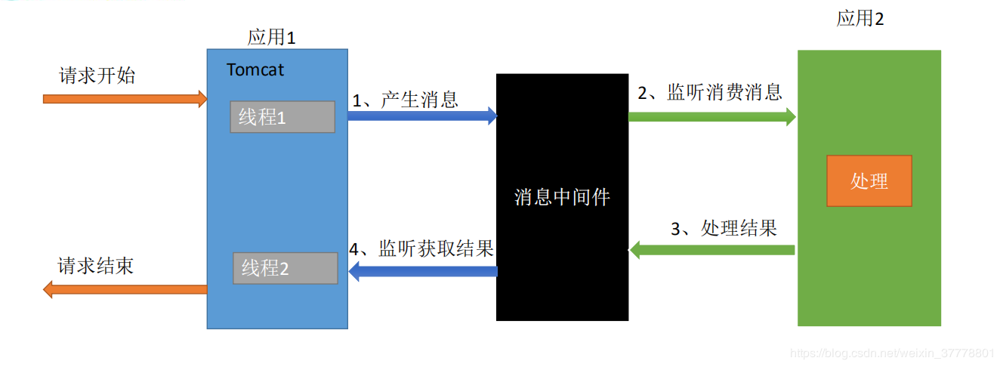

# Spring注解版

​											--------笔记来源:尚硅谷-雷丰阳

前置课程:seedling: spring基本学习  spring-mvc 

## 1. 容器-配置类

```java
//配置类
@ComponentScan(value = "com.github.spring.annotation",//指定要扫描的包
                excludeFilters = {@ComponentScan.Filter(type = FilterType.ANNOTATION,
                classes = {Controller.class, Service.class})}//指定要不扫描的类型的
)
@Configuration//配置类等同与配置文件
public class Config {
    @Scope
    @Bean("person")//告诉spring配置一个Person对象,id名为方法名
    public Person person() {
        return new Person("David", 1);
    }
}
```

```java
//main方法中
private AnnotationConfigApplicationContext ctx = new AnnotationConfigApplicationContext(Config.class);
```

### 1.1@ComponentScan  指定扫描的过滤规则

```java
public enum FilterType {
	ANNOTATION,//根据注解类型
	ASSIGNABLE_TYPE,//根据指定类型,包括子类也会算进去
	ASPECTJ,
	REGEX,
	/** Filter candidates using a given custom
	 * {@link org.springframework.core.type.filter.TypeFilter} implementation.
	 */
	CUSTOM//自定义类型,需要实现上面注释中的接口

}
```

### 1.2@Scope 指定单例,多例

```java
/*@Scope 中value取值
* @see ConfigurableBeanFactory#SCOPE_PROTOTYPE ----多例,获取对象的时候才实例化
* @see ConfigurableBeanFactory#SCOPE_SINGLETON ----单例,默认IOC创建就会实例化对象了,可以设置懒加载@Lazy
* @see org.springframework.web.context.WebApplicationContext#SCOPE_REQUEST ---request域
* @see org.springframework.web.context.WebApplicationContext#SCOPE_SESSION ---session域
*/
```

### 1.3@Conditional

```java
//@Conditional只有满足条件才能生效
public class WindowsCondition implements Condition {//实现该接口,在注解中用这个类,
    @Override
    public boolean matches(ConditionContext context, AnnotatedTypeMetadata metadata) {
        //1. 获取当前环境的bean工厂
        ConfigurableListableBeanFactory beanFactory = context.getBeanFactory();
        //2. 获取类加载器
        ClassLoader classLoader = context.getClassLoader();
        //3. 获取环境变量
        Environment environment = context.getEnvironment();
        //4. bean注册定义类
        BeanDefinitionRegistry registry = context.getRegistry();
        if (environment.getProperty("os.name").contains("Windows")){
            return true;
        }
        return false;
    }
}
```

### 1.4注册组件的方式

```java
@Controller 等注解
@Bean
@Import   	{@link Configuration}, //实现该接口
			{@link ImportSelector}, //实现该接口,返回全类名数组,不要返回null,会引发空指针异常
			{@link ImportBeanDefinitionRegistrar} //手动注册类
			{随便其他类}
@FactoryBean    
			1.默认获取到的是getObject返回的对象
             2.可以在getBean("&...")获取工厂本身
```

### 1.5生命周期

```java
1.@Bean(initMethod = "init", destroyMethod = "destroy")
//单例时候, 对象初始化完成后自动调用init方法,容器关闭销毁
//多例时候,关闭容器不会销毁
    
2.//通过实现以下两个接口也可达到上面的效果
org.springframework.beans.factory.InitializingBean
org.springframework.beans.factory.DisposableBean  
    
3.  //这两个注解见名知意
    javax.annotation.PostConstruct
    javax.annotation.PreDestroy
4. BeanPostProcessor //接口,完成一些后置处理工作  ,初始化工作前后,构造器后面  
```

## 2.容器-配置类的属性

### 2.1 @Value的使用

```java
//在类中的属性上
@Value    
//1.字面量 
//2.spel#{}   要在配置类上@PropertySource 添加资源文件路径,之后就可以直接使用了
//3.${}
```

### 2.2 自动装配-spring

```java
/**可以标注在  方法  构造器(有参会自动调用)  参数    */
@Autowired 	//优先按照类型,多个按照属性名

@Qualifier 	//指定id
@Primary	//自动装配的时候默认使用
```

### 2.3 自动装配-jsr

```java
@Resource 	//自动装配,默认按照组件名称
@Inject		//需要导入依赖inject  
```

### 2.4 XxxAware接口

```java
//获取spring底层的组件,自定义组件只需要实现对应的Aware接口
```

### 2.5@profile

```java
//Spring提供的根据当前环境,动态激发和切换一系列组件的功能
@Profile(标识)//只有跟标识一样,才会激活组件加入容器
激活方式:
1.命令行 动态虚拟机参数  -Dspring.profiles.active=标识
2.IOC容器		
    2.1   	获取空参IOC对象
    2.2		设置环境变量 ctx.getEnvironment().setActiveProfiles("标识")
    2.3		注册配置类	ctx.register(配置类)
    2.4 	刷新容器	ctx.refresh()
```

## 3.容器-AOP

### 3.1使用

-  在程序运行期间动态的且到指定代码指定位置运行[动态代理]

- 1.导入aop模块   spring-aspects

- 2.编写业务逻辑(演示:计算器类)

- 3.编写切面(演示:日志类),记得添加@Aspect

- 4.调用时机跟之前的spring一样,只是采用注解

  > - 前置通知@Befor 在调用目标方法前执行
  > - 后置通知@After  在调用目标方法后一定会执行
  > - 返回通知@AfterReturning  可以获取返回值
  > - 异常通知 @AfterThrowing  发生异常时候的通知
  > - 环绕通知@Around  手动推进通知

- 5.加入容器,并开启自动代理 @EnableAspectJAutoProxy

**注意点**:

> ```java
> //可以通过JoinPoint获取到代理方法的参数,注解等信息
> @Before("pointCut()")
> public void logStart(JoinPoint joinPoint) {
>     System.out.println("logStart...");
> }
> //返回值在注解的属性里,记得入参名字要和注解中的一样,异常也是洋洋处理
> @AfterReturning(value = "pointCut()", returning = "res")
>     public void logReturn(int res) {
>         System.out.println("logReturn..." + res);
>     }
> ```

### 3.2原理

```java
 /* 1.  @EnableAspectJAutoProxy要想aop生效,必须加入这个注解,查看这个注解
		   源码中含有@Import(AspectJAutoProxyRegistrar.class)给IOC容器导入这个类,查看这个类
		   利用AspectJAutoProxyRegistrar自动容器中注册bean(就是下面这个类)
		   AnnotationAwareAspectJAutoProxyCreator
*  2.   AnnotationAwareAspectJAutoProxyCreator这个类 以下是继承树
ProxyConfig (org.springframework.aop.framework)
ProxyProcessorSupport (org.springframework.aop.framework)
	**AbstractAutoProxyCreator (org.springframework.aop.framework.autoproxy)**
		AbstractAdvisorAutoProxyCreator (org.springframework.aop.framework.autoproxy)
			AspectJAwareAdvisorAutoProxyCreator (org.springframework.aop.aspectj.autoproxy)
				AnnotationAwareAspectJAutoProxyCreator (org.springframework.aop.aspectj.annotation)
2.1	**标注的那个类实现了这个后置处理器,和bean工厂接口
	SmartInstantiationAwareBeanPostProcessor, BeanFactoryAware 
	
2.2 流程:
	1.传入配置类,创建IOC容器
	2.注册配置类,refresh()容器(初始化bean)
	3.refresh中调用  registerBeanPostProcessors(beanFactory);注册bean后置处理器,方便拦截bean的创建
		Ⅰ.先获取ioc容器中已经定义了的需要创建对象的所有BeanPostProcessor
		Ⅱ.给IOC添加一些别的BeanPostProcessor
		Ⅲ.优先注册实现了PriorityOrdered接口的BeanPostProcessor,其次实现了Ordered接口,最后其他的BeanPostProcessor
		Ⅳ.注册BeanPostProcessor实际上就是创建BeanPostProcessor对象并保存在容器中
			①创建bean
			②给bean赋值
			③初始化bean	//下面的方法名称是简写,不是真正的类中名称
				<1>invokeAwareMethods()//处理aware接口的方法
				<2>调用后置处理器的beforeInitial()
				<3>invokeInitMethods() //真正处理init方法
				<4>调用后置处理器的afterInitial()
			④创建成功
		Ⅴ.把BeanPostProcessor注册到BeanFactory中,即beanFactory.addBeanPostProcessor(postProcessor)
========以上是	BeanPostProcessor创建和注册过程=========================================		
	4.finishBeanFactoryInitialization() //注册其他单例对象,完成BeanFactory初始化工作
	[InstantiationAwareBeanPostProcess是在bean实例之前尝试返回]
		Ⅰ.遍历容器中的所有Bean,依次创建对象(调用getBean(beanName)->doGetBean()->getSingleton())
		Ⅱ.创建Bean
			①先从缓存中获取,获取不到则创建
			②createBean() 
				<1>resolveBeforeInstantiation()//希望后置处理器返回一个代理对象,不能则继续执行
				<2>此时真正创建Bean实例,流程3.Ⅳ
					
InstantiationAwareBeanPostProcess作用:
1.每一个bean对象创建之前调用postProcessBeforeInstantiation();  以演示为例:
	关心MathCalculator和LogAspect
	Ⅰ.判断当前bean是否在advisedBeans中
	Ⅱ.判断当前bean是否是基础类型的Advice,Pointcut,Advisor,或者是切面
	Ⅲ.是否需要跳过
		①获取候选的增强器,即切面的通知方法
		②返回false
2.对象创建   
	<1>调用postProcessAfterInstantiation();  
    	return wrapIfNecessary();//返回包装类,如果需要的时候,
    	Ⅰ.获取当前bean的候选增强器
		Ⅱ.获取当前bean的能用的增强器
		Ⅲ.给增强器排序
	<2>保存当前bean到adviesedBeans中
	<3>如当前bean需要增强,则创建代理:
		获取增强器,保存到proxyFactory,创建代理对象(2种)
		1.Jdk类型
		2.cglib类型
	<4>给IOC添加cglib代理对象
3.目标方法的执行
	容器种保存了组件的代理对象,对象中有各种信息,包括通知信息,目标方法等
	<1>CglibAopProxy.intercept()
	<2>根据ProxyFactory获取目标方法的拦截器链
		①创建一个拦截器List,长度为增强器个数+一个默认增强器
		②遍历增强器,包装为拦截器,加入拦截器链
	<3>如果没有拦截器链,直接执行目标方法
	<4>有拦截器链,把需要执行的目标对象,方法,等信息传入创建一个CglibMethodInvocation对象并调用proceed
	<5>拦截器链的出发过程:
    	①一个记录当前拦截器索引的下标  默认-1 ,调用依次proceed+1
    	②调用mi.invoke(method),重复<5>
    	简而言之,利用递归调用方法,在递归最后调用前置方法,目标方法*/
```

## 4.容器-声明式事务

### 4.1  准备数据源  spring-jdbc  mysql驱动

```java
@EnableTransactionManagement//原理同AOP
@Configuration
public class TxConfig {
    //数据源
    @Bean
    public DataSource dataSource() throws PropertyVetoException {
        ComboPooledDataSource dataSource = new ComboPooledDataSource();
        // 配置用户名密码
        return dataSource;
    }
    //jdbc-template spring对Config类会特殊处理,多出调用都是找组件
    @Bean
    public JdbcTemplate jdbcTemplate() throws PropertyVetoException {
        return new JdbcTemplate(dataSource());
    }
    //创建一个事务管理器,必须有
    @Bean
    public PlatformTransactionManager transactionManager() throws PropertyVetoException {
        return new DataSourceTransactionManager(dataSource());
    }
}
//================================
    //在需要加事务的方法上@Transactional
```

### 4.2@EnableTransactionManagement原理

```java
/**
1.	利用Import导入  TransactionManagementConfigurationSelector这个又会导入两个组件
	AutoProxyRegistrar 和 ProxyTransactionManagementConfiguration
2.	AutoProxyRegistrar:给容器中注册InfrastructureAdvisorAutoProxyCreator
	利用后置处理器机制在创建对象后返回一个代理对象,含有增强器
3.  ProxyTransactionManagementConfiguration
	<1>给容器中增加事务增强器,要用事务注解的信息 AnnotationTransactionAttributeSource
	<2>添加事务拦截器 TransactionInterceptor,保存了事务信息,事务管理器
		它是一个MethodInterceptor,目标方法执行:
			执行拦截器链:
				执行事务拦截器:
					①获取事务相关属性
					②获取事务管理器,默认从IOC获取PlatformTransactionManager
					③执行目标方法,如果发生异常,利用事务管理器回滚
```

## 5. 拓展原理

### 5.1 BeanFactoryPostProcessor	

​	在BeanFactory标准初始化之后调用,所有的bean定义已经保存加载到BeanFactory中,实例还未创建,

1. ioc容器对象创建
2. invokeBeanFactoryPostProcessores()执行BeanFactoryPostProcessore.
   1. 直接在Bean Factory中找到所有类型式BeanFactoryPostProcessore对象
   2. 在初始化创建其他组件前面执行

### 5.2 BeanDefinitionRegistryPostProcessor

​	在所有bean定义信息将要被加载,bean实例还未创建,优先于5.1的,可以利用这个给容器添加一些组件

1. ioc容器对象创建

2. invokeBeanFactoryPostProcessores()执行BeanFactoryPostProcessore.

   Ⅰ.从容器中获取所有该类型的组件,触发方法postProcessBeanDefinitionRegistry

   再触发postProcessBeanFactory

   Ⅱ.触发其他的5.1

### 5.3 ApplicationListener

​	监听容器中发布的事件. 事件驱动模型的开发

```java
//ApplicationListener 监听器
//E extends ApplicationEvent 监听的事件
public interface ApplicationListener<E extends ApplicationEvent> extends EventListener
    
//事件
ContextClosedEvent 
ContextRefreshedEvent 
ContextStoppedEvent 
ContextStartedEvent 
//如何发布事件
    ctx.publishEvent(new ApplicationEvent())
```

1. ioc创建:refresh();

2. 结束的时候  finishRefresh();->publishEvent(new ContextRefreshedEvent(this));

   1. ```java
      //获取事件的多播器,获取派发事件
      getApplicationEventMulticaster().multicastEvent(applicationEvent, eventType);
      ```

   2. 获取所有的ApplicationListener,迭代:如果有excutor,可以使用异步派发,否则直接执行

3. 自己发布事件重复2.

[事件多播器]可以自己定义

********

**可以利用@EventListener快速实现监听器** 

​	类EventListenerMethodProcessor实现SmartInitializingSingleton接口:

1. 在所有单例bean创建完成后调用,在finishBeanFactoryInitialization()中调用:
   1. 先创建完成所有bean
   2. 获取所有实现Smart...接口的实例,调用afterSingletonsInstantiated()方法

----

### 5.4 IOC容器创建过程

```java
Spring容器的refresh()【创建刷新】;
1、prepareRefresh()刷新前的预处理;
	1）、initPropertySources()初始化一些属性设置;子类自定义个性化的属性设置方法；
	2）、getEnvironment().validateRequiredProperties();检验属性的合法等
	3）、earlyApplicationEvents= new LinkedHashSet<ApplicationEvent>();保存容器中的一些早期的事件；
2、obtainFreshBeanFactory();获取BeanFactory；
	1）、refreshBeanFactory();刷新【创建】BeanFactory；
			创建了一个this.beanFactory = new DefaultListableBeanFactory();
			设置id；
	2）、getBeanFactory();返回刚才GenericApplicationContext创建的BeanFactory对象；
	3）、将创建的BeanFactory【DefaultListableBeanFactory】返回；
3、prepareBeanFactory(beanFactory);BeanFactory的预准备工作（BeanFactory进行一些设置）；
	1）、设置BeanFactory的类加载器、支持表达式解析器...
	2）、添加部分BeanPostProcessor【ApplicationContextAwareProcessor】
	3）、设置忽略的自动装配的接口EnvironmentAware、EmbeddedValueResolverAware、xxx；
	4）、注册可以解析的自动装配；我们能直接在任何组件中自动注入：
			BeanFactory、ResourceLoader、ApplicationEventPublisher、ApplicationContext
	5）、添加BeanPostProcessor【ApplicationListenerDetector】
	6）、添加编译时的AspectJ；
	7）、给BeanFactory中注册一些能用的组件；
		environment【ConfigurableEnvironment】、
		systemProperties【Map<String, Object>】、
		systemEnvironment【Map<String, Object>】
4、postProcessBeanFactory(beanFactory);BeanFactory准备工作完成后进行的后置处理工作；
	1）、子类通过重写这个方法来在BeanFactory创建并预准备完成以后做进一步的设置
======================以上是BeanFactory的创建及预准备工作==================================
5、invokeBeanFactoryPostProcessors(beanFactory);执行BeanFactoryPostProcessor的方法；
	BeanFactoryPostProcessor：BeanFactory的后置处理器。在BeanFactory标准初始化之后执行的；
	两个接口：BeanFactoryPostProcessor、BeanDefinitionRegistryPostProcessor
	1）、执行BeanFactoryPostProcessor的方法；
		先执行BeanDefinitionRegistryPostProcessor
		1）、获取所有的BeanDefinitionRegistryPostProcessor；
		2）、看先执行实现了PriorityOrdered优先级接口的BeanDefinitionRegistryPostProcessor、
			postProcessor.postProcessBeanDefinitionRegistry(registry)
		3）、在执行实现了Ordered顺序接口的BeanDefinitionRegistryPostProcessor；
			postProcessor.postProcessBeanDefinitionRegistry(registry)
		4）、最后执行没有实现任何优先级或者是顺序接口的BeanDefinitionRegistryPostProcessors；
			postProcessor.postProcessBeanDefinitionRegistry(registry)
			
		
		再执行BeanFactoryPostProcessor的方法
		1）、获取所有的BeanFactoryPostProcessor
		2）、看先执行实现了PriorityOrdered优先级接口的BeanFactoryPostProcessor、
			postProcessor.postProcessBeanFactory()
		3）、在执行实现了Ordered顺序接口的BeanFactoryPostProcessor；
			postProcessor.postProcessBeanFactory()
		4）、最后执行没有实现任何优先级或者是顺序接口的BeanFactoryPostProcessor；
			postProcessor.postProcessBeanFactory()
6、registerBeanPostProcessors(beanFactory);注册BeanPostProcessor（Bean的后置处理器）【 intercept bean creation】
		不同接口类型的BeanPostProcessor；在Bean创建前后的执行时机是不一样的
		BeanPostProcessor、
		DestructionAwareBeanPostProcessor、
		InstantiationAwareBeanPostProcessor、
		SmartInstantiationAwareBeanPostProcessor、
		MergedBeanDefinitionPostProcessor【internalPostProcessors】、
		
		1）、获取所有的 BeanPostProcessor;后置处理器都默认可以通过PriorityOrdered、Ordered接口来执行优先级
		2）、先注册PriorityOrdered优先级接口的BeanPostProcessor；
			把每一个BeanPostProcessor；添加到BeanFactory中
			beanFactory.addBeanPostProcessor(postProcessor);
		3）、再注册Ordered接口的
		4）、最后注册没有实现任何优先级接口的
		5）、最终注册MergedBeanDefinitionPostProcessor；
		6）、注册一个ApplicationListenerDetector；来在Bean创建完成后检查是否是ApplicationListener，如果是
			applicationContext.addApplicationListener((ApplicationListener<?>) bean);
7、initMessageSource();初始化MessageSource组件（做国际化功能；消息绑定，消息解析）；
		1）、获取BeanFactory
		2）、看容器中是否有id为messageSource的，类型是MessageSource的组件
			如果有赋值给messageSource，如果没有自己创建一个DelegatingMessageSource；
				MessageSource：取出国际化配置文件中的某个key的值；能按照区域信息获取；
		3）、把创建好的MessageSource注册在容器中，以后获取国际化配置文件的值的时候，可以自动注入MessageSource；
			beanFactory.registerSingleton(MESSAGE_SOURCE_BEAN_NAME, this.messageSource);	
			MessageSource.getMessage(String code, Object[] args, String defaultMessage, Locale locale);
8、initApplicationEventMulticaster();初始化事件派发器；
		1）、获取BeanFactory
		2）、从BeanFactory中获取applicationEventMulticaster的ApplicationEventMulticaster；
		3）、如果上一步没有配置；创建一个SimpleApplicationEventMulticaster
		4）、将创建的ApplicationEventMulticaster添加到BeanFactory中，以后其他组件直接自动注入
9、onRefresh();留给子容器（子类）
		1、子类重写这个方法，在容器刷新的时候可以自定义逻辑；
10、registerListeners();给容器中将所有项目里面的ApplicationListener注册进来；
		1、从容器中拿到所有的ApplicationListener
		2、将每个监听器添加到事件派发器中；
			getApplicationEventMulticaster().addApplicationListenerBean(listenerBeanName);
		3、派发之前步骤产生的事件；
11、finishBeanFactoryInitialization(beanFactory);初始化所有剩下的单实例bean；
	1、beanFactory.preInstantiateSingletons();初始化后剩下的单实例bean
		1）、获取容器中的所有Bean，依次进行初始化和创建对象
		2）、获取Bean的定义信息；RootBeanDefinition
		3）、Bean不是抽象的，是单实例的，是懒加载；
			1）、判断是否是FactoryBean；是否是实现FactoryBean接口的Bean；
			2）、不是工厂Bean。利用getBean(beanName);创建对象
				0、getBean(beanName)； ioc.getBean();
				1、doGetBean(name, null, null, false);
				2、先获取缓存中保存的单实例Bean。如果能获取到说明这个Bean之前被创建过（所有创建过的单实例Bean都会被缓存起来）
					从private final Map<String, Object> singletonObjects = new ConcurrentHashMap<String, Object>(256);获取的
				3、缓存中获取不到，开始Bean的创建对象流程；
				4、标记当前bean已经被创建
				5、获取Bean的定义信息；
				6、【获取当前Bean依赖的其他Bean;如果有按照getBean()把依赖的Bean先创建出来；】
				7、启动单实例Bean的创建流程；
					1）、createBean(beanName, mbd, args);
					2）、Object bean = resolveBeforeInstantiation(beanName, mbdToUse);让BeanPostProcessor先拦截返回代理对象；
						【InstantiationAwareBeanPostProcessor】：提前执行；
						先触发：postProcessBeforeInstantiation()；
						如果有返回值：触发postProcessAfterInitialization()；
					3）、如果前面的InstantiationAwareBeanPostProcessor没有返回代理对象；调用4）
					4）、Object beanInstance = doCreateBean(beanName, mbdToUse, args);创建Bean
						 1）、【创建Bean实例】；createBeanInstance(beanName, mbd, args);
						 	利用工厂方法或者对象的构造器创建出Bean实例；
						 2）、applyMergedBeanDefinitionPostProcessors(mbd, beanType, beanName);
						 	调用MergedBeanDefinitionPostProcessor的postProcessMergedBeanDefinition(mbd, beanType, beanName);
						 3）、【Bean属性赋值】populateBean(beanName, mbd, instanceWrapper);
						 	赋值之前：
						 	1）、拿到InstantiationAwareBeanPostProcessor后置处理器；
						 		postProcessAfterInstantiation()；
						 	2）、拿到InstantiationAwareBeanPostProcessor后置处理器；
						 		postProcessPropertyValues()；
						 	=====赋值之前：===
						 	3）、应用Bean属性的值；为属性利用setter方法等进行赋值；
						 		applyPropertyValues(beanName, mbd, bw, pvs);
						 4）、【Bean初始化】initializeBean(beanName, exposedObject, mbd);
						 	1）、【执行Aware接口方法】invokeAwareMethods(beanName, bean);执行xxxAware接口的方法
						 		BeanNameAware\BeanClassLoaderAware\BeanFactoryAware
						 	2）、【执行后置处理器初始化之前】applyBeanPostProcessorsBeforeInitialization(wrappedBean, beanName);
						 		BeanPostProcessor.postProcessBeforeInitialization（）;
						 	3）、【执行初始化方法】invokeInitMethods(beanName, wrappedBean, mbd);
						 		1）、是否是InitializingBean接口的实现；执行接口规定的初始化；
						 		2）、是否自定义初始化方法；
						 	4）、【执行后置处理器初始化之后】applyBeanPostProcessorsAfterInitialization
						 		BeanPostProcessor.postProcessAfterInitialization()；
						 5）、注册Bean的销毁方法；
					5）、将创建的Bean添加到缓存中singletonObjects；
				ioc容器就是这些Map；很多的Map里面保存了单实例Bean，环境信息。。。。；
		所有Bean都利用getBean创建完成以后；
			检查所有的Bean是否是SmartInitializingSingleton接口的；如果是；就执行afterSingletonsInstantiated()；
12、finishRefresh();完成BeanFactory的初始化创建工作；IOC容器就创建完成；
		1）、initLifecycleProcessor();初始化和生命周期有关的后置处理器；LifecycleProcessor
			默认从容器中找是否有lifecycleProcessor的组件【LifecycleProcessor】；如果没有new DefaultLifecycleProcessor();
			加入到容器；
			
			写一个LifecycleProcessor的实现类，可以在BeanFactory
				void onRefresh();
				void onClose();	
		2）、	getLifecycleProcessor().onRefresh();
			拿到前面定义的生命周期处理器（BeanFactory）；回调onRefresh()；
		3）、publishEvent(new ContextRefreshedEvent(this));发布容器刷新完成事件；
		4）、liveBeansView.registerApplicationContext(this);
	======总结===========
	1）、Spring容器在启动的时候，先会保存所有注册进来的Bean的定义信息；
		1）、xml注册bean；<bean>
		2）、注解注册Bean；@Service、@Component、@Bean、xxx
	2）、Spring容器会合适的时机创建这些Bean
		1）、用到这个bean的时候；利用getBean创建bean；创建好以后保存在容器中；
		2）、统一创建剩下所有的bean的时候；finishBeanFactoryInitialization()；
	3）、后置处理器；BeanPostProcessor
		1）、每一个bean创建完成，都会使用各种后置处理器进行处理；来增强bean的功能；
			AutowiredAnnotationBeanPostProcessor:处理自动注入
			AnnotationAwareAspectJAutoProxyCreator:来做AOP功能；
			xxx....
			增强的功能注解：
			AsyncAnnotationBeanPostProcessor
			....
	4）、事件驱动模型；
		ApplicationListener；事件监听；
		ApplicationEventMulticaster；事件派发：

```


## 6.Servelt 3.0

### 6.1

​	现在，我们来说说注解版的web，我们以前来写web的三大组件：Servlet、Filter、Listener，包括SpringMVC的前端控制器DispatcherServlet都需要在web.xml文件中来进行注册；而在Servlet3.0标准以后，就给我们提供了方便的注解的方式来完成我们这些组件的注册以及添加，提供了运行时的可插拔的插件能力；、说明：Servlet3.0及以上的标准是需要Tomcat7及以上的支持；

**使用:**

1. 写上一个servlet，并且用`@WebServlet("/hello")`来标注，并且指明要拦截哪些路径
2. 同样，要注册Filter用`@WebFilter`注解、注册Listener用`@WebListener`注解；如果在注册的时候，需要一些初始化参数，我们就可以用`@WebInitParam`注解；

### 6.2servlet3.0-ServletContainerInitializer

```txt
Shared libraries（共享库） / runtimes pluggability（运行时插件能力）

1、Servlet容器启动会扫描，当前应用里面每一个jar包的ServletContainerInitializer的实现
2、提供ServletContainerInitializer的实现类；
	必须绑定在，META-INF/services/javax.servlet.ServletContainerInitializer
	文件的内容就是ServletContainerInitializer实现类的全类名；

总结：容器在启动应用的时候，会扫描当前应用每一个jar包里面
META-INF/services/javax.servlet.ServletContainerInitializer
指定的实现类，启动并运行这个实现类的方法；传入感兴趣的类型；


ServletContainerInitializer；
@HandlesTypes；标注在类上,会自动传入onStartUp()的参数中
```

### 6.3servlet3.0-ServletContext注册三大组件

```java
//容器启动的时候会将@HandlesTypes指定的这个类型下面的子类（实现类或者子接口等）传递过来
//传入感兴趣的类型
@HandlesTypes(value = {HelloService.class})
public class MyServletContainerInitializer implements ServletContainerInitializer {
    /**
     * 在应用启动的时候，会运行onStartup方法；
     * Set<Class<?>> ：感兴趣的类型的所有子类型；
     * ServletContext 代表当前的web应用的ServletContext对象，一个web应用相当于是一个ServletContext
     * 1）、使用ServletContext注册Web组件（Servlet、Filter、Listener）
     * 2）、使用编码的方式，在项目启动的时候给ServletContext添加组件
     * 必须在项目启动的时候来添加
     *  （1）ServletContainerInitializer得到ServletContext对象来注册；
     *  （2）ServletContextListener的方法的参数里面的ServletContextEvent对象可以获取ServletContext对象
     */
    @Override
    public void onStartup(Set<Class<?>> set, ServletContext servletContext) throws ServletException {
        System.out.println("感兴趣的类型：");
        set.forEach(System.out::println);

        //注册组件
        Dynamic servlet = servletContext.addServlet("userServlet", new UserServlet());
        //配置servlet的映射信息
        servlet.addMapping("/user");

        //注册Listener
        servletContext.addListener(UserListener.class);

        //注册Filter
        FilterRegistration.Dynamic filter = servletContext.addFilter("userFilter", UserFilter.class);
        filter.addMappingForUrlPatterns(EnumSet.of(DispatcherType.REQUEST),true,"/*");
    }
}

```

### 6.4 servlet3.0-与SpringMVC整合分析

```java
1、web容器在启动的时候，会扫描每个jar包下的META-INF/services/javax.servlet.ServletContainerInitializer
2、加载这个文件指定的类SpringServletContainerInitializer
3、spring的应用一启动会加载感兴趣的WebApplicationInitializer接口的下的所有组件；
4、并且为WebApplicationInitializer组件创建对象（组件不是接口，不是抽象类）
	1）、AbstractContextLoaderInitializer：创建根容器；createRootApplicationContext()；
	2）、AbstractDispatcherServletInitializer：
			创建一个web的ioc容器；createServletApplicationContext();
			创建了DispatcherServlet；createDispatcherServlet()；
			将创建的DispatcherServlet添加到ServletContext中；
				getServletMappings();
	3）、AbstractAnnotationConfigDispatcherServletInitializer：注解方式配置的DispatcherServlet初始化器
			创建根容器：createRootApplicationContext()
					getRootConfigClasses();传入一个配置类
			创建web的ioc容器： createServletApplicationContext();
					获取配置类；getServletConfigClasses();
	
总结：
	以注解方式来启动SpringMVC；继承AbstractAnnotationConfigDispatcherServletInitializer；
实现抽象方法指定DispatcherServlet的配置信息；

```

1. springmvc-整合-导入jar包

```xml
<?xml version="1.0" encoding="UTF-8"?>
<project xmlns="http://maven.apache.org/POM/4.0.0"
         xmlns:xsi="http://www.w3.org/2001/XMLSchema-instance"
         xsi:schemaLocation="http://maven.apache.org/POM/4.0.0 http://maven.apache.org/xsd/maven-4.0.0.xsd">
    <modelVersion>4.0.0</modelVersion>

    <groupId>com.ldc</groupId>
    <artifactId>springmvc-annotation</artifactId>
    <version>1.0-SNAPSHOT</version>
    <packaging>war</packaging>

    <dependencies>
        <dependency>
            <groupId>org.springframework</groupId>
            <artifactId>spring-webmvc</artifactId>
            <version>4.3.11.RELEASE</version>
        </dependency>
        <dependency>
            <groupId>javax.servlet</groupId>
            <artifactId>servlet-api</artifactId>
            <version>3.0-alpha-1</version>
            <!--因为tomcat也有servlet-api，要是项目打成war包的时候，就不要带上这个jar包,否则就会引起冲突-->
            <scope>provided</scope>
        </dependency>
    </dependencies>


    <build>
        <plugins>
            <plugin>
                <groupId>org.apache.maven.plugins</groupId>
                <artifactId>maven-war-plugin</artifactId>
                <version>2.4</version>
                <configuration>
                    <failOnMissingWebXml>false</failOnMissingWebXml>
                </configuration>
            </plugin>
        </plugins>
    </build>
</project>

```

2. 创建web初始化器，以及父子配置类：

```java
//Web容器启动的时候创建对象；调用方法来初始化容器以及前端控制器
public class MyWebInitializer extends AbstractAnnotationConfigDispatcherServletInitializer {

    //获取父容器的配置类:（Spring的配置文件） --->作为父容器
    @Override
    protected Class<?>[] getRootConfigClasses() {
        return new Class<?>[]{RootConfig.class};
    }

    //获取web容器的配置类（SpringMVC配置文件） --->作为一个子容器
    @Override
    protected Class<?>[] getServletConfigClasses() {
        return new Class<?>[]{AppConfig.class};
    }

    //获取DispatcherServlet的映射信息
    //  /:拦截所有请求（包括静态资源（xx.js,xx.png），但是不包括*.jsp）
    //  /*:拦截所有请求，连*.jsp页面都拦截；jsp页面是tomcat引擎解析的
    @Override
    protected String[] getServletMappings() {
        return new String[]{"/"};
    }
}

```

```java
//Spring的容器不扫描Controller，父容器
@ComponentScan(value = {"com.ldc."},excludeFilters = {
        @Filter(type = FilterType.ANNOTATION,classes = {Controller.class})
})
public class RootConfig {

}
```

```java
//SpringMVC只扫描Controller，子容器
//useDefaultFilters = false 禁用默认的过滤规则
@ComponentScan(value = {"com.ldc"},includeFilters = {
        @Filter(type = FilterType.ANNOTATION,classes = {Controller.class})
},useDefaultFilters = false)
public class AppConfig {

}
```

### 6.5 springmvc-定制与接管SpringMVC

```java
定制SpringMVC；
1）、@EnableWebMvc:开启SpringMVC定制配置功能；
	<mvc:annotation-driven/>；

2）、配置组件（视图解析器、视图映射、静态资源映射、拦截器。。。）
	extends WebMvcConfigurerAdapter
```

1. 直接实现WebMvcConfigurer接口的方式，有很多的方法用不到，我们可以用这个适配器WebMvcConfigurerAdapter来实现，它实现了WebMvcConfigurer接口：

```java
//SpringMVC只扫描Controller，子容器
//useDefaultFilters = false 禁用默认的过滤规则
@ComponentScan(value = {"com.ldc"},includeFilters = {
        @Filter(type = FilterType.ANNOTATION,classes = {Controller.class})
},useDefaultFilters = false)
@EnableWebMvc
public class AppConfig extends WebMvcConfigurerAdapter {
    //定制

    //视图解析器

    @Override
    public void configureViewResolvers(ViewResolverRegistry registry) {
        //默认所有页面都是从/WEB-INF/xxx.jsp
        //registry.jsp();
        //我们也可以自己来写规则
        registry.jsp("/WEB-INF/views/", ".jsp");
    }

    //静态资源的访问
    @Override
    public void configureDefaultServletHandling(DefaultServletHandlerConfigurer configurer) {
        configurer.enable();
    }

    //配置拦截器
    @Override
    public void addInterceptors(InterceptorRegistry registry) {
        //拦截任意的路径
        registry.addInterceptor(new MyFirstInterceptor()).addPathPatterns("/**");
    }
}

```


### 6.6 servlet3.0-异步请求

1. **servlet3.0异步处理**：
   在Servlet 3.0之前，Servlet采用Thread-Per-Request的方式处理请求。
   即每一次Http请求都由某一个线程从头到尾负责处理。

2. 如果一个请求需要进行IO操作，比如访问数据库、调用第三方服务接口等，那么其所对应的线程将同步地等待IO操作完成， 而IO操作是非常慢的，所以此时的线程并不能及时地释放回线程池以供后续使用，在并发量越来越大的情况下，这将带来严重的性能问题。即便是像Spring、Struts这样的高层框架也脱离不了这样的桎梏，因为他们都是建立在Servlet之上的。为了解决这样的问题，Servlet 3.0引入了异步处理，然后在Servlet 3.1中又引入了非阻塞IO来进一步增强异步处理的性能。

   ```java
   @WebServlet(value = "/async",asyncSupported = true)
   public class HelloAsyncServlet extends HttpServlet {
       @Override
       protected void doGet(HttpServletRequest req, HttpServletResponse resp) throws ServletException, IOException {
           //1.支持异步处理:asyncSupported = true
   
           //2.开启异步模式
           System.out.println("主线程开始..."+Thread.currentThread()+"==>"+ Instant.now().toEpochMilli());
           AsyncContext startAsync = req.startAsync();
           //3.业务逻辑进行异步处理，开始异步处理
           startAsync.start(()-> {
               try {
                   System.out.println("副线程开始..."+Thread.currentThread()+"==>"+ Instant.now().toEpochMilli());
                   sayHello();
                   startAsync.complete();
                   //获取异步上下文
                   //AsyncContext asyncContext = req.getAsyncContext();
                   //4.获取响应
                   ServletResponse response = startAsync.getResponse();
                   response.getWriter().write("hello async...");
                   System.out.println("副线程结束..."+Thread.currentThread()+"==>"+ Instant.now().toEpochMilli());
               } catch (Exception e) {
                   e.printStackTrace();
               }
           });
           System.out.println("主线程结束..."+Thread.currentThread()+"==>"+ Instant.now().toEpochMilli());
       }
   
       private void sayHello() throws InterruptedException {
           System.out.println(Thread.currentThread()+ " processing..."+"==>"+ Instant.now().toEpochMilli());
           Thread.sleep(3000);
       }
   }
   
   ```

   2.springmvc-异步请求-返回Callable

   ```java
   @Controller
   public class AsyncController {
   	 /**
        * 1、控制器返回Callable
        * 2、Spring异步处理，将Callable 提交到 TaskExecutor 使用一个隔离的线程进行执行
        * 3、DispatcherServlet和所有的Filter退出web容器的线程，但是response 保持打开状态；
        * 4、Callable返回结果，SpringMVC将请求重新派发给容器，恢复之前的处理；
        * 5、根据Callable返回的结果。SpringMVC继续进行视图渲染流程等（从收请求-视图渲染）。
        *
        * preHandle.../springmvc-annotation/async01
        主线程开始...Thread[http-bio-8081-exec-3,5,main]==>1513932494700
        主线程结束...Thread[http-bio-8081-exec-3,5,main]==>1513932494700
        =========DispatcherServlet及所有的Filter退出线程============================
   
        ================等待Callable执行==========
        副线程开始...Thread[MvcAsync1,5,main]==>1513932494707
        副线程开始...Thread[MvcAsync1,5,main]==>1513932496708
        ================Callable执行完成==========
   
        ================再次收到之前重发过来的请求========
        preHandle.../springmvc-annotation/async01
        postHandle...（Callable的之前的返回值就是目标方法的返回值）
        afterCompletion...
   
        异步的拦截器:
        1）、原生API的AsyncListener
        2）、SpringMVC：实现AsyncHandlerInterceptor；
        * @return
        */
       @ResponseBody
       @RequestMapping("/async01")
       public Callable<String> async01() {
           System.out.println("主线程开始..." + Thread.currentThread() + "==>" + Instant.now().getEpochSecond());
           Callable<String> callable = new Callable<String>() {
               @Override
               public String call() throws Exception {
                   System.out.println("副线程开始..." + Thread.currentThread() + "==>" + Instant.now().getEpochSecond());
                   Thread.sleep(2000);
                   System.out.println("副线程结束..." + Thread.currentThread() + "==>" + Instant.now().getEpochSecond());
                   return "Callable<String> async01()";
               }
           };
           System.out.println("主线程结束..." + Thread.currentThread() + "==>" + Instant.now().getEpochSecond());
           return callable;
       }
   
   }
   
   ```


3. springmvc-异步请求-返回DeferredResult

   

```java
public class DeferredResultQueue {

    private static Queue<DeferredResult<Object>> queue = new ConcurrentLinkedDeque<>();

    public static void save(DeferredResult<Object> deferredResult) {
        queue.add(deferredResult);
    }
    public static DeferredResult<Object> get() {
        return queue.poll();
    }
}

```


```java
@Controller
public class AsyncController {


    @ResponseBody
    @RequestMapping("/createOrder")
    public DeferredResult<Object> createOrder(){
        DeferredResult<Object> deferredResult = new DeferredResult<>((long)3000, "create fail...");

        DeferredResultQueue.save(deferredResult);

        return deferredResult;
    }


    @ResponseBody
    @RequestMapping("/create")
    public String create(){
        //创建订单
        String order = UUID.randomUUID().toString();
        DeferredResult<Object> deferredResult = DeferredResultQueue.get();
        deferredResult.setResult(order);
        return "success===>"+order;
    }
}

```


