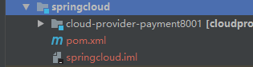
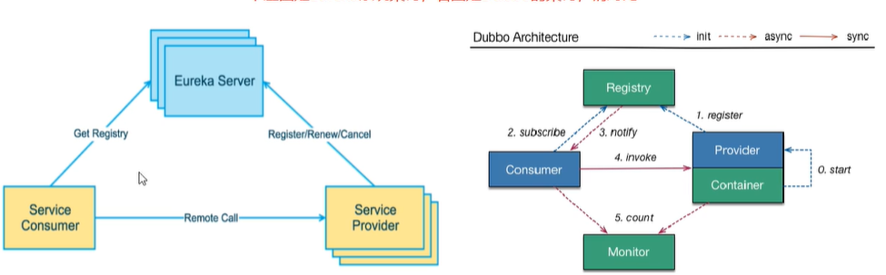
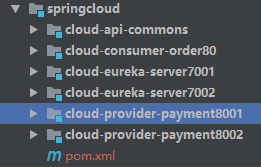

# SpringCloud :seedling:

[spring-cloud中文doc](https://www.springcloud.cc/spring-cloud-dalston.html) 

[官方doc](https://cloud.spring.io/spring-cloud-static/Hoxton.SR3/reference/html/spring-cloud.html)

笔记来源:尚硅谷-周阳大神

**cloud技术升级:**  支付-案例   约定>配置>编码

- 服务注册中心(Eureka ×   Zookeeper Consul Nacos)
- 服务调用(Ribbon  LoadBalancer)
- 服务调用2(Feign×   OpenFeign)
- 服务降级(Hystrix×    Sentinel    resilience4j)
- 服务网关(Zuul×    gateway)
- 服务配置(Config×   Nacos)
- 服务总线(Bus  Nacos)

**-------------------注意在csdn直接复制代码容易出奇奇怪怪的问题,建议去GitHub直接赋值--------------------------------**

##  一 . **环境配置**

### 1. 版本选择:spring-boot2.2.2+spring-cloud(H版SR1)+java8+maven3.6.3+idea18.3.6(可以高一点版本)

### 2. 创建一个maven工程,对pom文件进行配置(第一次进行配置时候,可能会有jar包导不进来,将`<dependencyManagement>`

去掉就会自动导包了),这里作为父工程,不需要写代码,所以除了pom.xml以外,没用的都可以删掉

```xml
<?xml version="1.0" encoding="UTF-8"?>
<project xmlns="http://maven.apache.org/POM/4.0.0"
         xmlns:xsi="http://www.w3.org/2001/XMLSchema-instance"
         xsi:schemaLocation="http://maven.apache.org/POM/4.0.0 http://maven.apache.org/xsd/maven-4.0.0.xsd">
    <modelVersion>4.0.0</modelVersion>

    <groupId>com.github.study</groupId>
    <artifactId>spring-cloud</artifactId>
    <version>1.0-SNAPSHOT</version>
    <packaging>pom</packaging>

    <!--统一管理jar包和版本-->
    <properties>
        <project.build.sourceEncoding>UTF-8</project.build.sourceEncoding>
        <maven.compiler.source>1.8</maven.compiler.source>
        <maven.compiler.target>1.8</maven.compiler.target>
        <junit.version>4.12</junit.version>
        <log4j.version>1.2.17</log4j.version>
        <lombok.version>1.16.18</lombok.version>
        <mysql.version>5.1.47</mysql.version>
        <druid.verison>1.1.16</druid.verison>
        <mybatis.spring.boot.verison>1.3.0</mybatis.spring.boot.verison>
    </properties>
    <!--    在我们项目顶层的POM文件中，我们会看到dependencyManagement元素。通过它元素来管理jar包的版本，让子项目中引用一个依赖而不用显示的列出版本号。Maven会沿着父子层次向上走，直到找到一个拥有dependencyManagement元素的项目，然后它就会使用在这个dependencyManagement元素中指定的版本号。
真正引入的是子项目,这里只是统一管理-->
    <dependencyManagement>
        <dependencies>
            <!--spring boot 2.2.2-->
            <dependency>
                <groupId>org.springframework.boot</groupId>
                <artifactId>spring-boot-dependencies</artifactId>
                <version>2.2.2.RELEASE</version>
                <type>pom</type>
                <scope>import</scope>
            </dependency>
            <!--spring cloud Hoxton.SR1-->
            <dependency>
                <groupId>org.springframework.cloud</groupId>
                <artifactId>spring-cloud-dependencies</artifactId>
                <version>Hoxton.SR1</version>
                <type>pom</type>
                <scope>import</scope>
            </dependency>
            <!--spring cloud alibaba 2.1.0.RELEASE-->
            <dependency>
                <groupId>com.alibaba.cloud</groupId>
                <artifactId>spring-cloud-alibaba-dependencies</artifactId>
                <version>2.2.0.RELEASE</version>
                <type>pom</type>
                <scope>import</scope>
            </dependency>
            <!-- MySql -->
            <dependency>
                <groupId>mysql</groupId>
                <artifactId>mysql-connector-java</artifactId>
                <version>${mysql.version}</version>
            </dependency>
            <!-- Druid -->
            <dependency>
                <groupId>com.alibaba</groupId>
                <artifactId>druid-spring-boot-starter</artifactId>
                <version>${druid.verison}</version>
            </dependency>
            <!-- mybatis-springboot整合 -->
            <dependency>
                <groupId>org.mybatis.spring.boot</groupId>
                <artifactId>mybatis-spring-boot-starter</artifactId>
                <version>${mybatis.spring.boot.verison}</version>
            </dependency>
            <!--lombok-->
            <dependency>
                <groupId>org.projectlombok</groupId>
                <artifactId>lombok</artifactId>
                <version>${lombok.version}</version>
            </dependency>
            <!--junit-->
            <dependency>
                <groupId>junit</groupId>
                <artifactId>junit</artifactId>
                <version>${junit.version}</version>
            </dependency>
            <!-- log4j -->
            <dependency>
                <groupId>log4j</groupId>
                <artifactId>log4j</artifactId>
                <version>${log4j.version}</version>
            </dependency>
        </dependencies>
    </dependencyManagement>
    <build>
        <plugins>
            <plugin>
                <groupId>org.springframework.boot</groupId>
                <artifactId>spring-boot-maven-plugin</artifactId>
                <configuration>
                    <fork>true</fork>
                    <addResources>true</addResources>
                </configuration>
            </plugin>
        </plugins>
    </build>

</project>
```

### 3. 将这个pom文件install,方便子项目引用

### 4. 在当前项目下建立新的module,直接右键建立就可以了



### 5.子项目添加依赖

```xml
<?xml version="1.0" encoding="UTF-8"?>
<project xmlns="http://maven.apache.org/POM/4.0.0"
         xmlns:xsi="http://www.w3.org/2001/XMLSchema-instance"
         xsi:schemaLocation="http://maven.apache.org/POM/4.0.0 http://maven.apache.org/xsd/maven-4.0.0.xsd">
    <parent>
        <artifactId>spring-cloud</artifactId>
        <groupId>com.github.study</groupId>
        <version>1.0-SNAPSHOT</version>
    </parent>
    <modelVersion>4.0.0</modelVersion>

    <artifactId>cloud-provider-payment8001</artifactId>

    <dependencies>
        <dependency>
            <groupId>org.springframework.boot</groupId>
            <artifactId>spring-boot-starter-web</artifactId>
        </dependency>
        <dependency>
            <groupId>org.springframework.boot</groupId>
            <artifactId>spring-boot-starter-actuator</artifactId>
        </dependency>
        <dependency>
            <groupId>org.mybatis.spring.boot</groupId>
            <artifactId>mybatis-spring-boot-starter</artifactId>
        </dependency>
        <dependency>
            <groupId>com.alibaba</groupId>
            <artifactId>druid-spring-boot-starter</artifactId>
            <version>1.1.10</version>
        </dependency>
        <!--mysql -->
        <dependency>
            <groupId>mysql</groupId>
            <artifactId>mysql-connector-java</artifactId>
        </dependency>
        <!--jdbc-->
        <dependency>
            <groupId>org.springframework.boot</groupId>
            <artifactId>spring-boot-starter-jdbc</artifactId>
        </dependency>

        <dependency>
            <groupId>org.springframework.boot</groupId>
            <artifactId>spring-boot-devtools</artifactId>
            <scope>runtime</scope>
            <optional>true</optional>
        </dependency>

        <dependency>
            <groupId>org.projectlombok</groupId>
            <artifactId>lombok</artifactId>
            <optional>true</optional>
        </dependency>

        <dependency>
            <groupId>org.springframework.boot</groupId>
            <artifactId>spring-boot-starter-test</artifactId>
            <scope>test</scope>
        </dependency>
    </dependencies>
</project>
```

### 6.添加配置resourcces/application.yml记得修改数据库信息

```yaml
server:
  port: 8001 #服务端口

spring:
  application:
    name: cloud-payment-service #服务名
  datasource:
    type: com.alibaba.druid.pool.DruidDataSource  #当前数据源操作类型
    driver-class-name: com.mysql.cj.jdbc.Driver #数据库驱动包
    url: jdbc:mysql://localhost:3306/cloud?characterEncoding=utf8&useSSL=false&serverTimezone=UTC&rewriteBatchedStatements=true
    username: root
    password: 1234

  devtools:
    restart:
      enabled: true #是否支持热部署

mybatis:
  mapper-locations: classpath:mapper/*.xml
  type-aliases-package: com.xzq.springcloud.entities  #所有entity别名所在包

```

数据库信息

```sql
CREATE DATABASE /*!32312 IF NOT EXISTS*/`cloud` /*!40100 DEFAULT CHARACTER SET utf8 COLLATE utf8_unicode_ci */;

USE `cloud`;

/*Table structure for table `payment` */

DROP TABLE IF EXISTS `payment`;

CREATE TABLE `payment` (
  `id` bigint(20) NOT NULL AUTO_INCREMENT COMMENT 'ID',
  `serial` varchar(200) COLLATE utf8_unicode_ci DEFAULT NULL,
  PRIMARY KEY (`id`)
) ENGINE=InnoDB AUTO_INCREMENT=5 DEFAULT CHARSET=utf8 COLLATE=utf8_unicode_ci;

/*Data for the table `payment` */

insert  into `payment`(`id`,`serial`) values (1,'尚硅谷'),(2,'alibaba'),(3,'京东'),(4,'头条');
```

### 7. 启动类

```java
@SpringBootApplication
public class PaymentMain8001 {
    public static void main(String[] args){
        SpringApplication.run(PaymentMain8001.class,args);
    } 
}
```

### 8.业务类

#### 8.1、dao层开发

新建PaymentDao接口

 * ```java
 
   @Mapper
   public interface PaymentDao {
       int create(Payment payment);

       Payment getPaymentById(@Param("id") Long id);
   }
   ```
```xml

#### 8.2 mapper.xml

resource下创建mapper文件夹，新建PaymentMapper.xml

<?xml version="1.0" encoding="UTF-8" ?>
<!DOCTYPE mapper PUBLIC "-//mybatis.org//DTD Mapper 3.0//EN" "http://mybatis.org/dtd/mybatis-3-mapper.dtd" >
<mapper namespace="com.xzq.springcloud.dao.PaymentDao">
    <resultMap id="BaseResultMap" type="com.xzq.springcloud.entities.Payment">
        <id column="id" property="id" jdbcType="BIGINT"/>
        <id column="serial" property="serial" jdbcType="VARCHAR"/>
    </resultMap>
<insert id="create" parameterType="payment" useGeneratedKeys="true" keyProperty="id">
        insert into payment(serial) values (#{serial})
</insert>

<select id="getPaymentById" parameterType="Long" resultMap="BaseResultMap">
    select * from payment where id = #{id}
</select>
    </mapper>
```
#### 8.3、service层

service接口

 * ```java
 package com.xzq.springcloud.service;

    import com.xzq.springcloud.entities.Payment;
import org.apache.ibatis.annotations.Param;
    
   public interface PaymentService {
    int create(Payment payment);
 
    Payment getPaymentById(@Param("id") Long id);
    }
   ```
 ```java
 
 

service实现类

​```java
package com.xzq.springcloud.service.impl;

import com.xzq.springcloud.dao.PaymentDao;
import com.xzq.springcloud.entities.Payment;
import com.xzq.springcloud.service.PaymentService;
import org.springframework.beans.factory.annotation.Autowired;
import org.springframework.stereotype.Service;

   @Service
   public class PaymentServiceImpl implements PaymentService {

   @Autowired
   private PaymentDao paymentDao;

   @Override
   public int create(Payment payment) {
       return paymentDao.create(payment);
   }

   @Override
   public Payment getPaymentById(Long id) {
       return paymentDao.getPaymentById(id);
   }
   }

//7、controller层

package com.xzq.springcloud.controller;

import com.xzq.springcloud.entities.CommonResult;
import com.xzq.springcloud.entities.Payment;
import com.xzq.springcloud.service.PaymentService;
import lombok.extern.slf4j.Slf4j;
import org.springframework.beans.factory.annotation.Autowired;
import org.springframework.web.bind.annotation.*;


   @RestController
   @Slf4j
   @RequestMapping("/payment")
   public class PaymentController {
   @Autowired
   private PaymentService paymentService;

   @PostMapping("/create")
   public CommonResult create(Payment payment) {
       int result = paymentService.create(payment);
       log.info("插入数据的ID:\t" + payment.getId());
       log.info("插入结果：" + result);
       if (result > 0) {
           return new CommonResult(200, "插入数据成功", result);
       } else {
           return new CommonResult(444, "插入数据失败", null);
       }
   }

   @GetMapping("/get/{id}")
   public CommonResult getPaymentById(@PathVariable("id") Long id) {
       Payment payment = paymentService.getPaymentById(id);
       log.info("***查询结果：" + payment);
       if (payment != null) {
           return new CommonResult(200, "查询数据成功", payment);
       } else {
           return new CommonResult(444, "没有对应记录", null);
       }
   }

}
 ```

### 9.编写其他两个模块  [代码见GitHub](https://github.com/BlossomRain/StudyDiary/tree/master/SpringFamily/code)

------------------环境就到这里准备完毕,以上都只是spring boot的内容---------------

## 二. 服务注册中心

引入:通过上面的环境,我们可以通过80的模块直接调用8001的模块,当有更多模块更过调用时,管理就显得尤为重要

### -   Eureka

##### **基本概念:**

###### 1. 服务治理

 spring cloud 封装了Netflix公司的Eureka模块来实现服务治理

 在传统的rpc远程调用框架中,**管理每个服务和服务之间依赖关系**复杂,所以需要服务治理,管理服务间的依赖关系,实现服务调用,负载均衡,容错,从而实现服务注册与发现,

###### 2.RPC

RPC（Remote Procedure Call Protocol）——远程过程调用协议，它是一种通过网络从远程计算机程序上请求服务，而不需要了解底层网络技术的协议

###### 3.什么是服务注册与发现 

​	Eureka采用了CS的设计架构，Eureka Server作为服务注册功能的服务器它是服务注册中心。而系统中的其他微服务使用Eureka的客户端连接到Eureka Server并维持心跳连接。这样系统的维沪人员就可以通过Eureka server来监控系统中各个微服务是否正常运行。 在服务注册与发现中有一个注册中心．当服务器启动的时候．会把当前自己服务器的信息以服务地址通讯地址等以别名方式注册到注册中心上．另一方（消费者|服务提供 者）以该别名的方式去注册中心上获取到实际的服务通讯地址然后再实现本地RPC调用RPC远程调用框架脚合设计思想二在于注册中心因为使用注朋中心管理每个服务与 服务之间的一个衣赖关系（服务治理概念）．在任何rpc远程框架中都会有一个注朋中心（存放服务地址相关信息（接口地址）) 



###### 4.两个组件：Eureka Server 和 Eureka Client

```txt
C: Consistency 一致性 
A: Availability 可用性
P: Tolerance of network Partition 分区容忍性
```

1.Eureka Client：一个Java客户端，用于简化与 Eureka Server 的交互（通常就是微服务中的客户端和服务端）

Eureka Server：提供服务注册和发现的能力（通常就是微服务中的注册中心）
服务在Eureka上注册，然后每隔30秒发送心跳来更新它们的租约。如果客户端不能多次续订租约，那么它将在大约90秒内从服务器注册表中剔除。注册信息和更新被复制到集群中的所有eureka节点。来自任何区域的客户端都可以查找注册表信息（每30秒发生一次）来定位它们的服务（可能在任何区域）并进行远程调用

2 Eureka 客户端与服务器之间的通信

服务发现有两种模式：一种是客户端发现模式，一种是服务端发现模式。Eureka采用的是客户端发现模式。

2.1. Register（注册）

Eureka客户端将关于运行实例的信息注册到Eureka服务器。注册发生在第一次心跳。

2.2. Renew（更新 / 续借）

Eureka客户端需要更新最新注册信息（续借），通过每30秒发送一次心跳。更新通知是为了告诉Eureka服务器实例仍然存活。如果服务器在90秒内没有看到更新，它会将实例从注册表中删除。建议不要更改更新间隔，因为服务器使用该信息来确定客户机与服务器之间的通信是否存在广泛传播的问题。

2.3. Fetch Registry（抓取注册信息）

Eureka客户端从服务器获取注册表信息并在本地缓存。之后，客户端使用这些信息来查找其他服务。通过在上一个获取周期和当前获取周期之间获取增量更新，这些信息会定期更新(每30秒更新一次)。获取的时候可能返回相同的实例。Eureka客户端自动处理重复信息。

2.4. Cancel（取消）

Eureka客户端在关机时向Eureka服务器发送一个取消请求。这将从服务器的实例注册表中删除实例，从而有效地将实例从流量中取出。

3、Eureka自我保护模式
如果 Eureka 服务器检测到超过预期数量的注册客户端以一种不优雅的方式终止了连接，并且同时正在等待被驱逐，那么它们将进入自我保护模式。这样做是为了确保灾难性网络事件不会擦除eureka注册表数据，并将其向下传播到所有客户端。

任何客户端，如果连续3次心跳更新失败，那么它将被视为非正常终止，病句将被剔除。当超过当前注册实例15%的客户端都处于这种状态，那么自我保护将被开启。

当自我保护开启以后，eureka服务器将停止剔除所有实例，直到：

它看到的心跳续借的数量回到了预期的阈值之上，或者自我保护被禁用

默认情况下，自我保护是启用的，并且，默认的阈值是要大于当前注册数量的15%

4、Eureka VS Zookeeper
4.1. Eureka保证AP

Eureka服务器节点之间是对等的，只要有一个节点在，就可以正常提供服务。

Eureka客户端的所有操作可能需要一段时间才能在Eureka服务器中反映出来，随后在其他Eureka客户端中反映出来。也就是说，客户端获取到的注册信息可能不是最新的，它并不保证强一致性

4.2. Zookeeper保证CP

Zookeeper集群中有一个Leader，多个Follower。Leader负责写，Follower负责读，ZK客户端连接到任何一个节点都是一样的，写操作完成以后要同步给所有Follower以后才会返回。如果Leader挂了，那么重新选出新的Leader，在此期间服务不可用。

4.3. 为什么用Eureka

分布式系统大都可以归结为两个问题：数据一致性和防止单点故障。而作为注册中心的话，即使在一段时间内不一致，也不会有太大影响，所以在A和C之间选择A是比较适合该场景的。

###### 5.演示案例-单机版eureka

1. 创建maven子模块 cloud-eureka-server7001并作如下配置----服务端

```yaml
#配置文件
server:
  port: 7001

eureka:
  instance: #服务名,随便写
    hostname: eureka7001.com
  client:
    #表示自己就是注册中心,不注册自己
    register-with-eureka: false
    fetch-registry: false
    service-url: #对应要访问的地址,单机版是http://localhost:7001/eureka
      defaultZone: http://eureka7002.com:7002/eureka/
```

```xml
<!--pom文件--> 
<dependencies>
        <dependency>
            <groupId>com.github.study</groupId>
            <artifactId>cloud-api-commons</artifactId>
            <version>${project.version}</version>
        </dependency>
        <!-- https://mvnrepository.com/artifact/org.springframework.cloud/spring-cloud-starter-netflix-eureka-client -->
        <dependency>
            <groupId>org.springframework.cloud</groupId>
            <artifactId>spring-cloud-starter-netflix-eureka-server</artifactId>
        </dependency>
        <dependency>
            <groupId>org.springframework.boot</groupId>
            <artifactId>spring-boot</artifactId>
        </dependency>
        <dependency>
            <groupId>org.springframework.boot</groupId>
            <artifactId>spring-boot-starter-web</artifactId>
        </dependency>
        <dependency>
            <groupId>org.springframework.boot</groupId>
            <artifactId>spring-boot-starter-actuator</artifactId>
        </dependency>
        <dependency>
            <groupId>org.springframework.boot</groupId>
            <artifactId>spring-boot-devtools</artifactId>
            <scope>runtime</scope>
            <optional>true</optional>
        </dependency>
    </dependencies>
```

```java
//主启动类
@SpringBootApplication
@EnableEurekaServer
public class EurekaMain7001 {
    public static void main(String[] args){
        SpringApplication.run(EurekaMain7001.class,args);
    } 
}

```

2. 客户端8001进行改造,添加

```yaml
eureka:
  instance:
    instance-id: payment8001   #单机版这里可以不配置
    prefer-ip-address: true
  client:
    register-with-eureka: true
    fetch-registry: true
    service-url:		#要访问的uri地址,单机版http://localhost:7001/eureka
      defaultZone: http://eureka7001.com:7001/eureka,http://eureka7002.com:7002/eureka
```

```java
@SpringBootApplication//主启动类
@EnableEurekaClient
@EnableDiscoveryClient
public class PaymentMain8001 {
    public static void main(String[] args){
        SpringApplication.run(PaymentMain8001.class,args);
    } 
}
```

3. 运行8001 和 7001 子模块,访问http://localhost:7001/eureka,出现eureka的管理页面,完成
4. 重复2的步骤改造80
5. 集群版:新建maven子模块,重复2-4,配置参考上面的,要修改etc/hosts文件

```

########SpringCloud2020#####
127.0.0.1 eureka7001.com
127.0.0.1 eureka7002.com

```



