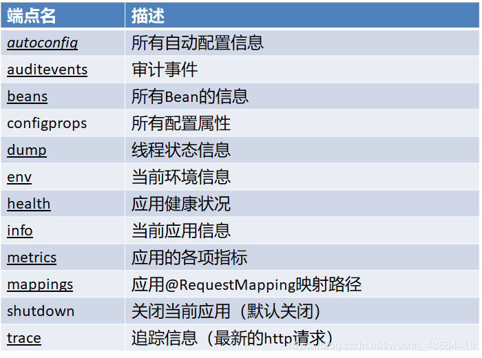

# Spring-boot整合篇:seedling:

笔记来源 --尚硅谷-雷丰阳

## 1、Spring Boot与缓存

JSR-107、Spring缓存抽象、整合Redis

### 一、JSR107

Java Caching定义了5个核心接口，分别是CachingProvider, CacheManager, Cache, Entry 和 Expiry。

CachingProvider定义了创建、配置、获取、管理和控制多个CacheManager。一个应用可 以在运行期访问多个CachingProvider。
CacheManager定义了创建、配置、获取、管理和控制多个唯一命名的Cache，这些Cache 存在于CacheManager的上下文中。一个CacheManager仅被一个CachingProvider所拥有。
Cache是一个类似Map的数据结构并临时存储以Key为索引的值。一个Cache仅被一个 CacheManager所拥有。
Entry是一个存储在Cache中的key-value对。
Expiry 每一个存储在Cache中的条目有一个定义的有效期。一旦超过这个时间，条目为过期 的状态。一旦过期，条目将不可访问、更新和删除。缓存有效期可以通过ExpiryPolicy设置。


### 二、Spring缓存抽象

Spring从3.1开始定义了org.springframework.cache.Cache 和org.springframework.cache.CacheManager接口来统一不同的缓存技术； 并支持使用JCache（JSR-107）注解简化我们开发；

Cache接口为缓存的组件规范定义，包含缓存的各种操作集合；
Cache接口下Spring提供了各种xxxCache的实现；如RedisCache，EhCacheCache , ConcurrentMapCache等；
每次调用需要缓存功能的方法时，Spring会检查检查指定参数的指定的目标方法是否 已经被调用过；如果有就直接从缓存中获取方法调用后的结果，如果没有就调用方法 并缓存结果后返回给用户。下次调用直接从缓存中获取。
使用Spring缓存抽象时我们需要关注以下两点；
1、确定方法需要被缓存以及他们的缓存策略
2、从缓存中读取之前缓存存储的数据


### 三、几个重要概念&缓存注解


### 四、缓存使用

1、引入spring-boot-starter-cache模块
2、@EnableCaching开启缓存
3、使用缓存注解
4、切换为其他缓存

### 五、整合redis实现缓存

引入spring-boot-starter-data-redis
application.yml配置redis连接地址
使用RestTemplate操作redis
redisTemplate.opsForValue();//操作字符串
redisTemplate.opsForHash();//操作hash
redisTemplate.opsForList();//操作list
redisTemplate.opsForSet();//操作set
redisTemplate.opsForZSet();//操作有序set
配置缓存、CacheManagerCustomizers
测试使用缓存、切换缓存、 CompositeCacheManager
**Redis配置类**

```java
/**

 * @author hqp

 * redis配置类
   */
   @Configuration
   @EnableCaching
   public class CacheConfig extends CachingConfigurerSupport{

   @SuppressWarnings("rawtypes")
   @Bean
   public CacheManager cacheManager(RedisTemplate redisTemplate) {
       RedisCacheManager rcm = new RedisCacheManager(redisTemplate);
       // 多个缓存的名称,目前只定义了一个
       rcm.setCacheNames(Arrays.asList("thisredis"));
       //设置缓存过期时间(秒)
       rcm.setDefaultExpiration(600);
       return rcm;
   }

   @Bean
   public RedisTemplate<String, String> redisTemplate(RedisConnectionFactory factory) {
       StringRedisTemplate template = new StringRedisTemplate(factory);
       Jackson2JsonRedisSerializer jackson2JsonRedisSerializer = new Jackson2JsonRedisSerializer(Object.class);
       ObjectMapper om = new ObjectMapper();
       om.setVisibility(PropertyAccessor.ALL, JsonAutoDetect.Visibility.ANY);
       om.enableDefaultTyping(ObjectMapper.DefaultTyping.NON_FINAL);
       jackson2JsonRedisSerializer.setObjectMapper(om);
       template.setValueSerializer(jackson2JsonRedisSerializer);
       template.afterPropertiesSet();
       return template;
   }

}
```

可以看出，我们这里主要配置了两个东西，cacheManager方法配置了一个缓存名称,它的名字叫做thisredis，当我们要在方法注解里面使用到它的时候,就要根据名称进行区分不同缓存。同时设置了缓
存的过期时间。redisTemplate则是比较常见的，我们设置了RedisTemplate,因此在代码里面,我们也可以通过**@Autowired**注入 RedisTemplate来操作redis.
使用

可以看出，我们这里主要配置了两个东西，cacheManager方法配置了一个缓存名称,它的名字叫做thisredis，当我们要在方法注解里面使用到它的时候,就要根据名称进行区分不同缓存。同时设置了缓
存的过期时间。redisTemplate则是比较常见的，我们设置了RedisTemplate,因此在代码里面,我们也可以通过**@Autowired**注入 RedisTemplate来操作redis.
使用

接下来就是如何使用注解啦,这一步反而是最简单的。其实只用到了两个注解,@Cacheable和@CacheEvict。第一个注解代表从缓存中查询指定的key，如果有，从缓存中取，不再执行方法。如果没有则执
行方法，并且将方法的返回值和指定的key关联起来，放入到缓存中。而**@CacheEvict**则是从缓存中清除指定的key对应的数据。使用的代码如下:

```java
@Cacheable(value="thisredis", key="'users_'+#id")
    public User findUser(Integer id) {
        User user = new User();
        user.setUsername("hlhdidi");
        user.setPassword("123");
        user.setUid(id.longValue());
        System.out.println("log4j2坏啦?");
        logger.info("输入user,用户名:{},密码:{}",user.getUsername(),user.getPassword());
        return user;
    }

@CacheEvict(value="thisredis", key="'users_'+#id",condition="#id!=1")
public void delUser(Integer id) {
    // 删除user
    System.out.println("user删除");
}

```

可以看出，我们用@Cacheable的value属性指定具体缓存，并通过key将其放入缓存中。这里key非常灵活，支持spring的el表达式，可以通过方法参数产生可变的key(见findUser方法)，也可以通过其指定在
什么情况下，使用/不使用缓存(见delUser方法)。
其实就是一个写了一个注解，然后解析注解再把相应的数据存到redis。集群一样的原理只是生成redis模板时使用集群方式。


## 2、Spring Boot与消息

JMS、AMQP、RabbitMQ

### 一、概述

1. 大多应用中，可通过消息服务中间件来提升系统异步通信、扩展解耦能力
2. 消息服务中两个重要概念： 消息代理（message broker）和目的地（destination） 当消息发送者发送消息以后，将由消息代理接管，消息代理保证消息传递到指定目 的地。
3. 消息队列主要有两种形式的目的地
   队列（queue）：点对点消息通信（point-to-point）
   主题（topic）：发布（publish）/订阅（subscribe）消息通信


4. 点对点式： – 消息发送者发送消息，消息代理将其放入一个队列中，消息接收者从队列中获取消息内容， 消息读取后被移出队列 – 消息只有唯一的发送者和接受者，但并不是说只能有一个接收者
5. 发布订阅式： – 发送者（发布者）发送消息到主题，多个接收者（订阅者）监听（订阅）这个主题，那么 就会在消息到达时同时收到消息
6. JMS（Java Message Service）JAVA消息服务：
   – 基于JVM消息代理的规范。ActiveMQ、HornetMQ是JMS实现
7. AMQP（Advanced Message Queuing Protocol）
   – 高级消息队列协议，也是一个消息代理的规范，兼容JMS
   – RabbitMQ是AMQP的实现

8. Spring支持
   – spring-jms提供了对JMS的支持
   – spring-rabbit提供了对AMQP的支持
   – 需要ConnectionFactory的实现来连接消息代理
   – 提供JmsTemplate、RabbitTemplate来发送消息
   – @JmsListener（JMS）、@RabbitListener（AMQP）注解在方法上监听消息代理发 布的消息
   – @EnableJms、@EnableRabbit开启支持
9. Spring Boot自动配置
   – JmsAutoConfiguration
   – RabbitAutoConfiguration

### 二、RabbitMQ简介

RabbitMQ简介：
RabbitMQ是一个由erlang开发的AMQP(Advanved Message Queue Protocol)的开源实现。

核心概念
Message
消息，消息是不具名的，它由消息头和消息体组成。消息体是不透明的，而消息头则由一系列的可选属性组 成，这些属性包括routing-key（路由键）、priority（相对于其他消息的优先权）、delivery-mode（指出 该消息可能需要持久性存储）等。

Publisher
消息的生产者，也是一个向交换器发布消息的客户端应用程序。

Exchange
交换器，用来接收生产者发送的消息并将这些消息路由给服务器中的队列。 Exchange有4种类型：direct(默认)，fanout, topic, 和headers，不同类型的Exchange转发消息的策略有 所区别

Queue
消息队列，用来保存消息直到发送给消费者。它是消息的容器，也是消息的终点。一个消息 可投入一个或多个队列。消息一直在队列里面，等待消费者连接到这个队列将其取走。

Binding
绑定，用于消息队列和交换器之间的关联。一个绑定就是基于路由键将交换器和消息队列连 接起来的路由规则，所以可以将交换器理解成一个由绑定构成的路由表。 Exchange 和Queue的绑定可以是多对多的关系。

Connection
网络连接，比如一个TCP连接。

Channel
信道，多路复用连接中的一条独立的双向数据流通道。信道是建立在真实的TCP连接内的虚 拟连接，AMQP 命令都是通过信道发出去的，不管是发布消息、订阅队列还是接收消息，这 些动作都是通过信道完成。因为对于操作系统来说建立和销毁 TCP 都是非常昂贵的开销，所 以引入了信道的概念，以复用一条 TCP 连接。

Consumer
消息的消费者，表示一个从消息队列中取得消息的客户端应用程序。

Virtual Host
虚拟主机，表示一批交换器、消息队列和相关对象。虚拟主机是共享相同的身份认证和加 密环境的独立服务器域。每个 vhost 本质上就是一个 mini 版的 RabbitMQ 服务器，拥有 自己的队列、交换器、绑定和权限机制。vhost 是 AMQP 概念的基础，必须在连接时指定， RabbitMQ 默认的 vhost 是 / 。

Broker
表示消息队列服务器实体


### 三、RabbitMQ运行机制

AMQP 中的消息路由
• AMQP 中消息的路由过程和 Java 开发者熟悉的 JMS 存在一些差别，AMQP 中增加了 Exchange 和 Binding 的角色。生产者把消息发布到 Exchange 上，消息最终到达队列并被 消费者接收，而 Binding 决定交换器的消息应该发送到那个队列。

Exchange 类型
• Exchange分发消息时根据类型的不同分发策略有区别，目前共四种类型： direct、fanout、topic、headers 。headers 匹配 AMQP 消息的 header 而不是路由键， headers 交换器和 direct 交换器完全一致，但性能差很多， 目前几乎用不到了，所以直接看另外三种类型：

消息中的路由键（routing key）如果和 Binding 中的 binding key 一致， 交换器就将消息发到对应的队列中。路由键与队 列名完全匹配，如果一个队列绑定到交换机要求路由键为 “dog”，则只转发 routing key 标记为“dog”的消息，不会转 发“dog.puppy”，也不会转发“dog.guard”等等。它是完全 匹配、单播的模式。


每个发到 fanout 类型交换器的消息都会分到所 有绑定的队列上去。fanout 交换器不处理路由键， 只是简单的将队列绑定到交换器上，每个发送 到交换器的消息都会被转发到与该交换器绑定 的所有队列上。很像子网广播，每台子网内的 主机都获得了一份复制的消息。fanout 类型转发 消息是最快的。


topic 交换器通过模式匹配分配消息的路由键属 性，将路由键和某个模式进行匹配，此时队列 需要绑定到一个模式上。它将路由键和绑定键 的字符串切分成单词，这些单词之间用点隔开。 它同样也会识别两个通配符：符号“#”和符号 “* ” 。 # 匹配 0 个或多个单词 ， *匹配一个单词。

### 四、RabbitMQ整合

1. 引入 spring-boot-starter-amqp
2. application.yml配置
3. 测试RabbitMQ
   AmqpAdmin：管理组件
   RabbitTemplate：消息发送处理组件

application.properties

```
spring.rabbitmq.host=192.168.169.131
spring.rabbitmq.username=guest
spring.rabbitmq.password=guest
```


RabbitmqApplication

 *  ```
 package com.example.rabbitmq;

import org.springframework.amqp.rabbit.annotation.EnableRabbit;
import org.springframework.boot.SpringApplication;
import org.springframework.boot.autoconfigure.SpringBootApplication;

    /**
    
     * 自动配置

  * 1、RabbitAutoConfiguration
 
  * 2、有自动配置了连接工厂ConnectionFactory；
 
  * 3、RabbitProperties 封装了 RabbitMQ的配置
 
  * 4、 RabbitTemplate ：给RabbitMQ发送和接受消息；
 
  * 5、 AmqpAdmin ： RabbitMQ系统管理功能组件;
 
  * AmqpAdmin：创建和删除 Queue，Exchange，Binding
 
  * 6、@EnableRabbit +  @RabbitListener 监听消息队列的内容
    *
     */
    @EnableRabbit  //开启基于注解的RabbitMQ模式
    @SpringBootApplication
    public class RabbitmqApplication {
 
    public static void main(String[] args) {
        SpringApplication.run(RabbitmqApplication.class, args);
    }
    }
 ```
 
 
 RabbitmqApplicationTests

```java
package com.example.rabbitmq;

import com.example.rabbitmq.bean.Book;
import org.junit.jupiter.api.Test;
import org.junit.runner.RunWith;
import org.springframework.amqp.core.AmqpAdmin;
import org.springframework.amqp.rabbit.core.RabbitTemplate;
import org.springframework.beans.factory.annotation.Autowired;
import org.springframework.boot.test.context.SpringBootTest;
import org.springframework.test.context.junit4.SpringRunner;

import java.util.HashMap;
import java.util.Map;

@RunWith(SpringRunner.class)
@SpringBootTest
class RabbitmqApplicationTests {
@Autowired
RabbitTemplate rabbitTemplate;

@Autowired
AmqpAdmin amqpAdmin;

@Test
public void createExchange(){
//		amqpAdmin.declareExchange(new DirectExchange("amqpadmin.exchange"));
//		System.out.println("创建完成");

//		amqpAdmin.declareQueue(new Queue("amqpadmin.queue",true));
        //创建绑定规则

//		amqpAdmin.declareBinding(new Binding("amqpadmin.queue", Binding.DestinationType.QUEUE,"amqpadmin.exchange","amqp.haha",null));
    //amqpAdmin.de
}

//单播（点对点）
@Test
void contextLoads() {
    //Message需要自己构造一个；定义消息体内容和消息头
    //rabbitTemplate.send(exchage,routeKey,message);

    //object默认当成消息体，只需要传入要发送的对象，自动序列化发送给rabbitmq
    //rabbitTemplate.convertAndSend(exchage,routKey,object);
    Map<String,String> map=new HashMap();
    map.put("a","zs");
    map.put("b","ls");
    //对象被默认序列化以后发送出去
    rabbitTemplate.convertAndSend("amq.direct","rabbitmq",new Book("西游记","吴承恩"));
}
//接收数据
@Test
public void receive(){

    Object o = rabbitTemplate.receiveAndConvert("rabbitmq");
    //        class java.util.HashMap
//        {a=zs, b=ls}
        System.out.println(o.getClass());
        System.out.println(o);
    }

    //广播
    @Test
    public void sendMsg(){
        rabbitTemplate.convertAndSend("amq.fanout","",new Book("mnmn","kjkj"));
    }

}


```

## 3、Spring Boot与检索

ElasticSearch

### 一、检索

我们的应用经常需要添加检索功能，开源的 ElasticSearch 是目前全文搜索引擎的 首选。他可以快速的存储、搜索和分析海量数据。Spring Boot通过整合Spring Data ElasticSearch为我们提供了非常便捷的检索功能支持；
Elasticsearch是一个分布式搜索服务，提供Restful API，底层基于Lucene，采用 多shard（分片）的方式保证数据安全，并且提供自动resharding的功能，github 等大型的站点也是采用了ElasticSearch作为其搜索服务，

### 二、概念

以员工文档 的形式存储为例：一个文档代表一个员工数据。存储数据到 ElasticSearch 的行为叫做 索引 ，但在索引一个文档之前，需要确定将文档存 储在哪里。
一个 ElasticSearch 集群可以 包含多个 索引 ，相应的每个索引可以包含多 个 类型 。 这些不同的类型存储着多个 文档 ，每个文档又有 多个 属性 。
类似关系：
– 索引-数据库
– 类型-表
– 文档-表中的记录
– 属性-列


### 三、整合ElasticSearch测试

- 引入spring-boot-starter-data-elasticsearch
  	

  ```xml
  	<dependency>
  			<groupId>org.springframework.boot</groupId>
  			<artifactId>spring-boot-starter-data-elasticsearch</artifactId>
  		</dependency>
  ```

- 安装Spring Data 对应版本的ElasticSearch

- application.yml配置

  ```
  spring.elasticsearch.jest.uris=http://118.24.44.169:9200
  spring.data.elasticsearch.cluster-name=elasticsearch
  spring.data.elasticsearch.cluster-nodes=118.24.44.169:9301
  ```

- Spring Boot自动配置的 ElasticsearchRepository、ElasticsearchTemplate、Jest

- 测试ElasticSearch

  ```java
  package com.atguigu.elastic;
  
  import com.atguigu.elastic.bean.Article;
  import com.atguigu.elastic.bean.Book;
  import com.atguigu.elastic.repository.BookRepository;
  import io.searchbox.client.JestClient;
  import io.searchbox.core.Index;
  import io.searchbox.core.Search;
  import io.searchbox.core.SearchResult;
  import org.junit.Test;
  import org.junit.runner.RunWith;
  import org.springframework.beans.factory.annotation.Autowired;
  import org.springframework.boot.test.context.SpringBootTest;
  import org.springframework.test.context.junit4.SpringRunner;
  
  import java.io.IOException;
  import java.util.List;
  
  @RunWith(SpringRunner.class)
  @SpringBootTest
  public class Springboot03ElasticApplicationTests {
  
  	@Autowired
  	JestClient jestClient;
  
  	@Autowired
  	BookRepository bookRepository;
  
  	@Test
  	public void test02(){
  //		Book book = new Book();
  //		book.setId(1);
  //		book.setBookName("西游记");
  //		book.setAuthor("吴承恩");
  //		bookRepository.index(book);
  
  
  		for (Book book : bookRepository.findByBookNameLike("游")) {
  			System.out.println(book);
  		}
  		;
  
  	}
  
  
  
  
  	@Test
  	public void contextLoads() {
  		//1、给Es中索引（保存）一个文档；
  		Article article = new Article();
  		article.setId(1);
  		article.setTitle("好消息");
  		article.setAuthor("zhangsan");
  		article.setContent("Hello World");
  
  		//构建一个索引功能
  		Index index = new Index.Builder(article).index("atguigu").type("news").build();
  
  		try {
  			//执行
  			jestClient.execute(index);
  		} catch (IOException e) {
  			e.printStackTrace();
  		}
  	}
  
  	//测试搜索
  	@Test
  	public void search(){
  
  		//查询表达式
  		String json ="{\n" +
  				"    \"query\" : {\n" +
  				"        \"match\" : {\n" +
  				"            \"content\" : \"hello\"\n" +
  				"        }\n" +
  				"    }\n" +
  				"}";
  
  		//更多操作：https://github.com/searchbox-io/Jest/tree/master/jest
  		//构建搜索功能
  		Search search = new Search.Builder(json).addIndex("atguigu").addType("news").build();
  
  		//执行
  		try {
  			SearchResult result = jestClient.execute(search);
  			System.out.println(result.getJsonString());
  		} catch (IOException e) {
  			e.printStackTrace();
  		}
  	}
  
  }
  
  
  ```

  ```java
  package com.atguigu.elastic.repository;
  
  import com.atguigu.elastic.bean.Book;
  import org.springframework.data.elasticsearch.repository.ElasticsearchRepository;
  
  import java.util.List;
  
  
  public interface BookRepository extends ElasticsearchRepository<Book,Integer> {
  
      //参照
      // https://docs.spring.io/spring-data/elasticsearch/docs/3.0.6.RELEASE/reference/html/
     public List<Book> findByBookNameLike(String bookName);
  
  }
  
  ```

  

```java
package com.atguigu.elastic.bean;

import org.springframework.data.elasticsearch.annotations.Document;

@Document(indexName = "atguigu",type = "book")
public class Book {
    private Integer id;
    private String bookName;
    private String author;

    public Integer getId() {
        return id;
    }

    public void setId(Integer id) {
        this.id = id;
    }

    public String getBookName() {
        return bookName;
    }

    public void setBookName(String bookName) {
        this.bookName = bookName;
    }

    public String getAuthor() {
        return author;
    }

    public void setAuthor(String author) {
        this.author = author;
    }

    @Override
    public String toString() {
        return "Book{" +
                "id=" + id +
                ", bookName='" + bookName + '\'' +
                ", author='" + author + '\'' +
                '}';
    }
}


```

```java
package com.atguigu.elastic.bean;

import io.searchbox.annotations.JestId;

public class Article {

    @JestId
    private Integer id;
    private String author;
    private String title;
    private String content;

    public Integer getId() {
        return id;
    }

    public void setId(Integer id) {
        this.id = id;
    }

    public String getAuthor() {
        return author;
    }

    public void setAuthor(String author) {
        this.author = author;
    }

    public String getTitle() {
        return title;
    }

    public void setTitle(String title) {
        this.title = title;
    }

    public String getContent() {
        return content;
    }

    public void setContent(String content) {
        this.content = content;
    }
}

```

## 4、Spring Boot与任务

异步任务、定时任务、邮件任务

### 一、异步任务

在Java应用中，绝大多数情况下都是通过同步的方式来实现交互处理的；但是在 处理与第三方系统交互的时候，容易造成响应迟缓的情况，之前大部分都是使用 多线程来完成此类任务，其实，在Spring 3.x之后，就已经内置了@Async来完 美解决这个问题。

两个注解：
@EnableAysnc、@Aysnc

### 二、定时任务

项目开发中经常需要执行一些定时任务，比如需要在每天凌晨时候，分析一次前 一天的日志信息。Spring为我们提供了异步执行任务调度的方式，提供 TaskExecutor 、TaskScheduler 接口。

两个注解：
@EnableScheduling、@Scheduled

**cron**表达式


### 三、邮件任务

- 邮件发送需要引入spring-boot-starter-mail

```xml
<dependency>
	<groupId>org.springframework.boot</groupId>
	<artifactId>spring-boot-starter-mail</artifactId>
</dependency>
```

- Spring Boot 自动配置MailSenderAutoConfiguration
- 定义MailProperties内容，配置在application.yml中

```yaml
spring.mail.username=534096094@qq.com
spring.mail.password=gtstkoszjelabijb
spring.mail.host=smtp.qq.com
spring.mail.properties.mail.smtp.ssl.enable=true
```

- 自动装配JavaMailSender • 测试邮件发送
- 

异步service


```java
package com.atguigu.task.service;
import org.springframework.scheduling.annotation.Async;
import org.springframework.stereotype.Service;
@Service
public class AsyncService {
//告诉Spring这是一个异步方法
@Async
public void hello(){
    try {
        Thread.sleep(3000);
    } catch (InterruptedException e) {
        e.printStackTrace();
    }
    System.out.println("处理数据中...");
}}
```

异步controller


```java
package com.atguigu.task.controller;

import com.atguigu.task.service.AsyncService;
import org.springframework.beans.factory.annotation.Autowired;
import org.springframework.web.bind.annotation.GetMapping;
import org.springframework.web.bind.annotation.RestController;

@RestController
public class AsyncController {
@Autowired
AsyncService asyncService;

@GetMapping("/hello")
public String hello(){
    asyncService.hello();
    return "success";
}}
```

定时service


```java
package com.atguigu.task.service;

import org.springframework.scheduling.annotation.Scheduled;
import org.springframework.stereotype.Service;

@Service
public class ScheduledService {
/**
 * second(秒), minute（分）, hour（时）, day of month（日）, month（月）, day of week（周几）.
 * 0 * * * * MON-FRI
 *  【0 0/5 14,18 * * ?】 每天14点整，和18点整，每隔5分钟执行一次
 *  【0 15 10 ? * 1-6】 每个月的周一至周六10:15分执行一次
 *  【0 0 2 ? * 6L】每个月的最后一个周六凌晨2点执行一次
 *  【0 0 2 LW * ?】每个月的最后一个工作日凌晨2点执行一次
 *  【0 0 2-4 ? * 1#1】每个月的第一个周一凌晨2点到4点期间，每个整点都执行一次；
 */
  // @Scheduled(cron = "0 * * * * MON-SAT")
    //@Scheduled(cron = "0,1,2,3,4 * * * * MON-SAT")
   // @Scheduled(cron = "0-4 * * * * MON-SAT")
    @Scheduled(cron = "0/4 * * * * MON-SAT")  //每4秒执行一次
    public void hello(){
        System.out.println("hello ... ");
    }
}
```

邮件测试类


```java
package com.atguigu.task;

import org.junit.Test;
import org.junit.runner.RunWith;
import org.springframework.beans.factory.annotation.Autowired;
import org.springframework.boot.test.context.SpringBootTest;
import org.springframework.mail.SimpleMailMessage;
import org.springframework.mail.javamail.JavaMailSenderImpl;
import org.springframework.mail.javamail.MimeMessageHelper;
import org.springframework.test.context.junit4.SpringRunner;

import javax.mail.internet.MimeMessage;
import java.io.File;

@RunWith(SpringRunner.class)
@SpringBootTest
public class Springboot04TaskApplicationTests {
@Autowired
JavaMailSenderImpl mailSender;

@Test
public void contextLoads() {
	SimpleMailMessage message = new SimpleMailMessage();
	//邮件设置
	message.setSubject("通知-今晚开会");
	message.setText("今晚7:30开会");

	message.setTo("17512080612@163.com");
	message.setFrom("534096094@qq.com");

	mailSender.send(message);
}

@Test
public void test02() throws  Exception{
	//1、创建一个复杂的消息邮件
	MimeMessage mimeMessage = mailSender.createMimeMessage();
	MimeMessageHelper helper = new MimeMessageHelper(mimeMessage, true);

	//邮件设置
	helper.setSubject("通知-今晚开会");
	helper.setText("<b style='color:red'>今天 7:30 开会</b>",true);

	helper.setTo("17512080612@163.com");
	helper.setFrom("534096094@qq.com");

	//上传文件
	helper.addAttachment("1.jpg",new File("C:\\Users\\lfy\\Pictures\\Saved Pictures\\1.jpg"));
	helper.addAttachment("2.jpg",new File("C:\\Users\\lfy\\Pictures\\Saved Pictures\\2.jpg"));

	mailSender.send(mimeMessage);

}}
```

## 5、Spring Boot与安全

安全、Spring Security

### 一、安全

Spring Security是针对Spring项目的安全框架，也是Spring Boot底层安全模 块默认的技术选型。他可以实现强大的web安全控制。对于安全控制，我们仅 需引入spring-boot-starter-security模块，进行少量的配置，即可实现强大的 安全管理。

几个类：
WebSecurityConfigurerAdapter：自定义Security策略 AuthenticationManagerBuilder：自定义认证策略
@EnableWebSecurity：开启WebSecurity模式

应用程序的两个主要区域是“认证”和“授权”（或者访问控制）。 这两个主要区域是Spring Security 的两个目标。
“认证”（Authentication），是建立一个他声明的主体的过程（一 个“主体”一般是指用户，设备或一些可以在你的应用程序中执行动 作的其他系统）。
“授权”（Authorization）指确定一个主体是否允许在你的应用程序 执行一个动作的过程。为了抵达需要授权的店，主体的身份已经有认 证过程建立。
这个概念是通用的而不只在Spring Security中。

### 二、Web&安全

1. 登陆/注销
   – HttpSecurity配置登陆、注销功能
2. Thymeleaf提供的SpringSecurity标签支持
   – 需要引入thymeleaf-extras-springsecurity4
   – sec:authentication=“name”获得当前用户的用户名
   – sec:authorize=“hasRole(‘ADMIN’)”当前用户必须拥有ADMIN权限时才会显示标签内容
3. remember me
   – 表单添加remember-me的checkbox
   – 配置启用remember-me功能
4. CSRF（Cross-site request forgery）跨站请求伪造
   – HttpSecurity启用csrf功能，会为表单添加_csrf的值，提交携带来预防CSRF；

```xml
<?xml version="1.0" encoding="UTF-8"?>
<project xmlns="http://maven.apache.org/POM/4.0.0" xmlns:xsi="http://www.w3.org/2001/XMLSchema-instance"
	xsi:schemaLocation="http://maven.apache.org/POM/4.0.0 http://maven.apache.org/xsd/maven-4.0.0.xsd">
	<modelVersion>4.0.0</modelVersion>

	<groupId>com.atguigu</groupId>
	<artifactId>springboot-05-security</artifactId>
	<version>0.0.1-SNAPSHOT</version>
	<packaging>jar</packaging>

	<name>springboot-05-security</name>
	<description>Demo project for Spring Boot</description>

	<parent>
		<groupId>org.springframework.boot</groupId>
		<artifactId>spring-boot-starter-parent</artifactId>
		<version>1.5.12.RELEASE</version>
		<relativePath/> <!-- lookup parent from repository -->
	</parent>

	<properties>
		<project.build.sourceEncoding>UTF-8</project.build.sourceEncoding>
		<project.reporting.outputEncoding>UTF-8</project.reporting.outputEncoding>
		<java.version>1.8</java.version>
		<thymeleaf.version>3.0.9.RELEASE</thymeleaf.version>
		<thymeleaf-layout-dialect.version>2.3.0</thymeleaf-layout-dialect.version>
		<thymeleaf-extras-springsecurity4.version>3.0.2.RELEASE</thymeleaf-extras-springsecurity4.version>
	</properties>

	<dependencies>
		<!-- https://mvnrepository.com/artifact/org.thymeleaf.extras/thymeleaf-extras-springsecurity4 -->
		<dependency>
			<groupId>org.thymeleaf.extras</groupId>
			<artifactId>thymeleaf-extras-springsecurity4</artifactId>
		</dependency>
		<dependency>
			<groupId>org.springframework.boot</groupId>
			<artifactId>spring-boot-starter-thymeleaf</artifactId>
		</dependency>
		<dependency>
			<groupId>org.springframework.boot</groupId>
			<artifactId>spring-boot-starter-security</artifactId>
		</dependency>
		<dependency>
			<groupId>org.springframework.boot</groupId>
			<artifactId>spring-boot-starter-web</artifactId>
		</dependency>

		<dependency>
			<groupId>org.springframework.boot</groupId>
			<artifactId>spring-boot-starter-test</artifactId>
			<scope>test</scope>
		</dependency>
	</dependencies>

	<build>
		<plugins>
			<plugin>
				<groupId>org.springframework.boot</groupId>
				<artifactId>spring-boot-maven-plugin</artifactId>
			</plugin>
		</plugins>
	</build>


</project>


```

```java
package com.atguigu.security;

import org.springframework.boot.SpringApplication;
import org.springframework.boot.autoconfigure.SpringBootApplication;

/**
 * 1、引入SpringSecurity；
 * 2、编写SpringSecurity的配置类；
 * 		@EnableWebSecurity   extends WebSecurityConfigurerAdapter
 * 3、控制请求的访问权限：
 * 		configure(HttpSecurity http) {
 * 		 	http.authorizeRequests().antMatchers("/").permitAll()
 * 		 		.antMatchers("/level1/**").hasRole("VIP1")
 * 		}
 * 4、定义认证规则：
 * 		configure(AuthenticationManagerBuilder auth){
 * 		 	auth.inMemoryAuthentication()
 * 		 		.withUser("zhangsan").password("123456").roles("VIP1","VIP2")
 * 		}
 * 5、开启自动配置的登陆功能：
 * 		configure(HttpSecurity http){
 * 		 	http.formLogin();
 * 		}
 * 6、注销：http.logout();
 * 7、记住我：Remeberme()；
 */
@SpringBootApplication
public class Springboot05SecurityApplication {

	public static void main(String[] args) {
		SpringApplication.run(Springboot05SecurityApplication.class, args);
	}
}


```

```java
package com.atguigu.security.controller;

import org.springframework.stereotype.Controller;
import org.springframework.web.bind.annotation.GetMapping;
import org.springframework.web.bind.annotation.PathVariable;

@Controller
public class KungfuController {
	private final String PREFIX = "pages/";
	/**
	 * 欢迎页
	 * @return
	 */
	@GetMapping("/")
	public String index() {
		return "welcome";
	}
	
	/**
	 * 登陆页
	 * @return
	 */
	@GetMapping("/userlogin")
	public String loginPage() {
		return PREFIX+"login";
	}
	
	
	/**
	 * level1页面映射
	 * @param path
	 * @return
	 */
	@GetMapping("/level1/{path}")
	public String level1(@PathVariable("path")String path) {
		return PREFIX+"level1/"+path;
	}
	
	/**
	 * level2页面映射
	 * @param path
	 * @return
	 */
	@GetMapping("/level2/{path}")
	public String level2(@PathVariable("path")String path) {
		return PREFIX+"level2/"+path;
	}
	
	/**
	 * level3页面映射
	 * @param path
	 * @return
	 */
	@GetMapping("/level3/{path}")
	public String level3(@PathVariable("path")String path) {
		return PREFIX+"level3/"+path;
	}


}


```

```java
package com.atguigu.security.config;

import org.springframework.security.config.annotation.authentication.builders.AuthenticationManagerBuilder;
import org.springframework.security.config.annotation.web.builders.HttpSecurity;
import org.springframework.security.config.annotation.web.configuration.EnableWebSecurity;
import org.springframework.security.config.annotation.web.configuration.WebSecurityConfigurerAdapter;

@EnableWebSecurity
public class MySecurityConfig extends WebSecurityConfigurerAdapter {

    @Override
    protected void configure(HttpSecurity http) throws Exception {
        //super.configure(http);
        //定制请求的授权规则
        http.authorizeRequests().antMatchers("/").permitAll()
                .antMatchers("/level1/**").hasRole("VIP1")
                .antMatchers("/level2/**").hasRole("VIP2")
                .antMatchers("/level3/**").hasRole("VIP3");

        //开启自动配置的登陆功能，效果，如果没有登陆，没有权限就会来到登陆页面
        http.formLogin().usernameParameter("user").passwordParameter("pwd")
                .loginPage("/userlogin");
        //1、/login来到登陆页
        //2、重定向到/login?error表示登陆失败
        //3、更多详细规定
        //4、默认post形式的 /login代表处理登陆
        //5、一但定制loginPage；那么 loginPage的post请求就是登陆


        //开启自动配置的注销功能。
        http.logout().logoutSuccessUrl("/");//注销成功以后来到首页
        //1、访问 /logout 表示用户注销，清空session
        //2、注销成功会返回 /login?logout 页面；

        //开启记住我功能
        http.rememberMe().rememberMeParameter("remeber");
        //登陆成功以后，将cookie发给浏览器保存，以后访问页面带上这个cookie，只要通过检查就可以免登录
        //点击注销会删除cookie

    }

    //定义认证规则
    @Override
    protected void configure(AuthenticationManagerBuilder auth) throws Exception {
        //super.configure(auth);
        auth.inMemoryAuthentication()
                .withUser("zhangsan").password("123456").roles("VIP1","VIP2")
                .and()
                .withUser("lisi").password("123456").roles("VIP2","VIP3")
                .and()
                .withUser("wangwu").password("123456").roles("VIP1","VIP3");

    }
}


```

```html
<!DOCTYPE html>
<html xmlns:th="http://www.thymeleaf.org"
	  xmlns:sec="http://www.thymeleaf.org/thymeleaf-extras-springsecurity4">
<head>
<meta http-equiv="Content-Type" content="text/html; charset=UTF-8">
<title>Insert title here</title>
</head>
<body>
<h1 align="center">欢迎光临武林秘籍管理系统</h1>
<div sec:authorize="!isAuthenticated()">
	<h2 align="center">游客您好，如果想查看武林秘籍 <a th:href="@{/userlogin}">请登录</a></h2>
</div>
<div sec:authorize="isAuthenticated()">
	<h2><span sec:authentication="name"></span>，您好,您的角色有：
		<span sec:authentication="principal.authorities"></span></h2>
	<form th:action="@{/logout}" method="post">
		<input type="submit" value="注销"/>
	</form>
</div>

<hr>

<div sec:authorize="hasRole('VIP1')">
	<h3>普通武功秘籍</h3>
	<ul>
		<li><a th:href="@{/level1/1}">罗汉拳</a></li>
		<li><a th:href="@{/level1/2}">武当长拳</a></li>
		<li><a th:href="@{/level1/3}">全真剑法</a></li>
	</ul>

</div>

<div sec:authorize="hasRole('VIP2')">
	<h3>高级武功秘籍</h3>
	<ul>
		<li><a th:href="@{/level2/1}">太极拳</a></li>
		<li><a th:href="@{/level2/2}">七伤拳</a></li>
		<li><a th:href="@{/level2/3}">梯云纵</a></li>
	</ul>

</div>

<div sec:authorize="hasRole('VIP3')">
	<h3>绝世武功秘籍</h3>
	<ul>
		<li><a th:href="@{/level3/1}">葵花宝典</a></li>
		<li><a th:href="@{/level3/2}">龟派气功</a></li>
		<li><a th:href="@{/level3/3}">独孤九剑</a></li>
	</ul>
</div>


</body>
</html>

```

```html
<!DOCTYPE html>
<html xmlns:th="http://www.thymeleaf.org"
	  xmlns:sec="http://www.thymeleaf.org/thymeleaf-extras-springsecurity4">
<head>
<meta http-equiv="Content-Type" content="text/html; charset=UTF-8">
<title>Insert title here</title>
</head>
<body>
<h1 align="center">欢迎光临武林秘籍管理系统</h1>
<div sec:authorize="!isAuthenticated()">
	<h2 align="center">游客您好，如果想查看武林秘籍 <a th:href="@{/userlogin}">请登录</a></h2>
</div>
<div sec:authorize="isAuthenticated()">
	<h2><span sec:authentication="name"></span>，您好,您的角色有：
		<span sec:authentication="principal.authorities"></span></h2>
	<form th:action="@{/logout}" method="post">
		<input type="submit" value="注销"/>
	</form>
</div>

<hr>

<div sec:authorize="hasRole('VIP1')">
	<h3>普通武功秘籍</h3>
	<ul>
		<li><a th:href="@{/level1/1}">罗汉拳</a></li>
		<li><a th:href="@{/level1/2}">武当长拳</a></li>
		<li><a th:href="@{/level1/3}">全真剑法</a></li>
	</ul>

</div>

<div sec:authorize="hasRole('VIP2')">
	<h3>高级武功秘籍</h3>
	<ul>
		<li><a th:href="@{/level2/1}">太极拳</a></li>
		<li><a th:href="@{/level2/2}">七伤拳</a></li>
		<li><a th:href="@{/level2/3}">梯云纵</a></li>
	</ul>

</div>

<div sec:authorize="hasRole('VIP3')">
	<h3>绝世武功秘籍</h3>
	<ul>
		<li><a th:href="@{/level3/1}">葵花宝典</a></li>
		<li><a th:href="@{/level3/2}">龟派气功</a></li>
		<li><a th:href="@{/level3/3}">独孤九剑</a></li>
	</ul>
</div>


</body>
</html>

```

```html
<!DOCTYPE html>
<html xmlns:th="http://www.thymeleaf.org">
<head>
<meta http-equiv="Content-Type" content="text/html; charset=UTF-8">
<title>Insert title here</title>
</head>
<body>
	<a th:href="@{/}">返回</a>
	<h1>太极拳</h1>
	<p>
	       一个西瓜圆又圆 劈它一刀成两半 你一半来 给你你不要 给他他不收 那就不给 把两人撵走 他们不走你走 走啦，一挥手，伤自尊
                  不买西瓜别缠我，缓慢纠缠様 两人缠我赖皮，手慢动作左右挥动 看我厉害，转头缓步拍苍蝇状 拍死了，手抱西瓜状+奥特曼十字手+广播操准备运动的站立
    </p>
</body>
</html>

```

```html
<!DOCTYPE html>
<html xmlns:th="http://www.thymeleaf.org">
<head>
<meta http-equiv="Content-Type" content="text/html; charset=UTF-8">
<title>Insert title here</title>
</head>
<body>
	<a th:href="@{/}">返回</a>
	<h1>葵花宝典</h1>
	<p>欲练神功，挥刀自宫</p>
</body>
</html>

```

## 6、Spring Boot与分布式

分步式、Dubbo/Zookeeper、Spring Boot/Cloud

### 一、分布式应用

在分布式系统中，国内常用zookeeper+dubbo组合，而Spring Boot推荐使用 全栈的Spring，Spring Boot+Spring Cloud。

分布式系统：

- 单一应用架构 当网站流量很小时，只需一个应用，将所有功能都部署在一起，以减少部署节点和成 本。此时，用于简化增删改查工作量的数据访问框架(ORM)是关键。
- 垂直应用架构 当访问量逐渐增大，单一应用增加机器带来的加速度越来越小，将应用拆成互不相干 的几个应用，以提升效率。此时，用于加速前端页面开发的Web框架(MVC)是关键。
- 分布式服务架构 当垂直应用越来越多，应用之间交互不可避免，将核心业务抽取出来，作为独立的服 务，逐渐形成稳定的服务中心，使前端应用能更快速的响应多变的市场需求。此时， 用于提高业务复用及整合的分布式服务框架(RPC)是关键。
- 流动计算架构 当服务越来越多，容量的评估，小服务资源的浪费等问题逐渐显现，此时需增加一个 调度中心基于访问压力实时管理集群容量，提高集群利用率。此时，用于提高机器利 用率的资源调度和治理中心(SOA)是关键。

### 二、Zookeeper和Dubbo

- ZooKeeper
  ZooKeeper 是一个分布式的，开放源码的分布式应用程序协调服务。它是 一个为分布式应用提供一致性服务的软件，提供的功能包括：配置维护、 域名服务、分布式同步、组服务等。

- Dubbo
  Dubbo是Alibaba开源的分布式服务框架，它最大的特点是按照分层的方 式来架构，使用这种方式可以使各个层之间解耦合（或者最大限度地松耦 合）。从服务模型的角度来看，Dubbo采用的是一种非常简单的模型，要 么是提供方提供服务，要么是消费方消费服务，所以基于这一点可以抽象 出服务提供方（Provider）和服务消费方（Consumer）两个角色。

1、安装zookeeper作为注册中心

2、编写服务提供者

3、编写服务消费者

4、整合dubbo

```xml
 <dependency> 
  	<groupId>com.alibaba.spring.boot</groupId> 
  	<artifactId>dubbo-spring-boot-starter</artifactId> 
  	<version>2.0.0</version> 
  </dependency>
```


application.properties

```properties
dubbo.application.name=consumer-user

dubbo.registry.address=zookeeper://118.24.44.169:2181
```


### 三、Spring Boot和Spring Cloud

Spring Cloud
Spring Cloud是一个分布式的整体解决方案。Spring Cloud 为开发者提供了在分布式系统（配 置管理，服务发现，熔断，路由，微代理，控制总线，一次性token，全局琐，leader选举，分 布式session，集群状态）中快速构建的工具，使用Spring Cloud的开发者可以快速的启动服务 或构建应用、同时能够快速和云平台资源进行对接。

SpringCloud分布式开发五大常用组件
* 服务发现——Netflix Eureka
* 客服端负载均衡——Netflix Ribbon
* 断路器——Netflix Hystrix
* 服务网关——Netflix Zuul
* 分布式配置——Spring Cloud Config
微服务
* 

- Spring Cloud 入门

####  1、创建provider

pom.xml

```xml
<?xml version="1.0" encoding="UTF-8"?>
<project xmlns="http://maven.apache.org/POM/4.0.0" xmlns:xsi="http://www.w3.org/2001/XMLSchema-instance"
	xsi:schemaLocation="http://maven.apache.org/POM/4.0.0 http://maven.apache.org/xsd/maven-4.0.0.xsd">
	<modelVersion>4.0.0</modelVersion>
<groupId>com.atguigu</groupId>
<artifactId>provider-ticket</artifactId>
<version>0.0.1-SNAPSHOT</version>
<packaging>jar</packaging>

<name>provider-ticket</name>
<description>Demo project for Spring Boot</description>

<parent>
	<groupId>org.springframework.boot</groupId>
	<artifactId>spring-boot-starter-parent</artifactId>
	<version>1.5.12.RELEASE</version>
	<relativePath/> <!-- lookup parent from repository -->
</parent>

<properties>
	<project.build.sourceEncoding>UTF-8</project.build.sourceEncoding>
	<project.reporting.outputEncoding>UTF-8</project.reporting.outputEncoding>
	<java.version>1.8</java.version>
	<spring-cloud.version>Edgware.SR3</spring-cloud.version>
</properties>

<dependencies>
	<dependency>
		<groupId>org.springframework.cloud</groupId>
		<artifactId>spring-cloud-starter-eureka</artifactId>
	</dependency>

	<dependency>
		<groupId>org.springframework.boot</groupId>
		<artifactId>spring-boot-starter-test</artifactId>
		<scope>test</scope>
	</dependency>
</dependencies>

<dependencyManagement>
	<dependencies>
		<dependency>
			<groupId>org.springframework.cloud</groupId>
			<artifactId>spring-cloud-dependencies</artifactId>
			<version>${spring-cloud.version}</version>
			<type>pom</type>
			<scope>import</scope>
		</dependency>
	</dependencies>
</dependencyManagement>

<build>
	<plugins>
		<plugin>
			<groupId>org.springframework.boot</groupId>
			<artifactId>spring-boot-maven-plugin</artifactId>
		</plugin>
	</plugins>
</build>
</project>
```


application.yml

```yaml
server:
  port: 8002
spring:
  application:
    name: provider-ticket


eureka:
  instance:
    prefer-ip-address: true # 注册服务的时候使用服务的ip地址
  client:
    service-url:
      defaultZone: http://localhost:8761/eureka/
```


service

```java
package com.atguigu.providerticket.service;

import org.springframework.stereotype.Service;

@Service
public class TicketService {public String getTicket(){
    System.out.println("8002");
    return "《厉害了，我的国》";
}}
```

controller

package com.atguigu.providerticket.controller;

import com.atguigu.providerticket.service.TicketService;
import org.springframework.beans.factory.annotation.Autowired;
import org.springframework.web.bind.annotation.GetMapping;
import org.springframework.web.bind.annotation.RestController;

@RestController


```java
public class TicketController {
@Autowired
TicketService ticketService;

@GetMapping("/ticket")
public String getTicket(){
    return ticketService.getTicket();
}}
```
#### 2、创建consumer

pom.xml

```xml
<?xml version="1.0" encoding="UTF-8"?>
<project xmlns="http://maven.apache.org/POM/4.0.0" xmlns:xsi="http://www.w3.org/2001/XMLSchema-instance"
	xsi:schemaLocation="http://maven.apache.org/POM/4.0.0 http://maven.apache.org/xsd/maven-4.0.0.xsd">
	<modelVersion>4.0.0</modelVersion>
<groupId>com.atguigu</groupId>
<artifactId>consumer-user</artifactId>
<version>0.0.1-SNAPSHOT</version>
<packaging>jar</packaging>

<name>consumer-user</name>
<description>Demo project for Spring Boot</description>

<parent>
	<groupId>org.springframework.boot</groupId>
	<artifactId>spring-boot-starter-parent</artifactId>
	<version>1.5.12.RELEASE</version>
	<relativePath/> <!-- lookup parent from repository -->
</parent>

<properties>
	<project.build.sourceEncoding>UTF-8</project.build.sourceEncoding>
	<project.reporting.outputEncoding>UTF-8</project.reporting.outputEncoding>
	<java.version>1.8</java.version>
	<spring-cloud.version>Edgware.SR3</spring-cloud.version>
</properties>

<dependencies>
	<dependency>
		<groupId>org.springframework.cloud</groupId>
		<artifactId>spring-cloud-starter-eureka</artifactId>
	</dependency>

	<dependency>
		<groupId>org.springframework.boot</groupId>
		<artifactId>spring-boot-starter-test</artifactId>
		<scope>test</scope>
	</dependency>
</dependencies>

<dependencyManagement>
	<dependencies>
		<dependency>
			<groupId>org.springframework.cloud</groupId>
			<artifactId>spring-cloud-dependencies</artifactId>
			<version>${spring-cloud.version}</version>
			<type>pom</type>
			<scope>import</scope>
		</dependency>
	</dependencies>
</dependencyManagement>

<build>
	<plugins>
		<plugin>
			<groupId>org.springframework.boot</groupId>
			<artifactId>spring-boot-maven-plugin</artifactId>
		</plugin>
	</plugins>
</build></project>
```


application.yml

```yaml
spring:
  application:
    name: consumer-user
server:
  port: 8200

eureka:
  instance:
    prefer-ip-address: true # 注册服务的时候使用服务的ip地址
  client:
    service-url:
      defaultZone: http://localhost:8761/eureka/
```


controller


    package com.atguigu.consumeruser.controller;
    
    import org.springframework.beans.factory.annotation.Autowired;
    import org.springframework.web.bind.annotation.GetMapping;
    import org.springframework.web.bind.annotation.RestController;
    import org.springframework.web.client.RestTemplate;
    
    @RestController
    public class UserController {
    @Autowired
    RestTemplate restTemplate;
    
    @GetMapping("/buy")
    public String buyTicket(String name){
        String s = restTemplate.getForObject("http://PROVIDER-TICKET/ticket", String.class);
        return name+"购买了"+s;
    }}

ConsumerUserApplication.java


```java
package com.atguigu.consumeruser;

import org.springframework.boot.SpringApplication;
import org.springframework.boot.autoconfigure.SpringBootApplication;
import org.springframework.cloud.client.discovery.EnableDiscoveryClient;
import org.springframework.cloud.client.loadbalancer.LoadBalanced;
import org.springframework.context.annotation.Bean;
import org.springframework.web.client.RestTemplate;

@EnableDiscoveryClient //开启发现服务功能
@SpringBootApplication
public class ConsumerUserApplication {
public static void main(String[] args) {
	SpringApplication.run(ConsumerUserApplication.class, args);
}

@LoadBalanced //使用负载均衡机制
@Bean
public RestTemplate restTemplate(){
	return new RestTemplate();
}}
```


#### 3、引入Spring Cloud

pom.xml


```xml
<?xml version="1.0" encoding="UTF-8"?>
<project xmlns="http://maven.apache.org/POM/4.0.0" xmlns:xsi="http://www.w3.org/2001/XMLSchema-instance"
	xsi:schemaLocation="http://maven.apache.org/POM/4.0.0 http://maven.apache.org/xsd/maven-4.0.0.xsd">
	<modelVersion>4.0.0</modelVersion>
<groupId>com.atguigu</groupId>
<artifactId>eureka-server</artifactId>
<version>0.0.1-SNAPSHOT</version>
<packaging>jar</packaging>

<name>eureka-server</name>
<description>Demo project for Spring Boot</description>

<parent>
	<groupId>org.springframework.boot</groupId>
	<artifactId>spring-boot-starter-parent</artifactId>
	<version>1.5.12.RELEASE</version>
	<relativePath/> <!-- lookup parent from repository -->
</parent>

<properties>
	<project.build.sourceEncoding>UTF-8</project.build.sourceEncoding>
	<project.reporting.outputEncoding>UTF-8</project.reporting.outputEncoding>
	<java.version>1.8</java.version>
	<spring-cloud.version>Edgware.SR3</spring-cloud.version>
</properties>

<dependencies>
	<dependency>
		<groupId>org.springframework.cloud</groupId>
		<artifactId>spring-cloud-starter-eureka-server</artifactId>
	</dependency>

	<dependency>
		<groupId>org.springframework.boot</groupId>
		<artifactId>spring-boot-starter-test</artifactId>
		<scope>test</scope>
	</dependency>
</dependencies>

<dependencyManagement>
	<dependencies>
		<dependency>
			<groupId>org.springframework.cloud</groupId>
			<artifactId>spring-cloud-dependencies</artifactId>
			<version>${spring-cloud.version}</version>
			<type>pom</type>
			<scope>import</scope>
		</dependency>
	</dependencies>
</dependencyManagement>

<build>
	<plugins>
		<plugin>
			<groupId>org.springframework.boot</groupId>
			<artifactId>spring-boot-maven-plugin</artifactId>
		</plugin>
	</plugins>
</build></project>
```


####  4、引入Eureka注册中心

application.yml

```yaml
server:
  port: 8761
eureka:
  instance:
    hostname: eureka-server  # eureka实例的主机名
  client:
    register-with-eureka: false #不把自己注册到eureka上
    fetch-registry: false #不从eureka上来获取服务的注册信息
    service-url:
      defaultZone: http://localhost:8761/eureka/
```


EurekaServerApplication.java

 * ```java
 package com.atguigu.eurekaserver;

import org.springframework.boot.SpringApplication;
import org.springframework.boot.autoconfigure.SpringBootApplication;
import org.springframework.cloud.netflix.eureka.server.EnableEurekaServer;
	
	/**
	
 * 注册中心
 
  * 1、配置Eureka信息
 
  * 2、@EnableEurekaServer
    */
    @EnableEurekaServer
    @SpringBootApplication
    public class EurekaServerApplication {
 
    public static void main(String[] args) {
    	SpringApplication.run(EurekaServerApplication.class, args);
    }
    }
 ```
 
 

####  5、引入Ribbon进行客户端负载均衡

## 7、Spring Boot与开发热部署

热部署

### 一、热部署

在开发中我们修改一个Java文件后想看到效果不得不重启应用，这导致大量时间 花费，我们希望不重启应用的情况下，程序可以自动部署（热部署）。有以下四 种情况，如何能实现热部署。

#### 1、模板引擎

– 在Spring Boot中开发情况下禁用模板引擎的cache
– 页面模板改变ctrl+F9可以重新编译当前页面并生效

#### 2、Spring Loaded

Spring官方提供的热部署程序，实现修改类文件的热部署
– 下载Spring Loaded（项目地址https://github.com/springprojects/spring-loaded）
– 添加运行时参数；
– javaagent:C:/springloaded-1.2.5.RELEASE.jar –noverify

#### 3、JRebel

– 收费的一个热部署软件
– 安装插件使用即可

#### 4、Spring Boot Devtools（推荐）

– 引入依赖

```xml
<dependency>  
<groupId>org.springframework.boot</groupId>  
<artifactId>spring-boot-devtools</artifactId> 
</dependency> 
```

– IDEA使用ctrl+F9
– 或做一些小调整 Intellij IEDA 和 Eclipse 不同， Eclipse 设置了自动编译之后，修改类它会自动编译 ，而 IDEA 在非 RUN 或 DEBUG 情况下 才会自动编译（前提是你已经设置了 Auto - Compile ）。

- 设置自动编译（settings-compiler-make project automatically）
  ctrl+shift+alt+/（maintenance）
  勾选compiler.automake.allow.when.app.running
  package com.atguigu.deploy.controller;


```java
import org.springframework.stereotype.Controller;
import org.springframework.web.bind.annotation.GetMapping;

@Controller
public class HelloController {
@GetMapping("/abc")
public String hello(){
    return "hello";
}
}
```


## 8、Spring Boot与监控管理

### 一、监控管理

通过引入spring-boot-starter-actuator，可以使用Spring Boot为我们提供的准 生产环境下的应用监控和管理功能。我们可以通过HTTP，JMX，SSH协议来进 行操作，自动得到审计、健康及指标信息等

- 步骤：
  – 引入spring-boot-starter-actuator
  – 通过http方式访问监控端点
  – 可进行shutdown（POST 提交，此端点默认关闭）
  监控和管理端点
- 

### 二、定制端点信息

– 定制端点一般通过endpoints+端点名+属性名来设置。
– 修改端点id（endpoints.beans.id=mybeans）
– 开启远程应用关闭功能（endpoints.shutdown.enabled=true）
– 关闭端点（endpoints.beans.enabled=false）
– 开启所需端点

- endpoints.enabled=false

- endpoints.beans.enabled=true – 定制端点访问根路径

- management.context-path=/manage – 关闭http端点

- management.port=-1

  

pom.xml

```xml
<?xml version="1.0" encoding="UTF-8"?>
<project xmlns="http://maven.apache.org/POM/4.0.0" xmlns:xsi="http://www.w3.org/2001/XMLSchema-instance"
	xsi:schemaLocation="http://maven.apache.org/POM/4.0.0 http://maven.apache.org/xsd/maven-4.0.0.xsd">
	<modelVersion>4.0.0</modelVersion>
<groupId>com.atguigu</groupId>
<artifactId>springboot-08-actuator</artifactId>
<version>0.0.1-SNAPSHOT</version>
<packaging>jar</packaging>

<name>springboot-08-actuator</name>
<description>Demo project for Spring Boot</description>

<parent>
	<groupId>org.springframework.boot</groupId>
	<artifactId>spring-boot-starter-parent</artifactId>
	<version>1.5.12.RELEASE</version>
	<relativePath/> <!-- lookup parent from repository -->
</parent>

<properties>
	<project.build.sourceEncoding>UTF-8</project.build.sourceEncoding>
	<project.reporting.outputEncoding>UTF-8</project.reporting.outputEncoding>
	<java.version>1.8</java.version>
</properties>

<dependencies>
	<dependency>
		<groupId>org.springframework.boot</groupId>
		<artifactId>spring-boot-starter-actuator</artifactId>
	</dependency>
	<dependency>
		<groupId>org.springframework.boot</groupId>
		<artifactId>spring-boot-starter-data-redis</artifactId>
	</dependency>
	<dependency>
		<groupId>org.springframework.boot</groupId>
		<artifactId>spring-boot-starter-web</artifactId>
	</dependency>

	<dependency>
		<groupId>org.springframework.boot</groupId>
		<artifactId>spring-boot-devtools</artifactId>
		<scope>runtime</scope>
	</dependency>
	<dependency>
		<groupId>org.springframework.boot</groupId>
		<artifactId>spring-boot-starter-test</artifactId>
		<scope>test</scope>
	</dependency>
</dependencies>

<build>
	<plugins>
		<plugin>
			<groupId>org.springframework.boot</groupId>
			<artifactId>spring-boot-maven-plugin</artifactId>
		</plugin>
	</plugins>
</build>
</project>
```


application.properties

```properties
management.security.enabled=false

spring.redis.host=118.24.44.169

info.app.id=hello
info.app.version=1.0.0

#endpoints.metrics.enabled=false
endpoints.shutdown.enabled=true

#endpoints.beans.id=mybean
#endpoints.beans.path=/bean
#endpoints.beans.enabled=false
#
#endpoints.dump.path=/du#
#\u5173\u95ED\u6240\u6709\u7AEF\u70B9\u8BBF\u95EE

#endpoints.enabled=false
#endpoints.beans.enabled=true

management.context-path=/manage

management.port=8181
```


git.properties

```properties
git.branch=master
git.commit.id=xjkd33s
git.commit.time=2017-12-12 12:12:56
```


Springboot08ActuatorApplication.java

 * ```java
 package com.atguigu.springboot08actuator;

import org.springframework.boot.SpringApplication;
import org.springframework.boot.autoconfigure.SpringBootApplication;
	
	/**
	
 * 自定义健康状态指示器
 
  * 1、编写一个指示器 实现 HealthIndicator 接口
 
  * 2、指示器的名字 xxxxHealthIndicator
 
  * 3、加入容器中
    */
    @SpringBootApplication
    public class Springboot08ActuatorApplication {
 
    public static void main(String[] args) {
    	SpringApplication.run(Springboot08ActuatorApplication.class, args);
    }
    }
 ```
 
 

```java

MyAppHealthIndicator.java

package com.atguigu.springboot08actuator.health;

import org.springframework.boot.actuate.health.Health;
import org.springframework.boot.actuate.health.HealthIndicator;
import org.springframework.stereotype.Component;

@Component
public class MyAppHealthIndicator implements HealthIndicator {
@Override
public Health health() {

    //自定义的检查方法
    //Health.up().build()代表健康
    return Health.down().withDetail("msg","服务异常").build();
}}
```


