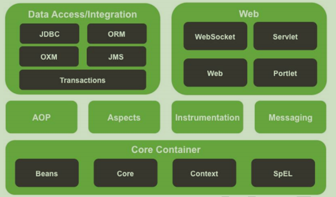
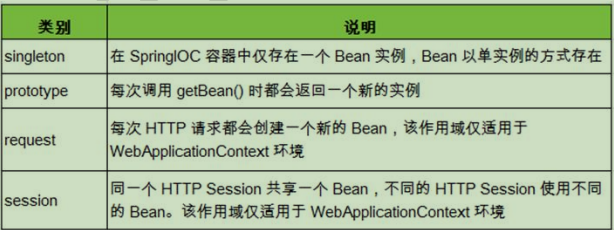
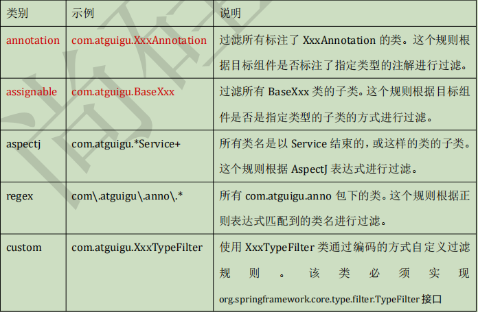
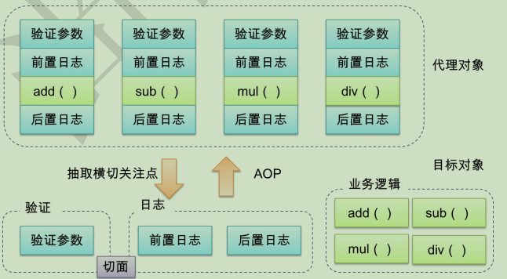
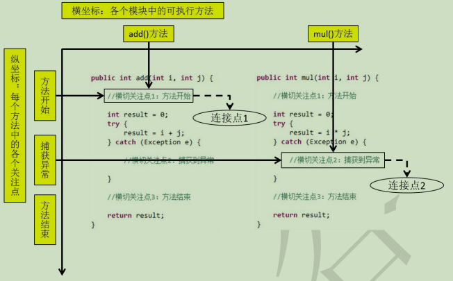
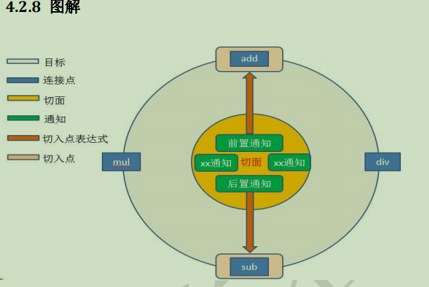
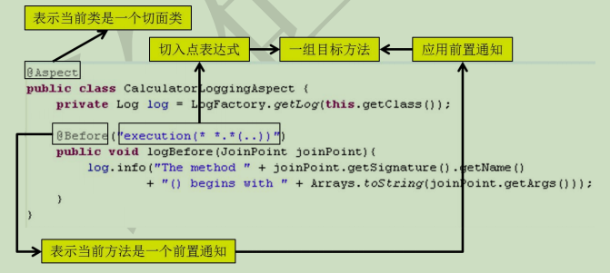

# Spring框架学习

笔记参考:尚硅谷-佟刚老师-spring4

## 1.是什么

> 1) Spring 是一个开源框架 
>
> 2) Spring 为简化企业级开发而生，使用 Spring，JavaBean 就可以实现很多以前要靠 EJB 才能实现的功能。同样的功能，在 EJB 中要通过繁琐的配置和复杂的代码才能够实现， 而在 Spring 中却非常的优雅和简洁。 
>
> 3) Spring 是一个 **IOC**(DI)和 **AOP** 容器框架。
>
> 4) Spring 的优良特性 
>
> ① **非侵入式**：基于 Spring 开发的应用中的对象可以不依赖于 Spring 的 API 
>
> ② **依赖注入**：DI——Dependency Injection，反转控制(IOC)最经典的实现。 
>
> ③ **面向切面编程**：Aspect Oriented Programming——AOP 
>
> ④ **容器**：Spring 是一个容器，因为它包含并且管理应用对象的生命周期 
>
> **⑤** **组件化**：
>
> Spring 实现了使用简单的组件配置组合成一个复杂的应用。在 Spring 中 可以使用 XML 和 Java 注解组合这些对象。 
>
> 5) **一站式**：在 IOC 和 AOP 的基础上可以整合各种企业应用的开源框架和优秀的第三方类库（实际上 Spring 自身也提供了表述层的 SpringMVC 和持久层的 Spring JDBC）。
>
> 6)**模块**



## 2.IOC容器和Bean的配置

### 2.1 helloworld

- 书写一个bean类
- 在配置文件中配置bean,获取IOC容器对象**(注意事项:在idea中使用maven时候,配置文件放在resource下才会自动放到类路径下)**
- 容器获取类对象

> 一些结论:在创建IOC容器对象的时候,它会根据配置文件去创建对应的bean对象并赋值

### 2.2IOC & DI

#### 2.2.1 IOC(Inversion of Control)：反转控制

​		在应用程序中的组件需要获取资源时，传统的方式是组件主动的从容器中获取所需 要的资源，在这样的模式下开发人员往往需要知道在具体容器中特定资源的获取方式， 

增加了学习成本，同时降低了开发效率。 

​		反转控制的思想完全颠覆了应用程序组件获取资源的传统方式：反转了资源的获取 方向——改由容器主动的将资源推送给需要的组件，开发人员不需要知道容器是如何创 建资源对象的，只需要提供接收资源的方式即可，极大的降低了学习成本，提高了开发 的效率。这种行为也称为查找的**被动形式**。

#### 2.2.2DI(Dependency Injection)：依赖注入

​		IOC 的另一种表述方式：即组件以一些预先定义好的方式(例如：setter 方法)接受 来自于容器的资源注入。相对于 IOC 而言，这种表述更直接。

#### **2.1.3 IOC** **容器在** **Spring** **中的实现**

1）在通过 IOC 容器读取 Bean 的实例之前，需要先将 IOC 容器本身实例化。 

2）Spring 提供了 IOC 容器的两种实现方式 

​	① BeanFactory：IOC 容器的基本实现，是 Spring 内部的基础设施，是面向Spring 本身的，不是提供给开发人员使用的。 

​	② ApplicationContext：BeanFactory 的子接口，提供了更多高级特性。面向 Spring 的 使 用 者 ， 几 乎 所 有 场 合 都 使 用 ApplicationContext 而 不 是 底 层 的 BeanFactory

#### **2.1.4 ApplicationContext** **的主要实现类** 

​	1) ClassPathXmlApplicationContext：对应类路径下的 XML 格式的配置文件 

​	2) FileSystemXmlApplicationContext：对应文件系统中的 XML 格式的配置文件 

​	3) 在初始化时就创建单例的 bean，也可以通过配置的方式指定创建的 Bean 是多实例的。 

#### **2.1.5 ConfigurableApplicationContext** 

​	1) 是 ApplicationContext 的子接口，包含一些扩展方法 

​	2) refresh()和 close()让 ApplicationContext 具有启动、关闭和刷新上下文的能力。

#### **2.1.6 WebApplicationContext** 

​	1) 专门为 WEB 应用而准备的，它允许从相对于 WEB 根目录的路径中完成初始化工作

### **2.3** **给** **bean** **的属性赋值** 

#### **2.3.1** **依赖注入的方式** 

**1.** **通过** **bean** **的** **setXxx()****方法赋值** 

Hello World 中使用的就是这种方式

**2.** **通过** **bean** **的构造器赋值** 

1) Spring 自动匹配合适的构造器

2) 通过索引值指定参数位置

3) 通过类型区分重载的构造器

#### **2.3.2 p** **名称空间** 

为了简化 XML 文件的配置，越来越多的 XML 文件采用属性而非子元素配置信息。Spring 从 2.5 版本开始引入了一个新的 p 命名空间，可以通过<bean>元素属性的方式配置 Bean 的属性。 使用 p 命名空间后，基于 XML 的配置方式将进一步简化。

#### **2.3.3** **可以使用的值** 

**1.** **字面量** 

1) 可以使用字符串表示的值，可以通过 value 属性或 value 子节点的方式指定 

2) 基本数据类型及其封装类、String 等类型都可以采取字面值注入的方式 

3) 若字面值中包含特殊字符，可以使用<![CDATA[]]>把字面值包裹起来

**2. null** **值**

<null/>子节点

**3.** **给** **bean** **的级联属性赋值** 在name中直接 . 即可

**4.** **外部已声明的** **bean**  使用ref属性

**5.** **内部** **bean** 

当 bean 实例仅仅给一个特定的属性使用时，可以将其声明为内部 bean。内部bean 声明直接包含在<property>或<constructor-arg>元素里，不需要设置任何 id 或 name 属性 内部 bean 不能使用在任何其他地方

### **2.4** **集合属性** 

在 Spring 中可以通过一组内置的 XML 标签来配置集合属性，例如：<list>，<set>或<map>。 

#### **2.4.1** **数组和** **List** 

- 配置 java.util.List 类型的属性，需要指定<list>标签，在标签里包含一些元素。这些标签 可以通过<value>指定简单的常量值，通过<ref>指定对其他 Bean 的引用。通过<bean> 指定内置 bean 定义。通过<null/>指定空元素。甚至可以内嵌其他集合。 
- 数组的定义和 List 一样，都使用<list>元素。 

- 配置 java.util.Set 需要使用<set>标签，定义的方法与 List 一样。 

#### **2.4.2 Map** 

- Java.util.Map 通过<map>标签定义，<map>标签里可以使用多个<entry>作为子标签.每个条目包含一个键和一个值。 

- 必须在<key>标签里定义键。 因为键和值的类型没有限制，所以可以自由地为它们指定<value>、<ref>、<bean>或 <null/>元素。 可以将 Map 的键和值作为<entry>的属性定义：简单常量使用 key 和 value 来定义；bean 引用通过 key-ref 和 value-ref 属性定义。

#### **2.4.3** **集合类型的** **bean** 

如果只能将集合对象配置在某个 bean 内部，则这个集合的配置将不能重用。我们需要 将集合 bean 的配置拿到外面，供其他 bean 引用。 配置集合类型的 bean 需要引入 util 名称空间 

### **2.5 FactoryBean** 

#### **2.5.1 FactoryBean** 

- Spring 中有两种类型的 bean，一种是普通 bean，另一种是工厂 bean，即 FactoryBean。 

- 工厂 bean 跟普通 bean 不同，其返回的对象不是指定类的一个实例，其返回的是该工 厂 bean 的 getObject 方法所返回的对象。 

- 工厂 bean 必须实现 org.springframework.beans.factory.FactoryBean 接口。

### **2.6 bean** **的高级配置** 

#### **2.6.1** **配置信息的继承**

**2.** **配置信息的继承** 

Spring 允许继承 bean 的配置，被继承的 bean 称为父 bean。继承这个父 bean 的 bean 为子 bean .子 bean 从父 bean 中继承配置，包括 bean 的属性配置 子 bean 也可以覆盖从父 bean 继承过来的配置

**3.** **补充说明** 

- 父 bean 可以作为配置模板，也可以作为 bean 实例。若只想把父 bean 作为模板，可以 设置<bean>的 abstract 属性为 true，这样 Spring 将不会实例化这个 bean 

- 如果一个 bean 的 class 属性没有指定，则必须是抽象 bean 并不是<bean>元素里的所有属性都会被继承。比如：autowire，abstract 等。 

- 也可以忽略父 bean 的 class 属性，让子 bean 指定自己的类，而共享相同的属性配置。 但 此时 abstract 必须设为 true

#### **2.6.2 bean** **之间的依赖** 

​	有的时候创建一个 bean 的时候需要保证另外一个 bean 也被创建，这时我们称前面的bean 对后面的 bean 有依赖。例如：要求创建 Employee 对象的时候必须创建 Department。 

​	这里需要注意的是依赖关系不等于引用关系，Employee 即使依赖 Department 也可以不 引用它。

### **2.7 bean** **的作用域****★** 

- 在 Spring 中，可以在<bean>元素的 scope 属性里设置 bean 的作用域，以决定这个 bean 是单实例的还是多实例的。 

- 默认情况下，Spring 只为每个在 IOC 容器里声明的 bean 创建唯一一个实例，整个 IOC 容器范围内都能共享该实例：所有后续的 getBean()调用和 bean 引用都将返回这个唯一的 bean 实例。该作用域被称为 singleton，它是所有 bean 的默认作用域。



- 当 bean 的作用域为单例时，Spring 会在 IOC 容器对象创建时就创建 bean 的对象实例。 而当 bean 的作用域为 prototype 时，IOC 容器在获取 bean 的实例时创建 bean 的实例对象。

### **2.8 bean** **的生命周期** 

##### **1) Spring IOC 容器可以管理 bean 的生命周期，Spring 允许在 bean 生命周期内特定的时间 点执行指定的任务。** 

##### **2) Spring IOC 容器对 bean 的生命周期进行管理的过程：** 

① 通过构造器或工厂方法创建 bean 实例 

② 为 bean 的属性设置值和对其他 bean 的引用 

③ 调用 bean 的初始化方法 

④ bean 可以使用了 

⑤ 当容器关闭时，调用 bean 的销毁方法 

##### **3) 在配置 bean 时，通过 init-method 和 destroy-method 属性为 bean 指定初始化和销毁 方法** 

##### **4) bean 的后置处理器** 

① bean 后置处理器允许在调用**初始化方法前后**对 bean 进行额外的处理 

② bean 后置处理器对 IOC 容器里的所有 bean 实例逐一处理，而非单一实例。其典型 应用是：检查 bean 属性的正确性或根据特定的标准更改 bean 的属性。 

③ bean 后置处理器时需要实现接口： org.springframework.beans.factory.config.BeanPostProcessor。

在初始化方法被调用前 后，Spring 将把每个 bean 实例分别传递给上述接口的以下两个方法： 

●postProcessBeforeInitialization(Object, String) 

●postProcessAfterInitialization(Object, String) 

##### **5) 添加 bean 后置处理器后 bean 的生命周期** 

①通过构造器或工厂方法**创建** **bean** **实例** 

②为 bean 的**属性设置值**和对其他 bean 的引用 

③将 bean 实例传递给 bean 后置处理器的 postProcessBeforeInitialization()方法 

④调用 bean 的**初始化**方法 

⑤将 bean 实例传递给 bean 后置处理器的 postProcessAfterInitialization()方法 

⑥bean 可以使用了

⑦当容器关闭时调用 bean 的**销毁方法**

### **2.9** **引用外部属性文件** 

​	当 bean 的配置信息逐渐增多时，查找和修改一些 bean 的配置信息就变得愈加困难。这 时可以将一部分信息提取到 bean 配置文件的外部，以 properties 格式的属性文件保存起来， 同时在 bean 的配置文件中引用 properties 属性文件中的内容，从而实现一部分属性值在发 生变化时仅修改 properties 属性文件即可。这种技术多用于连接数据库的基本信息的配置。 

#### **2.9.1** **直接配置** 

```xml
<!-- 直接配置 -->
<bean id="dataSource" class="com.mchange.v2.c3p0.ComboPooledDataSource">
    <property name="user" value="root"/>
    <property name="password" value="root"/> 
    <property name="jdbcUrl" value="jdbc:mysql:///test"/>
    <property name="driverClass" value="com.mysql.jdbc.Driver"/> 
</bean>
```

#### **2.9.2** **使用外部的属性文件** 

​	**1.** **创建** **properties** **属性文件**

​	**2.** **引入** **context** **名称空间**

​	**3.****指定** **properties** **属性文件的位置**

​	**4.****从** **properties** **属性文件中引入属性值** 

### **2.10** **自动装配** 

#### **2.10.1** **自动装配的概念** 

1) 手动装配：以 value 或 ref 的方式**明确指定属性值**都是手动装配。 

2) 自动装配：根据指定的装配规则，**不需要明确指定**，Spring **自动**将匹配的属性值**注入**bean 中。 

#### **2.10.2** **装配模式** 

1) 根据**类型**自动装配：将类型匹配的 bean 作为属性注入到另一个 bean 中。若 IOC 容器中 有多个与目标 bean 类型一致的 bean，Spring 将无法判定哪个 bean 最合适该属性，所 以不能执行自动装配 

2) 根据**名称**自动装配：必须将目标 bean 的名称和属性名设置的完全相同 

3) 通过构造器自动装配：当 bean 中存在多个构造器时，此种自动装配方式将会很复杂。不推荐使用。 

#### **2.10.3** **选用建议** 

相对于使用注解的方式实现的自动装配，在 XML 文档中进行的自动装配略显笨拙，在项目中更多的使用注解的方式实现。 

### **2.11 SpEL** 

#### **2.11.1** **简介** 

Spring Expression Language，Spring 表达式语言，简称 SpEL。支持运行时查询并可以操作对象图。和 JSP 页面上的 **EL** 表达式、Struts2 中用到的 **OGNL** 表达式一样，SpEL 根据 JavaBean 风 格的 **getXxx()****、****setXxx()****方法定义的属性**访问对象图，**完全符合我们熟悉的操作习惯**。 

#### **2.11.2** **基本语法** 

SpEL 使用**#{…}**作为定界符，所有在大框号中的字符都将被认为是 SpEL 表达式。

#### **2.11.3** **使用字面量** 

1) 整数：<property name="count" value="**#{5}**"/> 

2) 小数：<property name="frequency" value="**#{89.7}**"/> 

3) 科学计数法：<property name="capacity" value="**#{1e4}**"/> 

4) String 类型的字面量可以使用单引号或者双引号作为字符串的定界符号 

<property name="name" value=**"#{'Chuck'}"**/> 

<property name="name" value=**'#{"Chuck"}'**/> 

5) Boolean：<property name="enabled" value="**#{false}**"/>

#### **2.11.4** **引用其他** **bean**

```xml
<property name="detp" value="#{dept}"/>
```

#### **2.11.5** **引用其他** **bean** **的属性值作为自己某个属性的值**

```xml
<property name="deptName" value="#{dept.deptName}"/>
```

#### **2.11.6** **调用非静态方法** 

```xml
<property name="salayOfYear" value="#{salaryGenerator.getSalaryOfYear(5000)}"/>
```

#### **2.11.7** **调用静态方法** 

```xml
<property name="circle" value="#{T(java.lang.Math).PI*20}"/>
```

#### **2.11.8** **运算符** 

1) 算术运算符：+、-、*、/、%、^ 

2) 字符串连接：+ 

3) 比较运算符：<、>、==、<=、>=、lt、gt、eq、le、ge 

4) 逻辑运算符：and, or, not, | 

5) 三目运算符：判断条件?判断结果为 true 时的取值:判断结果为 false 时的取值 

6) 正则表达式：matches

### **2.12** **通过注解配置** **bean** 

#### **2.12.1** **概述** 

相对于 XML 方式而言，通过注解的方式配置 bean 更加简洁和优雅，而且和 MVC 组件 化开发的理念十分契合，是开发中常用的使用方式。

#### **2.12.2** **使用注解标识组件** 

1) 普通组件：@Component 			标识一个受 Spring IOC 容器管理的组件 

2) 持久化层组件：@Repository 		标识一个受 Spring IOC 容器管理的持久化层组件 

3) 业务逻辑层组件：@Service 		标识一个受 Spring IOC 容器管理的业务逻辑层组件 

4) 表述层控制器组件：@Controller 	标识一个受 Spring IOC 容器管理的表述层控制器组件 

5) 组件命名规则 

①默认情况：使用组件的简单类名首字母小写后得到的字符串作为 bean 的 id 

②使用组件注解的 value 属性指定 bean 的 id 

注意：事实上 Spring 并没有能力识别一个组件到底是不是它所标记的类型，即使将 @Respository 注解用在一个表述层控制器组件上面也不会产生任何错误，所以 @Respository、@Service、@Controller 这几个注解仅仅是为了让开发人员自己 明确 当前的组件扮演的角色。 

#### **2.12.3** **扫描组件** 

组件被上述注解标识后还需要通过 Spring 进行扫描才能够侦测到。

**1) 指定被扫描的 package** 

```xml
<context:component-scan base-package=*"com.atguigu.component"*/> 
```

**2) 详细说明** 

①**base-package** 属性指定一个需要扫描的基类包，Spring 容器将会扫描这个基类包及其 子包中的所有类

②当需要扫描多个包时可以使用逗号分隔。 

③如果仅希望扫描特定的类而非基包下的所有类，可使用 resource-pattern 属性过滤特 定的类，示例：

④包含与排除 

●<context:include-filter>子节点表示要包含的目标类 

**注意**：通常需要与 use-default-filters 属性配合使用才能够达到“仅包含某些 组件”这样的效果。即：通过将 use-default-filters 属性设置为 false， 禁用默认过滤器，然后扫描的就只是 include-filter 中的规则指定的 组件了。 

●<context:exclude-filter>子节点表示要排除在外的目标类 

●component-scan 下可以拥有若干个 include-filter 和 exclude-filter 子节点 

●过滤表达式



3) JAR 包

必须在原有 JAR 包组合的基础上再导入一个：spring-aop-4.0.0.RELEASE.jar

#### **2.12.4** **组件装配** 

##### 1) 需求

Controller 组件中往往需要用到 Service 组件的实例，Service 组件中往往需要用到 Repository 组件的实例。Spring 可以通过注解的方式帮我们实现属性的装配。 

##### 2) 实现依据 

在指定要扫描的包时，<context:component-scan> 元素会自动注册一个 bean 的后置处 理器：AutowiredAnnotationBeanPostProcessor 的实例。该后置处理器可以自动装配标记 了**@Autowired**、@Resource 或@Inject 注解的属性。 

##### 3) @Autowired 注解 

①根据类型实现自动装配。 

②构造器、普通字段(即使是非 public)、一切具有参数的方法都可以应用@Autowired 注解 

③默认情况下，所有使用@Autowired 注解的属性都需要被设置。当 Spring 找不到匹 配的 bean 装配属性时，会抛出异常。 

④若某一属性允许不被设置，可以设置@Autowired 注解的 required 属性为 false 

⑤默认情况下，当 IOC 容器里存在多个类型兼容的 bean 时，Spring 会尝试匹配 bean 的 id 值是否与变量名相同，如果相同则进行装配。如果 bean 的 id 值不相同，通 过类 型的自动装配将无法工作。此时可以在@Qualifier 注解里提供 bean 

的名称。Spring 甚至允许在方法的形参上标注@Qualifiter 注解指定注入 bean 的名称。 

⑥@Autowired 注解也可以应用在数组类型的属性上，此时 Spring 将会把所有匹配的 bean 进行自动装配。 

⑦@Autowired 注解也可以应用在集合属性上，此时 Spring 读取该集合的类型信息， 然后自动装配所有与之兼容的 bean。 

⑧@Autowired 注解用在 java.util.Map 上时，若该 Map 的键值为 String，那么 Spring 将自动装配与值类型兼容的 bean 作为值，并以 bean 的 id 值作为键。 

##### 4) @Resource 

@Resource 注解要求提供一个 bean 名称的属性，若该属性为空，则自动采用标注处的 变量或方法名作为 bean 的名称。 

##### 5) @Inject 

@Inject 和@Autowired 注解一样也是按类型注入匹配的 bean，但没有 reqired 属性。

## 3.AOP

### **3.1 AOP** **概述** 

1) AOP(Aspect-Oriented Programming，**面向切面编程**)：是一种新的方法论，是对传 统 OOP(Object-Oriented Programming，面向对象编程)的补充。 

2) AOP 编程操作的主要对象是切面(aspect)，而切面**模块化横切关注点**。 

3) 在应用 AOP 编程时，仍然需要定义公共功能，但可以明确的定义这个功能应用在哪里， 以什么方式应用，并且不必修改受影响的类。这样一来横切关注点就被模块化到特殊的 类里——这样的类我们通常称之为“切面”。 

4) AOP 的好处： 

① 每个事物逻辑位于一个位置，代码不分散，便于维护和升级 

② 业务模块更简洁，只包含核心业务代码 

③ AOP 图解



### **3.2 AOP** **术语** 

**3.2.1** **横切关注点** 			从每个方法中抽取出来的同一类非核心业务。 

**3.2.2** **切面** **(Aspect)** 	封装横切关注点信息的类，每个关注点体现为一个通知方法。 

**3.2.3** **通知** **(Advice)** 	切面必须要完成的各个具体工作 

**3.2.4** **目标** **(Target)** 	被通知的对象 

**3.2.5** **代理** **(Proxy)** 	向目标对象应用通知之后创建的代理对象 

**3.2.6** **连接点** **(Joinpoint)** 		横切关注点在程序代码中的具体体现，对应程序执行的某个特定位置。例如：类某个方法调用前、调用后、方法捕获到异常后等。 

在应用程序中可以使用横纵两个坐标来定位一个具体的连接点：

**3.2.7** **切入点** **(pointcut)** **：** 	定位连接点的方式。每个类的方法中都包含多个连接点，所以连接点是类中客观存在的 事物。如果把连接点看作数据库中的记录，那么切入点就是查询条件——AOP 可以通过切 入点定位到特定的连接点。切点通过 org.springframework.aop.Pointcut 接口进行描述，它 使用类和方法作为连接点的查询条件。 



### **3.3 AspectJ** 

#### **3.3.1** **简介** 

AspectJ：Java 社区里最完整最流行的 AOP 框架。 

在 Spring2.0 以上版本中，可以使用基于 AspectJ 注解或基于 XML 配置的 AOP。 

#### **3.3.2** **在** **Spring** **中启用** **AspectJ** **注解支持** 

1) 导入 JAR 包 

com.springsource.net.sf.cglib-2.2.0.jar 

com.springsource.org.aopalliance-1.0.0.jar 

com.springsource.org.aspectj.weaver-1.6.8.RELEASE.jar  

spring-aop-4.0.0.RELEASE.jar  

spring-aspects-4.0.0.RELEASE.jar 

2) 引入 aop 名称空间

3) 配置

> < aop:aspectj-autoproxy > 
>
> 当 Spring IOC 容器侦测到 bean 配置文件中的< aop:aspectj-autoproxy >元素时，会自动为 与 AspectJ 切面匹配的 bean 创建代理

#### **3.3.3** **用** **AspectJ** **注解声明切面** 

1) 要在 Spring 中声明 AspectJ 切面，只需要在 IOC 容器中将切面声明为 bean 实例。 

2) 当在 Spring IOC 容器中初始化 AspectJ 切面之后，Spring IOC 容器就会为那些与 AspectJ 

切面相匹配的 bean 创建代理。 

3) 在 AspectJ 注解中，切面只是一个带有@Aspect 注解的 Java 类，它往往要包含很多通知。 

4) 通知是标注有某种注解的简单的 Java 方法。 

5) AspectJ 支持 5 种类型的通知注解： 

​	① @Before：前置通知，在方法执行之前执行 

​	② @After：后置通知，在方法执行之后执行 

​	③ @AfterRunning：返回通知，在方法返回结果之后执行 

​	④ @AfterThrowing：异常通知，在方法抛出异常之后执行 

​	⑥ @Around：环绕通知，围绕着方法执行

## **5** AOP 细节 

### **5.1** **切入点表达式** 

**5.1.1** **作用** 		通过**表达式的方式**定位**一个或多个**具体的连接点。 

**5.1.2** **语法细节**

1) 切入点表达式的语法格式 

> execution([权限修饰符] [返回值类型] [简单类名/全类名] [方法名]([参数列表]))

2) 例子

| 表达式 | execution(***** com.atguigu.spring.ArithmeticCalculator.*****(**..**)) |
| ------ | ------------------------------------------------------------ |
| 含义   | ArithmeticCalculator 接口中声明的所有方法。<br />第一个“*”代表任意修饰符及任意返回值。 <br />第二个“*”代表任意方法。<br />“..”匹配任意数量、任意类型的参数。 <br />若目标类、接口与该切面类在同一个包中可以省略包名。 |

3）在 AspectJ 中，切入点表达式可以通过 “&&”、“||”、“!”等操作符结合起来。

**5.1.3** **切入点表达式应用到实际的切面类中**



### **5.2** **当前连接点细节** 

**5.2.1** **概述** 

切入点表达式通常都会是从宏观上定位一组方法，和具体某个通知的注解结合起来就能 够确定对应的连接点。那么就一个具体的连接点而言，我们可能会关心这个连接点的一些具 体信息，例如：当前连接点所在方法的方法名、当前传入的参数值等等。这些信息都封装在 JoinPoint 接口的实例对象中。 

**5.2.2 JoinPoint** 

### **5.3** **通知** 

#### **5.3.1** **概述** 

1) 在具体的连接点上要执行的操作。 

2) 一个切面可以包括一个或者多个通知。 

3) 通知所使用的注解的值往往是切入点表达式。

#### **5.3.2** **前置通知** 

1) 前置通知：在方法执行之前执行的通知 

2) 使用@Before 注解 

#### **5.3.3** **后置通知** 

1) 后置通知：后置通知是在连接点完成之后执行的，即连接点返回结果或者抛出异常的时 候 

2) 使用@After 注解 

#### **5.3.4** **返回通知** 

1) 返回通知：无论连接点是正常返回还是抛出异常，后置通知都会执行。如果只想在连接 点返回的时候记录日志，应使用返回通知代替后置通知。 

2) 使用@AfterReturning 注解,在返回通知中访问连接点的返回值 

①在返回通知中，只要将 returning 属性添加到@AfterReturning 注解中，就可以访问连接点的返回值。该属性的值即为用来传入返回值的参数名称 

②必须在通知方法的签名中添加一个同名参数。在运行时 Spring AOP 会通过这个参数 传递返回值 

③原始的切点表达式需要出现在 pointcut 属性中 

#### **5.3.5** **异常通知** 

1) 异常通知：只在连接点抛出异常时才执行异常通知 

2) 将 throwing 属性添加到@AfterThrowing 注解中，也可以访问连接点抛出的异常。 

Throwable 是所有错误和异常类的顶级父类，所以在异常通知方法可以捕获到任何错误 和异常。 

3) 如果只对某种特殊的异常类型感兴趣，可以将参数声明为其他异常的参数类型。然后通 知就只在抛出这个类型及其子类的异常时才被执行 

#### **5.3.6** **环绕通知** 

1) 环绕通知是所有通知类型中功能最为强大的，能够全面地控制连接点，甚至可以控制是 否执行连接点。 

2) 对于环绕通知来说，连接点的参数类型必须是 ProceedingJoinPoint。它是 JoinPoint 的 子接口，允许控制何时执行，是否执行连接点。 

3) 在环绕通知中需要明确调用 ProceedingJoinPoint 的 proceed()方法来执行被代理的方法。 如果忘记这样做就会导致通知被执行了，但目标方法没有被执行。 

4) 注意：环绕通知的方法需要返回目标方法执行之后的结果，即调用 joinPoint.proceed(); 的返回值，否则会出现空指针异常

### **5.4** **重用切入点定义** 

1) 在编写 AspectJ 切面时，可以直接在通知注解中书写切入点表达式。但同一个切点表达 式可能会在多个通知中重复出现。 

2) 在 AspectJ 切面中，可以通过@Pointcut 注解将一个切入点声明成简单的方法。切入点 的方法体通常是空的，因为将切入点定义与应用程序逻辑混在一起是不合理的。 

3) 切入点方法的访问控制符同时也控制着这个切入点的可见性。如果切入点要在多个切面 中共用，最好将它们集中在一个公共的类中。在这种情况下，它们必须被声明为 public。在引入这个切入点时，必须将类名也包括在内。如果类没有与这个切面放在同一个包中， 还必须包含包名。 

4) 其他通知可以通过方法名称引入该切入点 

**5.4** **指定切面的优先级** 

1) 在同一个连接点上应用不止一个切面时，除非明确指定，否则它们的优先级是不确定的。 

2) 切面的优先级可以通过实现 Ordered 接口或利用@Order 注解指定。 

3) 实现 Ordered 接口，getOrder()方法的返回值越小，优先级越高。 

4) 若使用@Order 注解，序号出现在注解中

## 6.**以** **XML** **方式配置切面**

### **6.1** **概述** 

除了使用 AspectJ 注解声明切面，Spring 也支持在 bean 配置文件中声明切面。这种声明是通过 aop 名称空间中的 XML 元素完成的。

正常情况下，基于注解的声明要优先于基于 XML 的声明。通过 AspectJ 注解，切面可以 与 AspectJ 兼容，而基于 XML 的配置则是 Spring 专有的。由于 AspectJ 得到越来越多的 AOP框架支持，所以以注解风格编写的切面将会有更多重用的机会。 

### **6.2** **配置细节** 

在 bean 配置文件中，所有的 Spring AOP 配置都必须定义在< aop:config >元素内部。对于 每个切面而言，都要创建一个< aop:aspect >元素来为具体的切面实现引用后端 bean 实例。切面 bean 必须有一个标识符，供< aop:aspect>元素引用。

### **6.3** **声明切入点** 

1) 切入点使用< aop:pointcut>元素声明。 

2) 切入点必须定义在< aop:aspect>元素下，或者直接定义在< aop:config>元素下。 

① 定义在< aop:aspect>元素下：只对当前切面有效 

② 定义在< aop:config>元素下：对所有切面都有效 

3) 基于 XML 的 AOP 配置不允许在切入点表达式中用名称引用其他切入点。

### **6.4** **声明通知** 

1) 在 aop 名称空间中，每种通知类型都对应一个特定的 XML 元素。 

2) 通知元素需要使用<pointcut-ref>来引用切入点，或用<pointcut>直接嵌入切入点表达式。 

3) method 属性指定切面类中通知方法的名称

## 7. **JdbcTemplate** 

### **7.1** **概述** 

​	为了使 JDBC 更加易于使用，Spring 在 JDBC API 上定义了一个抽象层，以此建立一个 JDBC存取框架。

​	作为 Spring JDBC 框架的核心，JDBC 模板的设计目的是为不同类型的 JDBC 操作提供模 板方法，通过这种方式，可以在尽可能保留灵活性的情况下，将数据库存取的工作量降到最 低。可以将 Spring 的 JdbcTemplate 看作是一个小型的轻量级持久化层框架，和我们之前使 用过的 DBUtils 风格非常接近。

### **7.2** **环境准备** 

**7.2.1** **导入** **JAR** **包** 

1) IOC 容器所需要的 JAR 包 

commons-logging-1.1.1.jar 

spring-beans-4.0.0.RELEASE.jar 

spring-context-4.0.0.RELEASE.jar 

spring-core-4.0.0.RELEASE.jar 

spring-expression-4.0.0.RELEASE.jar 

2) JdbcTemplate 所需要的 JAR 包 

spring-jdbc-4.0.0.RELEASE.jar 

spring-orm-4.0.0.RELEASE.jar 

spring-tx-4.0.0.RELEASE.jar 

3) 数据库驱动和数据源 

c3p0-0.9.1.2.jar 

mysql-connector-java-5.1.7-bin.jar

**7.2.2** **创建连接数据库基本信息属性文件**

**7.2.3** **在** **Spring** **配置文件中配置相关的** **bean** 

1) 数据源对象 

2) JdbcTemplate 对象

### **7.3** **持久化操作** 

1) 增删改

JdbcTemplate.update(String, Object...) 

2) 批量增删改 

JdbcTemplate.batchUpdate(String, List<Object[]>) 

Object[]封装了 SQL 语句每一次执行时所需要的参数 

List 集合封装了 SQL 语句多次执行时的所有参数 

3) 查询单行

JdbcTemplate.queryForObject(String, RowMapper<Department>, Object...)

4) 查询多行

JdbcTemplate.query(String, RowMapper<Department>, Object...) 

RowMapper 对象依然可以使用 BeanPropertyRowMapper 

5) 查询单一值 

JdbcTemplate.queryForObject(String, Class, Object...) 

### **7.4** **使用具名参数的** **JdbcTemplate** 

1) 关于具名参数 

在 Hibernate 的 HQL 查询中我们体验过具名参数的使用，相对于基于位置的参数， 具名参数具有更好的可维护性，在 SQL 语句中参数较多时可以考虑使用具名参数。

 在 Spring 中可以通过 NamedParameterJdbcTemplate 类的对象使用带有具名参数的 SQL 语句。 

2) 通过 IOC 容器创建 NamedParameterJdbcTemplate 对象

3) 具名参数在 SQL 语句中的格式 INSERT INTO depts (dept_name) VALUES (**:deptName**)

4) 具名参数传入 

①通过 Map 对象传入 

NamedParameterJdbcTemplate.update(String sql, Map<String, ?> map) 

Map 的键是参数名，值是参数值 

② 通过 SqlParameterSource 对象传入

### **7.5** **使用** **JdbcTemplate** **实现** **Dao** 

1) 通过 IOC 容器自动注入 

**JdbcTemplate** **类是线程安全的**，所以可以在 IOC 容器中声明它的单个实例，并将 这个实例注入到所有的 Dao 实例中。