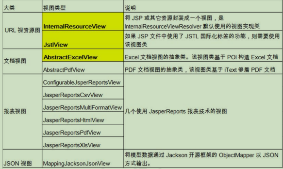
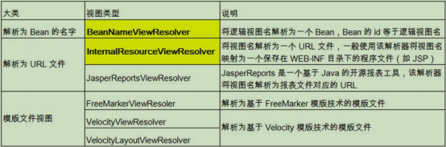
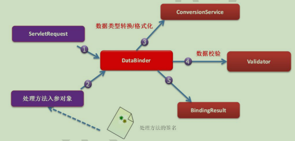
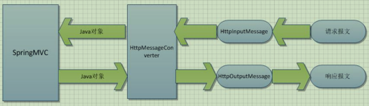
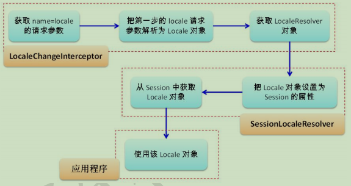

# Spring-mvc :seedling:

​												--笔记来源:尚硅谷-佟刚老师

## **第** **1** **章** **SpringMVC** **概述** 

### **1.1 SpringMVC** **概述** 

1） Spring 为展现层提供的基于 MVC 设计理念的优秀的 Web 框架，是目前最主流的MVC 框架之一 

2）Spring3.0 后全面超越 Struts2，成为最优秀的 MVC 框架。 

3）Spring MVC 通过一套 MVC 注解，让 POJO 成为处理请求的控制器，而无须实现任何接口。 

4）支持 REST 风格的 URL 请求。 

5）采用了松散耦合可插拔组件结构，比其他 MVC 框架更具扩展性和灵活性。

### **1.2 SpringMVC** **是什么** 

1）一种轻量级的、基于 MVC 的 Web 层应用框架。偏前端而不是基于业务逻辑层。Spring 框架的一个后续产品。

### **1.3 SpringMVC** **能干什么** 

1） 天生与 Spring 框架集成，如：(IOC,AOP) 

2） 支持 Restful 风格 

3） 进行更简洁的 Web 层开发 

4） 支持灵活的 URL 到页面控制器的映射 

5） 非常容易与其他视图技术集成，如:Velocity、FreeMarker 等等 

6） 因为模型数据不存放在特定的 API 里，而是放在一个 Model 里(Map 数据结构实现，因此很容易被其他框架使用) 

7） 非常灵活的数据验证、格式化和数据绑定机制、能使用任何对象进行数据绑定，不必实现特定框架的 API 

8） 更加简单、强大的异常处理 

9） 对静态资源的支持 

10） 支持灵活的本地化、主题等解析 

### **1.4 SpringMVC** **怎么玩** 

1） 将 Web 层进行了职责解耦，基于请求-响应模型 

2） 常用主要组件 

1.  **DispatcherServlet**：前端控制器 

2. **Controller**：处理器/页面控制器，做的是 MVC 中的 C 的事情，但控制逻辑转移到前端控制器了，用于对请求进行处理 

3.  **HandlerMapping** ：请求映射到处理器，找谁来处理，如果映射成功返回一个 HandlerExecutionChain 对象（包含一个 Handler 处理器(页面控制器)对象、多 个 **HandlerInterceptor** 拦截器对象） 

4. **View Resolver** : 视图解析器，找谁来处理返回的页面。把逻辑视图解析为具体 的 View,进行这种策略模式，很容易更换其他视图技术； 如 InternalResourceViewResolver 将逻辑视图名映射为 JSP 视图 

5. **LocalResolver**：本地化、国际化 

6. **MultipartResolver**：文件上传解析器 

7. **HandlerExceptionResolver**：异常处理器

### **1.5** **永远的** **HelloWorld** 

#### **1） 新建 Web 工程，加入 jar 包**

spring-aop-4.0.0.RELEASE.jar 

spring-beans-4.0.0.RELEASE.jar 

spring-context-4.0.0.RELEASE.jar 

spring-core-4.0.0.RELEASE.jar 

spring-expression-4.0.0.RELEASE.jar 

commons-logging-1.1.3.jar 

**spring-web-4.0.0.RELEASE.jar** 

**spring-webmvc-4.0.0.RELEASE.jar**

#### **2） 在 web.xml 中配置 DispatcherServlet**

```xml
<!--配置DispatcherServlet-->
    <servlet>
        <servlet-name>DispatcherServlet</servlet-name>
        <servlet-class>org.springframework.web.servlet.DispatcherServlet</servlet-class>
        <!--配置DispatcherServlet的一个初始化参数-->
        <init-param>
            <param-name>contextConfigLocation</param-name>
            <param-value>classpath:springmvc.xml</param-value>
        </init-param>
    </servlet>
    <servlet-mapping>
        <servlet-name>DispatcherServlet</servlet-name>
        <url-pattern>/</url-pattern>
    </servlet-mapping>
```

解释配置文件的名称定义规则: 

实际上也可以不通过 contextConfigLocation 来配置 SpringMVC 的配置文件, 而使用默认 的.默认的配置文件为: **/WEB-INF/****-servlet.xml**

#### **3） 加入 Spring MVC 的配置文件：springmvc.xml** 

1 增加名称空间

2 增加配置

```xml
<!--配置自动扫描的包-->
<context:component-scan base-package="com.github.springmvc"></context:component-scan>
<!--配置视图解析器-->
<bean class="org.springframework.web.servlet.view.InternalResourceViewResolver">
    <property name="prefix" value="/WEB-INF/views/"></property>
    <property name="suffix" value=".jsp"></property>
</bean>
```

#### 4） 需要创建一个入口页面，index.jsp

#### 5） 编写处理请求的处理器，并标识为处理器

```java
/*** 映射请求的名称：用于客户端请求；类似 Struts2 中 action 映射配置的 action 名称 
* 1. 使用 @RequestMapping 注解来映射请求的 URL 
* 2. 返回值会通过视图解析器解析为实际的物理视图, 对于 InternalResourceViewResolver 视图解析器,
* 会做如下的解析:
* 通过 prefix + returnVal + suffix 这样的方式得到实际的物理视图, 然后做转发操作.
* /WEB-INF/views/success.jsp */
@RequestMapping(value="/helloworld",method=RequestMethod.GET)
public String helloworld(){ System.out.println("hello,world"); return "success"; //结果如何跳转呢？需要配置映射解析器 
} }
```

#### 6） 编写视图 

/WEB-INF/views/success.jsp


## **第** **2** **章** **@RequestMapping** **注解** 

### **2.1 @RequestMapping** **映射请求注解** 

#### **2.1.1 @RequestMapping** **概念** 

1） SpringMVC 使用@RequestMapping 注解为控制器指定可以处理哪些 URL 请求 

2） 在控制器的**类定义及方法定义处**都可标注 @RequestMapping 

1 **标记在类上**：提供初步的请求映射信息。相对于 WEB 应用的根目录 

2 **标记在方法上**：提供进一步的细分映射信息。相对于标记在类上的 URL。 

3） 若类上未标注 @RequestMapping，则方法处标记的 URL 相对于 WEB 应用的根目 录 

4） 作用：DispatcherServlet 截获请求后，就通过控制器上 @RequestMapping 提供的映射信息确定请求所对应的处理方法。 

### **2.3 RequestMapping** **映射请求方式**

#### **2.3.2** **映射请求参数、请求方法或请求头** 

1）@RequestMapping 除了可以使用请求 URL 映射请求外，还可以使用请求方法、请 求参数及请求头映射请求 

2）@RequestMapping 的 value【重点】、method【重点】、params【了解】 及 heads 【了解】 分别表示请求 URL、请求方法、请求参数及请求头的映射条件，他们之间是 与的关系，联合使用多个条件可让请求映射更加精确化。 

3）params 和 headers 支持简单的表达式： 

param1: 表示请求必须包含名为 param1 的请求参数 

!param1: 表示请求不能包含名为 param1 的请求参数 

param1 != value1: 表示请求包含名为 param1 的请求参数，但其值不能为 value1 

{"param1=value1", "param2"}: 请求必须包含名为 param1 和 param2 的两个请求参数，且 param1 参数的值必须为 value1

### **2.5 RequestMapping** **支持** **Ant** **路径风格** 

#### **2.5.1 Ant** 

**1** **）** **Ant** **风格资源地址支持** **3** **种匹配符**：【了解】 

**?** **：匹配文件名中的一个字符** 

***** **：匹配文件名中的任意字符** 

***\*****：*****\*** **匹配多层路径** 

2） @RequestMapping 还**支持** **Ant** **风格的** **URL**：

### **2.6 RequestMapping** **映射请求占位符** **PathVariable** **注解** 

#### **2.6.1 @PathVariable** 

**带占位符的** **URL** **是** **Spring3.0** **新增的功能**，该功能在 SpringMVC 向 **REST** 目标挺进发展过程中具有里程碑的意义 

**通过** **@PathVariable** **可以将** **URL** **中占位符参数绑定到控制器处理方法的入参中**：URL 中的 {**xxx**} 占位符可以通过 @PathVariable("**xxx**") 绑定到操作方法的入参中。

## **第** **3** **章** **REST** 

### **3.1** **参考资料：** 

1）理解本真的 REST 架构风格: http://kb.cnblogs.com/page/186516/ 

2）REST: http://www.infoq.com/cn/articles/rest-introduction

### **3.2 REST** **是什么？** 

#### 1） REST：即 Representational State Transfer。

​	**（资源）表现层状态转化。是目前最流行** **的一种互联网软件架构**。它结构清晰、符合标准、易于理解、扩展方便，所以正得 到越来越多网站的采用

1 **资源（Resources）**：网络上的一个实体，或者说是网络上的一个具体信息。它可以是一段文本、一张图片、一首歌曲、一种服务，总之就是一个具体的存在。可以用一个 URI（统一资源定位符）指向它，每种资源对应一个特定的 URI 。获取这个资源，访问它的 URI 就可以，因此 URI 即为每一个资源的独一无二的识别符。 

2 表现层（Representation）：把资源具体呈现出来的形式，叫做它的表现层（Representation）。比如，文本可以用 txt 格式表现，也可以用 HTML 格式、XML 式、JSON 格式表现，甚至可以采用二进制格式。 

3 状态转化（State Transfer）：每发出一个请求，就代表了客户端和服务器的一次 交互过程。HTTP 协议，是一个无状态协议，即所有的状态都保存在服务器端。因此，如果客户端想要操作服务器，必须通过某种手段，让服务器端发生“状态转化” （State Transfer） 而这种转化是建立在表现层之上的，所以就是 “表现层状态转化”。 

4 具体说，就是 HTTP 协议里面，四个表示操作方式的动词：GET、POST、PUT、DELETE。它们分别对应四种基本操作：GET 用来获取资源，POST 用来新建资源，PUT 用来 更新资源，DELETE 用来删除资源。

#### 2）URL 风格 

示例： 

/order/1 HTTP **GET** ：得到 id = 1 的 order 

/order/1 HTTP **DELETE：**删除 id = 1 的 order 

/order HTTP **PUT**：更新 order 

/order HTTP **POST**：新增 order 

#### 3）HiddenHttpMethodFilter 

浏览器 form 表单只支持 GET 与 POST 请求，而 DELETE、PUT 等 method 并不支持，Spring3.0 添加了一个过滤器，可以将这些请求转换为标准的 http 方法，使 得支持 GET、POST、PUT 与 DELETE 请求。

## **第** **4** **章 处理请求数据** 

### **4.1** **请求处理方法签名** 

1） Spring MVC 通过分析处理方法的签名，HTTP 请求信息绑定到处理方法的相应人参中。 

2） Spring MVC 对控制器处理方法签名的限制是很宽松的，几乎可以按喜欢的任何方式对 方法进行签名。 

3） 必要时可以对方法及方法入参标注相应的注解（ @PathVariable 、@RequestParam、@RequestHeader 等）、 

4） Spring MVC 框架会将 HTTP 请求的信息绑定到相应的方法入参中，并根据方法的返回 值类型做出相应的后续处理。 

### **4.2 @RequestParam** **注解** 

1）在处理方法入参处使用 @RequestParam 可以把请求参数传递给请求方法 

2）value：参数名 

3）required：是否必须。默认为 true, 表示请求参数中必须包含对应的参数，若不存在，将 抛出异常 

4）defaultValue: 默认值，当没有传递参数时使用该值

**4.2.1** **实验代码** 

1） 增加控制器方法 @RequestParam 注解用于映射请求参数

### **4.3 @RequestHeader** **注解** 

1） 使用 @RequestHeader 绑定请求报头的属性值 

2） 请求头包含了若干个属性，服务器可据此获知客户端的信息，**通过** **@RequestHeader** **即** **可将请求头中的属性值绑定到处理方法的入参中**

### **4.4 @CookieValue** **注解** 

1） 使用 @CookieValue 绑定请求中的 Cookie 值 

2） **@CookieValue** 可让处理方法入参绑定某个 Cookie 值

### **4.5** **使用** **POJO** **作为参数** 

1） 使用 POJO 对象绑定请求参数值 

2） Spring MVC **会按请求参数名和** **POJO** **属性名进行自动匹配，自动为该对象填充属性值**。 **支持级联属性**。如：dept.deptId、dept.address.tel 等

4） 如果中文有乱码，需要配置字符编码过滤器，且配置其他过滤器之前， 如（HiddenHttpMethodFilter），否则不起作用。（思考 method=”get”请求的乱码问题怎 么解决的）

```xml
<!-- 配置字符集 -->
<filter>
    <filter-name>encodingFilter</filter-name>
    <filter-class>org.springframework.web.filter.CharacterEncodingFilter</filter-class> 
    <init-param> 
        <param-name>encoding</param-name> 
        <param-value>UTF-8</param-value> 
    </init-param>
    <init-param> 
        <param-name>forceEncoding</param-name>
        <param-value>true</param-value> 
    </init-param> 
</filter>
<filter-mapping>
    <filter-name>encodingFilter</filter-name>
    <url-pattern>/*</url-pattern> 
</filter-mapping>
```

### **4.6** **使用** **Servlet** **原生** **API** **作为参数** 

1） MVC 的 Handler 方法可以接受哪些 ServletAPI 类型的参数 

1) HttpServletRequest 

2) HttpServletResponse 

3) HttpSession 

4) **java.security.Principal** 

5) **Locale** 

6) **InputStream** 

7) **OutputStream** 

8) **Reader** 

9) **Writer** 

2） 源码参考：AnnotationMethodHandlerAdapter L866 

## **第** **5** **章 处理响应数据** 

### **5.1 SpringMVC** **输出模型数据概述** 

#### **5.1.1** **提供了以下几种途径输出模型数据** 

1） **ModelAndView**: 处理方法返回值类型为 ModelAndView 时, 方法体即可通过该对象添加模型数据 

2） **Map** **及** **Model**: 入参为 org.springframework.ui.Model、org.springframework.ui.ModelMap 或 java.uti.Map 时，处理方法返回时，Map 中 的数据会自动添加到模型中。 

3） **@SessionAttributes**: 将模型中的某个属性暂存到 HttpSession 中，以便多个请求之 间可以共享这个属性 

4） **@ModelAttribute**: 方法入参标注该注解后, 入参的对象就会放到数据模型中

### **5.2** **处理模型数据之** **ModelAndView** 

#### **5.2.1 ModelAndView** **介绍** 

1） 控制器处理方法的返回值如果为 ModelAndView, 则其既包含视图信息，也包含模型 数据信息。 

2）添加模型数据: 

MoelAndView addObject(String attributeName, Object attributeValue) 

ModelAndView addAllObject(Map<String, ?> modelMap) 

3）设置视图: 

void setView(View view) 

void setViewName(String viewName)

### **5.3** **处理模型数据之** **Map** 

#### **5.3.1 Map** **介绍** 

1）Spring MVC 在内部使用了一个 org.springframework.ui.Model 接口存储模型数据具体使用步骤 

**2****）****Spring MVC** **在调用方法前会创建一个隐含的模型对象作为模型数据的存储容器**。 

**3****）如果方法的入参为** **Map** **或** **Model** **类型**，Spring MVC 会将隐含模型的引用传递给这些入参。 

4）在方法体内，开发者可以通过这个入参对象访问到模型中的所有数据，也可以向模型 中添加**新的属性数据** 

### **5.4** **处理模型数据之** **SessionAttributes** **注解【了解】** 

**1****）** **若希望在多个请求之间共用某个模型属性数据**，则可以在控制器类上标注一个**@SessionAttributes**, Spring MVC 将在模型中对应的属性暂存到 HttpSession 中。 

2） @SessionAttributes 除了可以通过**属性名**指定需要放到会话中的属性外，还可以通过模 型属性的**对象类型**指定哪些模型属性需要放到会话中 

例如： 

1 @SessionAttributes(types=User.class) 会 将 隐 含 模 型 中 所 有 类 型 为 User.class 的属性添加到会话中。 

2 @SessionAttributes(value={“user1”, “user2”}) 

3 @SessionAttributes(types={User.class, Dept.class}) 

4 @SessionAttributes(value={“user1”, “user2”}, types={Dept.class})

### **5.5 @ModelAttribute** **注解** 

#### **5.5.1 @ModelAttribute** **注解之使用场景【了解】** 

#### **5.5.2@ModelAttribute** **注解之示例代码** 

1） 在方法定义上使用 @ModelAttribute 注解：Spring MVC 在调用目标处理方法前， 会先逐个调用在方法级上标注了 @ModelAttribute 的方法。 

2） 在方法的入参前使用 @ModelAttribute 注解：可以从隐含对象中获取隐含的模型 数据中获取对象，再将请求参数绑定到对象中，再传入入参 

3） 将方法入参对象添加到模型中 

#### **5.5.4 @ModelAttribute** **注解之运行原理** 

1 执行@ModelAttribute 注解所修饰的方法，将从数据库中获取的对象存放到 Map 集 合中，key 为 user 

2 SpringMVC从Map集合中获取 user对象，将表单数据封装到与参数名称对应的user 对象属性上 

3 SpringMVC 将 user 对象作为参数，传递给目标方法。 

4 注意：@ModelAttribute 注解修饰的方法中，放入到 Map 集合中的 key 值，应该和 目标方法参数类型的类名称首字母小写一致。 

#### **5.5.5 @ModelAttribute** **注解之源码分析** 

1） 调用 @ModelAttribute 注解修饰的方法. 实际上把 @ModelAttribute 方法中 Map 中的数据放在了 implicitModel 中. 

2） 解析请求处理器的目标参数, 实际上该目标参数来自于 WebDataBinder 对象的 target 属性 

1 创建 WebDataBinder 对象 

2 确定 objectName 属性: 若传入的 attrName 属性值为 "", 则 objectName 为 类名第一个字母小写. 

注意: attrName. 若目标方法的 POJO 属性使用了 @ModelAttribute 来修饰, 则 attrName 值即为 @ModelAttribute 的 value 属性值 

3 确定 target 属性: 

- 在 implicitModel 中查找 attrName 对应的属性值. 
- 若存在, ok 
- 若不存在: 则验证当前 Handler 是否使用了@SessionAttributes 进行修饰, 
  - 若使用了, 则尝试从 Session 中获取 attrName 所对应的属性值. 
  - 若 session 中没有对应的属性值, 则抛出了异常. 
- 若 Handler 没 有 使 用 @SessionAttributes 进 行 修 饰 , 或 @SessionAttributes 中没有使用 value 值指定的 key 和 attrName 相匹 配, 则通过反射创建了 POJO 对象 

3） SpringMVC 把表单的请求参数赋给了 WebDataBinder 的 target 对应的属性. 

4） SpringMVC 会把 WebDataBinder 的 attrName 和 target 给到 implicitModel. 进 而传到 request 域对象中. 

5） 把 WebDataBinder 的 target 作为参数传递给目标方法的入参. 

#### **5.5.6 SpringMVC** **确定目标方法** **POJO** **类型入参的过程** 

1） 确定一个 key: 

1 若目标方法的 POJO 类型的参数木有使用 @ModelAttribute 作为修饰,则 key 为 POJO 类名第一个字母的小写 

2 若使用了@ModelAttribute 来修饰, 则 key 为 @ModelAttribute 注解的value 属性值. 

2） 在 implicitModel 中查找 key 对应的对象, 若存在, 则作为入参传入 若在 @ModelAttribute 标记的方法中在 Map 中保存过, 且 key 和 1）确定的 key 一致, 则会获取到. 

3） 若 implicitModel 中不存在 key 对应的对象, 则检查当前的 Handler 是否使用 @SessionAttributes 注解修饰, 

4） 若使用了该注解, 且 @SessionAttributes 注解的 value 属性值中包含了 key, 则会 从 HttpSession 中来获取 key 所对应的 value 值, 若存在则直接传入到目标方法 的入参中. 若不存在则将抛出异常. 

5） 若 Handler 没有标识 @SessionAttributes 注解或 @SessionAttributes 注解的 value 值中不包含 key, 则会通过反射来创建 POJO 类型的参数, 传入为目标方法 的参数 

6） SpringMVC 会把 key 和 POJO 类型的对象保存到 implicitModel 中, 进而会保存 到 request 中.

#### **5.5.7@ModelAttribute** **注解修饰** **POJO** **类型的入参**

#### **5.5.8****@sessionAttributes** **注解引发的异常** 

1） 由@SessionAttributes 引发的异常

2） 如果在处理类定义处标注了@SessionAttributes(“xxx”)，则尝试从会话中获取该属 性，并将其赋给该入参，然后再用请求消息填充该入参对象。如果在会话中找不到对应 的属性，则抛出 HttpSessionRequiredException 异常

## **第** **6** **章 视图解析** 

### **6.1 SpringMVC** **如何解析视图概述** 

1） 不论控制器返回一个 String,ModelAndView,View 都会转换为 ModelAndView 对象，由视 图解析器解析视图，然后，进行页面的跳转。 

### **6.2** **视图和视图解析器** 

1） 请求处理方法执行完成后，最终返回一个 ModelAndView 对象。对于那些返回 String， View 或 ModeMap 等类型的处理方法，**Spring MVC** **也会在内部将它们装配成一个** **ModelAndView** **对象**，它包含了逻辑名和模型对象的视图 

2） Spring MVC 借助**视图解析器**（**ViewResolver**）得到最终的视图对象（View），最终的视 图可以是 JSP ，也可能是 Excel、JFreeChart 等各种表现形式的视图 

3） 对于最终究竟采取何种视图对象对模型数据进行渲染，处理器并不关心，处理器工作重 点聚焦在生产模型数据的工作上，从而实现 MVC 的充分解耦 

### **6.3** **视图** 

1） **视图**的作用是渲染模型数据，将模型里的数据以某种形式呈现给客户。 

2） 为了实现视图模型和具体实现技术的解耦，Spring 在 org.springframework.web.servlet 包中定义了一个高度抽象的 **View** 接口：

### **6.4** **常用的视图实现类** 



### **6.5 JstlView** 

1） 若项目中使用了JSTL，则SpringMVC 会自动把视图由InternalResourceView转为 **JstlView** **（断点调试，将** **JSTL** **的** **jar** **包增加到项目中，视图解析器会自动修改为** **JstlView****）** 

2） 若使用 JSTL 的 fmt 标签则需要在 SpringMVC 的配置文件中**配置国际化资源文件** 

3） 若希望直接响应通过 SpringMVC 渲染的页面，可以使用 **mvc:view-controller** 标签实现 

#### **6.5.1** **实验代码** 

1）增加 jstl 标签 jar 包（**断点调试，这时的** **View** **对象就是** **JstlView**）

**6.6** **视图解析器** 

1） SpringMVC 为逻辑视图名的解析提供了不同的策略，可以在 Spring WEB 上下文中**配置** 

**一种或多种解析策略**，**并指定他们之间的先后顺序**。每一种映射策略对应一个具体的 视图解析器实现类。 

2） 视图解析器的作用比较单一：将逻辑视图解析为一个具体的视图对象。 

3） 所有的视图解析器都必须实现 ViewResolver 接口：

### **6.7** **常用的视图解析器实现类** 



1） 程序员可以选择一种视图解析器或混用多种视图解析器 

2） 每个视图解析器都实现了 Ordered 接口并开放出一个 order 属性，**可以通过** **order** **属** **性指定解析器的优先顺序**，**order** **越小优先级越高**。 

3） SpringMVC 会按视图解析器顺序的优先顺序对逻辑视图名进行解析，直到解析成功并返 回视图对象，否则将抛出ServletException 异常 

4） InternalResourceViewResolver 

1 JSP 是最常见的视图技术，可以使用 InternalResourceViewResolve 作为视图解析器：

### **6.8 mvc:view-controller** **标签** 

1）若希望直接响应通过 SpringMVC 渲染的页面，可以使用 **mvc:view-controller** 标签 实现 

```xml
<!-- 直接配置响应的页面：无需经过控制器来执行结果 --> 
<mvc:view-controller path="**/success**" view-name="success"/> 
```

2）请求的路径： 

http://localhost:8080/SpringMVC_02_View**/success** 

3）配置<mvc:view-controller>会导致其他请求路径失效 

```xml
<!-- 在实际开发过程中都需要配置 mvc:annotation-driven 标签，后面讲，这里先配置上 --> 
<mvc:annotation-driven/> 
```

### **6.9** **自定义视图【了解】** 

1） 自定义视图（需要加入 SpringMVC，那么，一定需要实现框架的接口） 

2） 若希望使用 Excel 展示数据列表，仅需要扩展 SpringMVC 提供的 **AbstractExcelView** 或 AbstractJExcelView 即可。 

3） 实现 buildExcelDocument() 方法，在方法中使用模型数据对象构建 Excel 文档就可以了。 

4） **AbstractExcelView** **基于** **POI API**，而 AbstractJExcelView 是基于 JExcelAPI 的。 

5） **视图对象需要配置** **IOC** **容器中的一个** **Bean****，使用** **BeanNameViewResolver** **作为视图** **解析器即可** 

6） 若希望直接在浏览器中直接下载 Excel 文档，则可以设置响应头 **Content-Disposition** 的值为 **attachment;filename=xxx.xls**

### **6.10** **重定向** 

1） 关于重定向 

1 一般情况下，控制器方法返回字符串类型的值会被当成逻辑视图名处理 

2 如果返回的字符串中带 **forward:** **或** **redirect:** 前缀时，SpringMVC 会对他们进行 特殊处理：将 forward: 和 redirect: 当成指示符，其后的字符串作为 URL 来处理 3 redirect:success.jsp：会完成一个到 success.jsp 的重定向的操作4 orward:success.jsp：会完成一个到 success.jsp 的转发操作 

## **7.5** **使用** **Spring** **的表单标签** 

1） 通过 SpringMVC 的**表单标签**可以实现将模型数据中的属性和 HTML 表单元素相绑定， 以实现表单数据**更便捷编辑和表单值的回显** 

2） form 标签 

- 一般情况下，**通过** **GET** **请求获取表单页面**，而**通过** **POST** **请求提交表单页面**，**因** **此获取表单页面和提交表单页面的** **URL** **是相同的**。
- **只要满足该最佳条件的契约**， **标签就无需通过** **action** **属性指定表单** **提交的** **URL**
- **可以通过 **modelAttribute** 属性指定绑定的模型属性，若没有指定该属性，则默认 从 request 域对象中读取 **command** 的表单 bean，如果该属性值也不存在，则会 发生错误。 

3） SpringMVC 提供了多个表单组件标签，如 <form:input/>、<form:select/> 等，用以绑定表单字段的属性值，它们的共有属性如下： 

 **path**：**表单字段，对应** **html** **元素的** **name** **属性，支持级联属性** 

 htmlEscape：是否对表单值的 HTML 特殊字符进行转换，默认值为 true 

 cssClass：表单组件对应的 CSS 样式类名 

 cssErrorClass：表单组件的数据存在错误时，采取的 CSS 样式 

4） form:input、form:password、form:hidden、form:textarea：对应 HTML 表单的 text、password、hidden、textarea 标签 

5） form:radiobutton：单选框组件标签，当表单 bean 对应的属性值和 value 值相等时单选框被选中 

6） **form:radiobuttons**：单选框组标签，用于构造多个单选框 

 **items**：可以是一个 List、String[] 或 Map 

 **itemValue**：指定 radio 的 value 值。可以是集合中 bean 的一个属性值 

 **itemLabel**：指定 radio 的 label 值 

 **delimiter**：多个单选框可以通过 delimiter 指定分隔符 

7） form:checkbox：复选框组件。用于构造单个复选框 

8） form:checkboxs：用于构造多个复选框。使用方式同 form:radiobuttons 标签 

9） form:select：用于构造下拉框组件。使用方式同 form:radiobuttons 标签 

10）form:option：下拉框选项组件标签。使用方式同 form:radiobuttons 标签 

11）**form:errors**：显示表单组件或数据校验所对应的错误 

 <form:errors path= “*” /> ：显示表单所有的错误 

 <form:errors path= “user*” /> ：显示所有以 user 为前缀的属性对应的错误 

 <form:errors **path=** **“****username****”** /> ：显示特定表单对象属性的错误

### **7.7.4** **关于********作用**

```xml
<!-- 
<mvc:default-servlet-handler/> 将在 SpringMVC 上下文中定义一个 DefaultServletHttpRequestHandler，
 	它会对进入 DispatcherServlet 的请求进行筛查，如果发现是没有经过映射的请求， 就将该请求交由 WEB 应用服务器默认的 Servlet 处理，如果不是静态资源的请求，才由 DispatcherServlet 继续处理 
	一般 WEB 应用服务器默认的 Servlet 的名称都是 default。 若所使用的 WEB 服务器的默认 Servlet 名称不是 default，则需要通过 default-servlet-name 属性显式指 定参考：CATALINA_HOME/config/web.xml
 <servlet> 
<servlet-name>default</servlet-name> 
<servlet-class>org.apache.catalina.servlets.DefaultServlet</servlet-class>
 <init-param> 
<param-name>debug</param-name>
 <param-value>0</param-value> 
</init-param> 
<init-param>
 <param-name>listings</param-name> 
<param-value>false</param-value>
</init-param> 
<load-on-startup>1</load-on-startup> 
</servlet> 该标签属性 default-servlet-name 默认值是"default",可以省略。 
<mvc:default-servlet-handler/> --> 
<mvc:default-servlet-handler default-servlet-name="default"/>
```

## **第** **8** **章 数据绑定流程分析【了解】** 

### **8.1** **提出问题** 

日期字符串格式的表单参数，提交后转换为 Date 类型 

### **8.2** **数据绑定流程原理** 

1） Spring MVC 主 框 架 将 ServletRequest 对 象 及 目 标 方 法 的 入 参 实 例 传 递 给 WebDataBinderFactory 实例，以创建 **DataBinder** 实例对象 

2） DataBinder 调用装配在 Spring MVC 上下文中的 **ConversionService** 组件进行**数据类型** **转换、数据格式化**工作。将 Servlet 中的请求信息填充到入参对象中 

3） 调用 **Validator** 组件对已经绑定了请求消息的入参对象进行数据合法性校验，并最终生成数据绑定结果 **BindingData** 对象 

4） Spring MVC 抽取 **BindingResult** 中的入参对象和校验错误对象，将它们赋给处理方法的响应入参 

5） Spring MVC 通过反射机制对目标处理方法进行解析，将请求消息绑定到处理方法的入 参中。数据绑定的核心部件是 **DataBinder**，运行机制如下： 



### **8.4** **自定义类型转换器** 

#### **8.4.1** **类型转换器概述** 

1 ConversionService 是 Spring 类型转换体系的核心接口。 

2 可以利用 ConversionServiceFactoryBean 在 Spring 的 IOC 容器中定义一个 ConversionService. Spring 将自动识别出 IOC 容器中的 ConversionService，并在 Bean 属性配置及 Spring MVC 处理方法入参绑定等场合使用它进行数据的转换 

3 可通过 ConversionServiceFactoryBean 的 converters 属性注册自定义的类型转换 器

#### **8.4.2 Spring** **支持的类型转换器** 

① Spring 定义了 3 种类型的转换器接口，实现任意一个转换器接口都可以作为自定 义转换器注册到 ConversionServiceFactoryBean 中： 

② Converter<S,T>：将 S 类型对象转为 T 类型对象 

③ ConverterFactory：将相同系列多个 “同质” Converter 封装在一起。如果希望将 一种类型的对象转换为另一种类型及其子类的对象（例如将 String 转换为 Number 及 Number 子类（Integer、Long、Double 等）对象）可使用该转换器工厂类 

④ GenericConverter：会根据源类对象及目标类对象所在的宿主类中的上下文信息进 行类型转换

### **8.5 ****配置在什么时候必须配置？** 

1） 直接配置响应的页面：无需经过控制器来执行结果 ；但会导致其他请求路径失效，需 要配置 mvc:annotation-driven 标签 <mvc:view-controller path="/success" view-name="success"/> 

2） RESTful-CRUD 操作，删除时，通过 jQuery 执行 delete 请求时，找不到静态资源，需要 配置 mvc:annotation-driven 标签 <mvc:default-servlet-handler/> 将在 SpringMVC 上下文中定义一个 DefaultServletHttpRequestHandler，它会对进入 DispatcherServlet 的请求进行筛查，如 果发现是没有经过映射的请求，就将该请求交由 WEB 应用服务器默认的 Servlet 处 理，如果不是静态资源的请求，才由 DispatcherServlet 继续处理。 

3） 配置类型转换器服务时，需要指定转换器服务引用 <mvc:annotation-driven conversion-service=“conversionService”/> 会将自定义的 ConversionService 注册到 Spring MVC 的上下文中 

4） 后面完成 JSR 303 数据验证，也需要配置 

#### **8.5.1** **关于** **** **作用** 

1） <mvc:annotation-driven /> 会自动注册： **RequestMappingHandlerMapping** 、**RequestMappingHandlerAdapter** 与 **ExceptionHandlerExceptionResolver** 三个 bean。 

2） 还将提供以下支持： 

1 支持使用 **ConversionService** 实例对表单参数进行类型转换 

2 支持使用 **@NumberFormat****、****@DateTimeFormat** 注解完成数据类型的格式化 

3 支持使用 **@Valid** 注解对 JavaBean 实例进行 JSR 303 验证 

4 支持使用 **@RequestBody** 和 **@ResponseBody** 注解 

3） 结合**源码分析（在** **bean** **对象的** **set** **方法上设置断点进行调试）** 

1 既没有配置 <mvc:default-servlet-handler/> 也没有配置 <mvc:annotation-driven/>

### **8.6 InitBinder** **注解【了解】** 

1） @InitBinder 

1 由 **@InitBinder** 标 识 的 方 法 ， **可 以 对** **WebDataBinder** **对 象 进 行 初 始 化** 。WebDataBinder 是 DataBinder 的子类，用于完成由表单字段到 JavaBean 属性的 绑定 

2 **@InitBinder** **方法不能有返回值**，它必须声明为 void。 

3 **@InitBinder** **方法的参数通常是** **WebDataBinder**

### **8.7** **数据的格式化** 

#### **8.7.1** **数据格式化概述** 

1） 对属性对象的输入/输出进行格式化，从其本质上讲依然属于 “类型转换” 的范 畴。 

2） Spring 在格式化模块中定义了一个实现 ConversionService 接口的 **FormattingConversionService** 实现类，该实现类扩展了 GenericConversionService， 因此它**既具有类型转换的功能，又具有格式化的功能** 

3） FormattingConversionService 拥 有 一 个 **FormattingConversionServiceFactoryBean** 工 厂 类 ， 后 者 用 于 在 

Spring 上 下 文 中 构 造 前 者 ， FormattingConversionServiceFactoryBean 内部已经注册了 : 

1 NumberFormatAnnotationFormatterFactory：支持对数字类型的属性使用 **@NumberFormat** 注解 

2 JodaDateTimeFormatAnnotationFormatterFactory：支持对日期类型的属性使用 @DateTimeFormat 注解 

4） 装配了 FormattingConversionServiceFactroyBean 后，就可以在 Spring MVC 入参绑 定及模型数据输出时使用注解驱动了。 

1 **** **默认创建的** **ConversionService** **实例即为** DefaultFormattingConversionService 

#### **8.7.2** **日期格式化概述** 

1） @DateTimeFormat 注解可对 java.util.Date、java.util.Calendar、java.long.Long 时间 类型进行标注： 

1 pattern 属性：类型为字符串。指定解析/格式化字段数据的模式，如：”yyyy-MM-dd hh:mm:ss” 

2 iso 属性：类型为 DateTimeFormat.ISO。指定解析/格式化字段数据的 ISO 模式， 包 括 四 种 ： ISO.NONE （ 不 使 用 ） -- 默 认 、 ISO.DATE(yyyy-MM-dd) 、 ISO.TIME(hh:mm:ss.SSSZ)、 ISO.DATE_TIME(yyyy-MM-dd hh:mm:ss.SSSZ) 

3 style 属性：字符串类型。通过样式指定日期时间的格式，由两位字符组成，第 一位表示日期的格式，第二位表示时间的格式：S：短日期/时间格式、M：中 日期/时间格式、L：长日期/时间格式、F：完整日期/时间格式、-：忽略日期或 时间格式 

#### **8.7.3** **数值格式化概述** 

1） @NumberFormat 可对类似数字类型的属性进行标注，它拥有两个互斥的属性： 

1 style ： 类 型 为 NumberFormat.Style 。 用 于 指 定 样 式 类 型 ， 包 括 三 种 ： Style.NUMBER（正常数字类型）、 Style.CURRENCY（货币类型）、 Style.PERCENT （百分数类型） 

2 pattern：类型为 String，自定义样式，如 pattern="#,###"；

### **8.8 JSR303** **数据校验** 

#### **8.8.1** **如何校验** 

1） 使用 JSR 303 验证标准 

2） 加入 hibernate validator 验证框架 

3） 在 SpringMVC 配置文件中增加<mvc:annotation-driven/> 

4） 需要在 bean 的属性上增加对应验证的注解 

5） 在目标方法 bean 类型的前面增加@Valid 注解 

#### **8.8.2 JSR 303** 

是 Java 为 Bean 数据合法性校验提供的标准框架，它已经包含在 JavaEE 6.0 中 .JSR 303 (Java Specification Requests 意思是 Java 规范提案)通过**在** **Bean** **属性上标注** 类似于 @NotNull、@Max 等标准的注解指定校验规则，并通过标准的验证接口对 Bean 进行验证

#### **8.8.4 Spring MVC** **数据校验** 

1） Spring 4.0 拥有自己独立的数据校验框架，同时支持 JSR 303 标准的校验框架。 

2） Spring 在进行数据绑定时，可同时调用校验框架完成数据校验工作。**在** **Spring MVC** **中，可直接通过注解驱动的方式进行数据校验** 

3） Spring 的 LocalValidatorFactroyBean 既实现了 Spring 的 Validator 接口，也实现了 JSR 303 的 

Validator 接 口 。 只 要 在 Spring 容 器 中 定 义 了 一 个 **LocalValidatorFactoryBean**，即可将其注入到需要数据校验的 Bean 中。 

4） **Spring** **本身并没有提供** **JSR303** **的实现，所以****必须将** **JSR303** **的实现者的** **jar** **包** **放到类路径下****。** 

5） **** **会默认装配好一个** **LocalValidatorFactoryBean**，通过在处 理方法的入参上标注 **@Valid** 注解即可让 Spring MVC 在完成数据绑定后执行数 据校验的工作 

6） 在已经标注了 JSR303 注解的表单/命令对象前标注一个 @Valid，Spring MVC 框架 在将请求参数绑定到该入参对象后，就会调用校验框架根据注解声明的校验规则实 施校验

### **8.9** **错误消息的显示及国际化** 

#### **8.9.1** **在页面上显示错误** 

1） Spring MVC 除了会将表单/命令对象的校验结果保存到对应的 BindingResult 或 Errors 对象中外，**还会将所有校验结果保存到 “隐含模型”** 

2） 即使处理方法的签名中没有对应于表单/命令对象的结果入参，校验结果也会保存 在 “隐含对象” 中。 

3） 隐含模型中的所有数据最终将通过 HttpServletRequest 的属性列表暴露给 JSP 视 图对象，因此在 JSP 中可以获取错误信息 

4） 在 JSP 页面上可通过 ****“****userName****”****>** 显示错误消息

### **8.10** **提示消息的国际化** 

1） 每个属性在数据绑定和数据校验发生错误时，都会生成一个对应的 FieldError 对象。 

2） **当一个属性校验失败后，校验框架会为该属性生成** **4** **个消息代码**，这些代码以**校验注** **解类名为****前缀**，结合 **modleAttribute****、属性名及属性类型名**生成多个对应的消息代码： 例如 User 类中的 password 属性标注了一个 @Pattern 注解，当该属性值不满足 

@Pattern 所定义的规则时, 就会产生以下 4 个错误代码： 

1 Pattern.user.password 

2 Pattern.password 

3 Pattern.java.lang.String 

4 Pattern 

3） 当使用 Spring MVC 标签显示错误消息时， Spring MVC 会查看 WEB 上下文是否装配 了对应的国际化消息，如果没有，则显示默认的错误消息，否则使用国际化消息。 

4） 若数据类型转换或数据格式转换时发生错误，或该有的参数不存在，或调用处理方法时 发生错误，都会在隐含模型中创建错误消息。其错误代码前缀说明如下： 

1 **required**：必要的参数不存在。如 @RequiredParam(“param1”) 标注了一个入参，但是该参数不存在 

2 **typeMismatch**：在数据绑定时，发生数据类型不匹配的问题 

3 **methodInvocation**：Spring MVC 在调用处理方法时发生了错误 

5） 注册国际化资源文件

## **第** **9** **章 处理** **JSON** 

### **9.1** **返回** **JSON** 

1） 加入 jar 包： 

http://wiki.fasterxml.com/JacksonDownload/ 下载地址 

jackson-annotations-2.1.5.jar 

jackson-core-2.1.5.jar 

jackson-databind-2.1.5.jar 

2） 编写目标方法，使其返回 JSON 对应的对象或集合

```java
@ResponseBody //SpringMVC 对 JSON 的支持 
@RequestMapping("/testJSON") 
public Collection<Employee> testJSON(){ return employeeDao.getAll(); }
```

### **9.2 HttpMessageConverter** **原理** 

#### **9.2.1 HttpMessageConverter** 

1） **HttpMessageConverter** 是 Spring3.0 新添加的一个接口，**负责将请求信息转换** **为一个对象（类型为** **T****），****将对象（类型为** **T****）输出为响应信息** 

**2****）** **HttpMessageConverter****接口定义的方法：** 

1 Boolean canRead(Class<?> clazz,MediaType mediaType): 指定转换器可以读取的对象类型，即 转 换 器 是 否 可 将 请 求 信 息 转 换 为 clazz 类 型 的 对 象 ， 同 时 指 定 支 持 MIME 类 型 (text/html,applaiction/json 等) 

2 Boolean canWrite(Class<?> clazz,MediaType mediaType):指定转换器是否可将 clazz 类型的对 象写到响应流中，响应流支持的媒体类型在 MediaType 中定义。 

3 List<MediaType> getSupportMediaTypes()：该转换器支持的媒体类型。 

4 T read(Class<? extends T> clazz,**HttpInputMessage** inputMessage)：将请求信息流转换为 T 类型的对象。 

5 void write(T t,MediaType contnetType,**HttpOutputMessgae** outputMessage):将 T 类型的对象写 到响应流中，同时指定相应的媒体类型为 contentType。



### **9.3** **使用** **HttpMessageConverter** 

1） **使用** **HttpMessageConverter** **将请求信息转化并绑定到处理方法的入参中或将响应****结果转为对应类型的响应信息，****Spring** **提供了两种途径**： 

 使用 **@RequestBody / @ResponseBody** 对处理方法进行标注 

 使用 **HttpEntity / ResponseEntity** 作为处理方法的入参或返回值 

2） 当控制器处理方法使用到 @RequestBody/@ResponseBody 或 HttpEntity<T>/ResponseEntity<T> 时, Spring **首先根据请求头或响应头的** **Accept** **属性** **选择匹配的** **HttpMessageConverter**, **进而根据参数类型或泛型类型的过滤得到匹配的** **HttpMessageConverter**, 若找不到可用的 HttpMessageConverter 将报错 

3） **@RequestBody** **和** **@ResponseBody** **不需要成对出现** 

4） Content-Disposition：attachment; filename=abc.pdf 

## **第** **10** **章 国际化【了解】** 

### **10.1** **国际化****_****页面中获取国际化资源信息** 

1） 在页面上能够根据浏 览器语言设置的情况对文本, 时间, 数值进行本地化处理

2） 可以在 bean 中获取国际化资源文件 Locale 对应的消息 

3） 可以通过超链接切换 Locale, 而不再依赖于浏览器的语言设置情况 

#### **10.1.1** **实现** 

1） 使用 JSTL 的 fmt 标签 

2） 在 bean 中注入 ResourceBundleMessageSource 的实例, 使用其对应的 getMessage 方法即可 

3） 配置 LocalResolver 和 LocaleChangeInterceptor

### **10.3** **国际化****_****通过超链接切换** **Locale** 

1） 国际化概述 

1 默认情况下，SpringMVC 根据 **Accept-Language** 参数判断客户端的本地化类型。 

2 当接受到请求时，SpringMVC 会在上下文中查找一个本地化解析器（**LocalResolver**），找到后使用它获取请求所对应的本地化类型信息。 

3 SpringMVC 还允许装配一个**动态更改本地化类型的拦截器**，这样通过指定一个请求参数就可以控制单个请求的本地化类型。 

4 SessionLocaleResolver & LocaleChangeInterceptor 工作原理 

