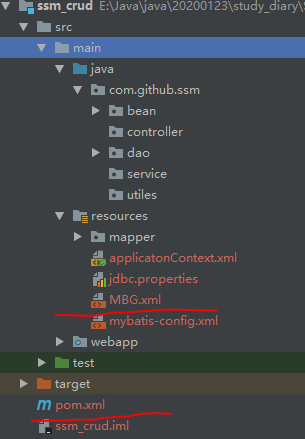
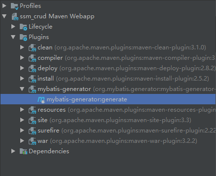

# Spring错误笔记 :seedling:

随随便便从网上复制粘贴容易出现各种问题!!!

## 1.web.xml中出现:

**The content of element type "web-app" must match "(icon?,display-name?,description?,distributable?,context-param*,filter*,filter-mapping*,listener*,servlet*,servlet-mapping*,session-config?,mime-mapping*,welcome-file-list?,error-page*,taglib*,resource-env-ref*,resource-ref*,security-constraint*,login-config?,security-role*,env-entry*,ejb-ref*,ejb-local-ref*)". eoso/WebRoot/WEB-INF** 

```xml
<!DOCTYPE web-app PUBLIC "-//Sun Microsystems, Inc.//DTD Web Application 2.3//EN" "http://java.sun.com/dtd/web-app_2_3.dtd">
这一段校验代码删掉，问题就解决了。原因是：我添加的那部分代码符合xml文档规范，但不符合web-app_2_3.dtd所定义的规范。
```

## 2.idea+maven 下 Mybatis逆向工程步骤(踩过的坑)

### 1.添加依赖以及插件 pom.xml文件  注意相对位置

```xml
</dependencies> 
<dependency>
        <groupId>org.mybatis.generator</groupId>
        <artifactId>mybatis-generator-core</artifactId>
         <version>1.4.0</version>
        </dependency>
</dependencies>
<build>
 <plugins>
            <plugin>
                <groupId>org.mybatis.generator</groupId>
                <artifactId>mybatis-generator-maven-plugin</artifactId>
                <version>1.3.0</version>
                <configuration>
                    <configurationFile>${basedir}/src/main/resources/MBG.xml</configurationFile>
                    <overwrite>true</overwrite>
                    <verbose>true</verbose>
                </configuration>
                <executions>
                    <execution>
                        <id>Generate MyBatis Artifacts</id>
                        <goals>
                            <goal>generate</goal>
                        </goals>
                    </execution>
                </executions>
            </plugin>
        </plugins>
    </build>
```

### 2.创建一个mybatis-generator的配置文件,这里我取名MBG.xml,位置放在/src/main/resources 见图



```xml
<?xml version='1.0' encoding='UTF-8'?>
<!DOCTYPE generatorConfiguration
        PUBLIC "-//mybatis.org//DTD MyBatis Generator Configuration 1.0//EN"
        "http://mybatis.org/dtd/mybatis-generator-config_1_0.dtd">


<generatorConfiguration>
    <!-- 找maven仓库中的mysql-connector  jar包 -->
    <classPathEntry
            location="D:\Program Files\IntelliJ IDEA 2018.3.6\maven_repo\mysql\mysql-connector-java\8.0.19\mysql-connector-java-8.0.19.jar"></classPathEntry>
    <context id="mybatisGenerator" targetRuntime="MyBatis3">
        <commentGenerator>
            <!-- 是否去除自动生成的注释 true：是 ： false:否 -->
            <property name="suppressAllComments" value="true"/>
        </commentGenerator>
        <!--数据库连接的信息：驱动类、连接地址、用户名、密码,这里的参数是为了解决MySQL连接报错 -->
        <jdbcConnection driverClass="com.mysql.cj.jdbc.Driver"
                        connectionURL="jdbc:mysql://localhost:3306/test?useUnicode=true&amp;characterEncoding=UTF-8&amp;serverTimezone=UTC
                        userId="root"
                        password="root">
        </jdbcConnection>

        <!-- 默认false，把JDBC DECIMAL 和 NUMERIC 类型解析为 Integer，为 true时把JDBC DECIMAL 和
            NUMERIC 类型解析为java.math.BigDecimal -->
        <javaTypeResolver>
            <property name="forceBigDecimals" value="false"/>
        </javaTypeResolver>

        <!-- targetProject:生成PO类的位置 -->
        <javaModelGenerator targetPackage="com.github.ssm.bean"
                            targetProject="src/main/java">
            <!-- enableSubPackages:是否让schema作为包的后缀 -->
            <property name="enableSubPackages" value="false"/>
            <!-- 从数据库返回的值被清理前后的空格 -->
            <property name="trimStrings" value="true"/>
        </javaModelGenerator>
        <!-- targetProject:mapper映射文件生成的位置 -->
        <sqlMapGenerator targetPackage="mapper"
                         targetProject="src/main/resources">
            <!-- enableSubPackages:是否让schema作为包的后缀 -->
            <property name="enableSubPackages" value="false"/>
        </sqlMapGenerator>
        <!-- targetPackage：mapper接口生成的位置 -->
        <javaClientGenerator type="XMLMAPPER"
                             targetPackage="com.github.ssm.dao"
                             targetProject="src/main/java">
            <!-- enableSubPackages:是否让schema作为包的后缀 -->
            <property name="enableSubPackages" value="false"/>
        </javaClientGenerator>
        <!-- 指定数据库表 -->
        <table tableName="t_book" domainObjectName="Book"></table>

        <!-- 有些表的字段需要指定java类型
         <table schema="" tableName="">
            <columnOverride column="" javaType="" />
        </table> -->
    </context>
</generatorConfiguration>
```

### 3.右键运行--完成



**过程中出现的问题:**

1. IDEA 不显示 Maven 插件 mybatis-generator 解决:   注意pom.xml中插件的相对位置
2. 出现跟sql连接问题相关的

```txt
The server time zone value '?????????±?????????±???¤' is unrecognized or represents more than one time zone. You must configure either the server or JDBC driver (via the serverTimezone configuration property) to use a more specifc time zone value if you want to utilize time zone support.
```

```xml
解决方案
connectionURL="jdbc:mysql://localhost:3306/test?                           useUnicode=true&amp;characterEncoding=UTF-8&amp;serverTimezone=UTC"
```

3. 去除注释失效 只能手动去除使用正则匹配

   ```txt
    (/\*([^*]|[\r\n]|(\*+([^*/]|[\r\n])))*\*+/|[ \t]*//.*)
   ```

   

## 3.使用idea编辑jsp页面的时候，发现不能使用pageContext.setAttribute，爆红。

```xml
<!-- 解决方式 -->
<!-- https://mvnrepository.com/artifact/javax.servlet/jsp-api -->
<dependency>
    <groupId>javax.servlet</groupId>
    <artifactId>jsp-api</artifactId>
    <version>2.0</version>
    <scope>provided</scope>
</dependency>
```

## 4.spring boot +thymeleaf 升级3.0+报错java.lang.Class: org.thymeleaf.spring5.SpringTemplateEngine

更换版本

```xml
<thymeleaf.version>3.0.11.RELEASE</thymeleaf.version>
<thymeleaf-layout-dialect.version>2.1.1</thymeleaf-layout-dialect.version>
```

有问题的话再修改application.properties

```properties
spring.thymeleaf.mode=HTML
```

## 5.maven3.6.3报错

Unable to import maven project: See logs for details,查看idea.log 

```log
java.lang.RuntimeException: com.google.inject.CreationException: Unable to create injector, see the following errors:

1) No implementation for org.apache.maven.model.path.PathTranslator was bound.
  while locating org.apache.maven.model.path.PathTranslator
    for field at org.apache.maven.model.interpolation.AbstractStringBasedModelInterpolator.pathTranslator(Unknown Source)
  at org.codehaus.plexus.DefaultPlexusContainer$1.configure(DefaultPlexusContainer.java:350)

2) No implementation for org.apache.maven.model.path.UrlNormalizer was bound.
  while locating org.apache.maven.model.path.UrlNormalizer
    for field at org.apache.maven.model.interpolation.AbstractStringBasedModelInterpolator.urlNormalizer(Unknown Source)
  at org.codehaus.plexus.DefaultPlexusContainer$1.configure(DefaultPlexusContainer.java:350)

2 errors
```

解决:3.6.3版本兼容有问题,需要更换低版本的,查看网上貌似3.6.2也有问题,故采用3.6.1

## 6.注意：如果注解@Slf4j注入后找不到变量log，那就给IDE安装lombok插件

下面以idea为例

File  → settings →  Plugins,  然后点击“Browse repositories” 输入lombok 然后install